# 1. Product introduction

## 1.1 Introduction

Nowadays, technological education such as VR, kids’ programming, and artificial intelligence, has become a mainstream in educational industry. Thereby, people attach more importance to STEAM education.

As Arduino is notably famous in Maker education sector. Keyestuido surf this current and launch a smart mini tank robot which is a combination of Arduino and programming.

So what is Arduino? Arduino is an open-source electronics platform based on easy-to-use hardware and software. Arduino boards are able to read inputs - light on a sensor, a finger on a button, or a Twitter message - and turn it into an output - activating a motor, turning on an LED, publishing something online.

Based on this, Keyestudio team has designed a mini tank robot. It has a processor which is programmable using the Arduino IDE, to map its pins to sensors and actuators by a shield that plug in the processor, and it reads sensors and controls the actuators and decides how to operate.

It can perform multiple functions like obstacle avoidance, IR remote control, BT control, light following and so on.

Detailed 15 learning projects, from simple to complex, which guide you to build up your own smart mini tank robot and provide the basic knowledge of sensors and modules. Moreover, it is the best choice for graphical programming education.

## 1.2 Features

1. Multi-purpose function: Multi-purpose function: Obstacle avoidance, following, IR remote control, Bluetooth control, ultrasonic following and facial emoticons display.
2. Simple assembly: No soldering circuit required, complete assembly easily.
3. High Tenacity: Aluminum alloy bracket, metal motors, high quality wheels and tracks.
4. High extension: connect numerous sensors and modules through motor driver shield and sensor shield.
5. Multiple controls: IR remote control, App control(iOS and Android system)
6. Basic programming：C language code of Arduino IDE.

## 1.3 Specification

- Working voltage: 5v
- Input voltage: 7-12V
- Maximum output current: 2A
- Maximum power dissipation: 25W (T=75℃)
- Motor speed: 5V 200 rpm/min
- Motor drive mode: dual H bridge drive (L298P)
- Ultrasonic induction angle: \<15 degrees
- Ultrasonic detection distance: 2cm-400cm
- Infrared remote control distance: 10 meters (measured)
- Bluetooth remote control distance: 50 meters (measured)

## 1.4 Product List

|              Name               | QTY  |                           Picture                            |
| :-----------------------------: | :--: | :----------------------------------------------------------: |
|        Development Board        |  1   | 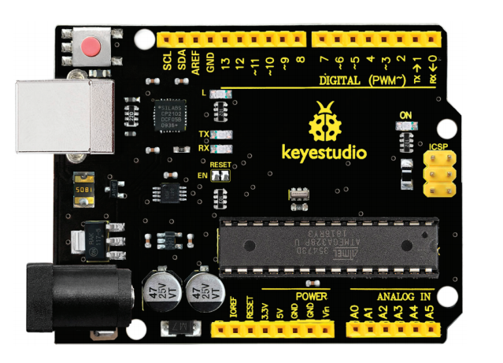 |
|            V5 Shield            |  1   | 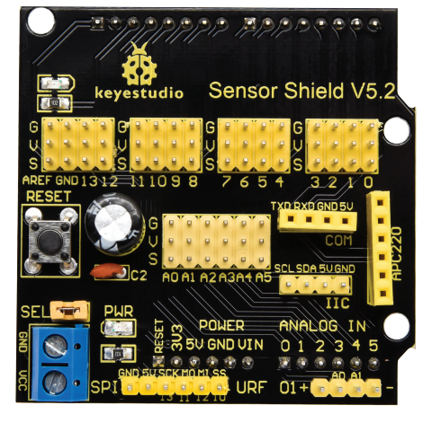 |
|            BT module            |  1   | 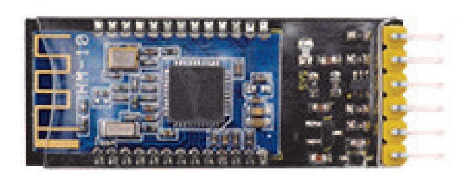 |
|           Servo motor           |  1   | 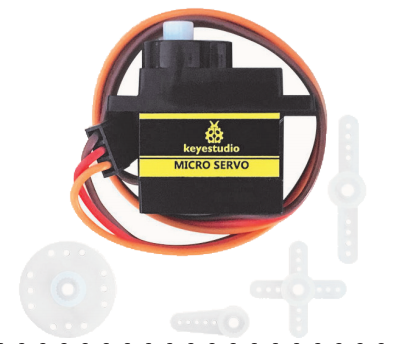 |
|        Photocell sensor         |  2   | 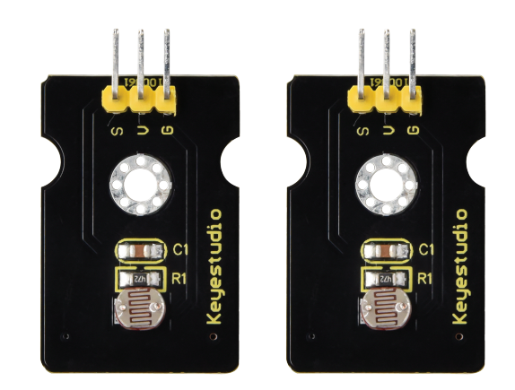 |
|             RGB LED             |  1   | 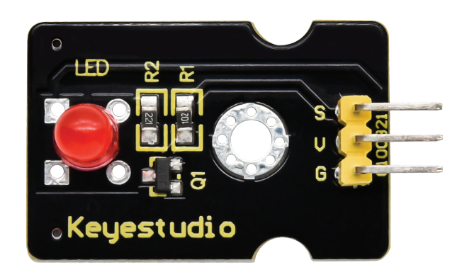 |
|           Metal motor           |  1   | 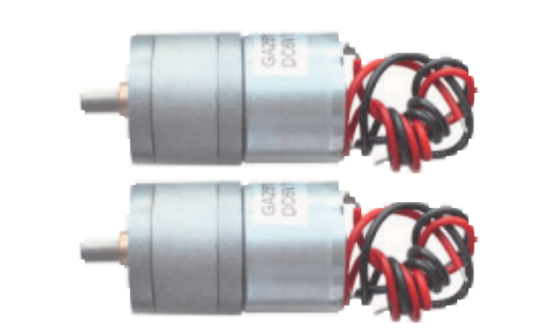 |
|        Tank drive wheel         |  2   | 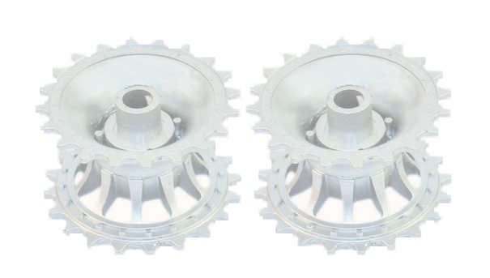 |
|          L298P shield           |  1   | 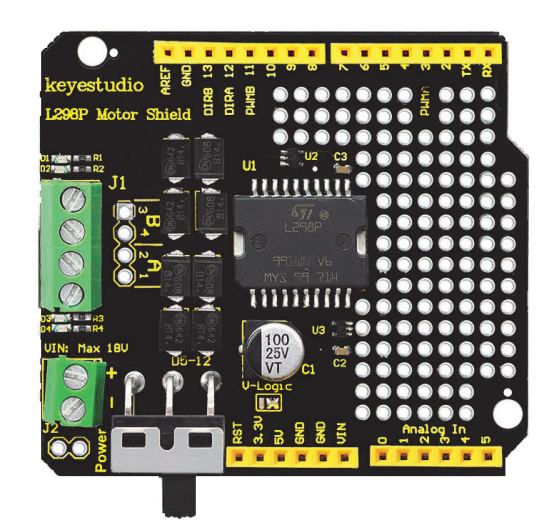 |
|        Ultrasonic module        |  1   | 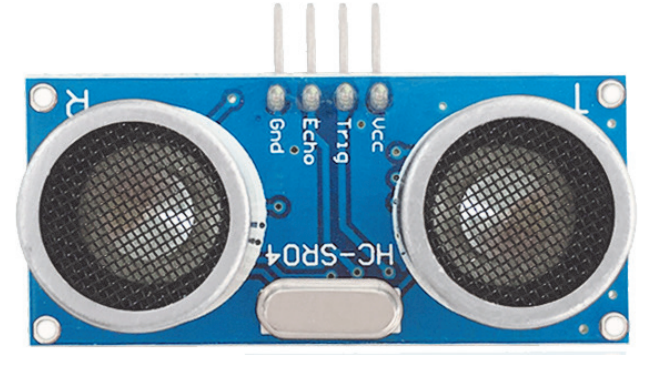 |
|     8X16 LED panel + wires      |  1   | 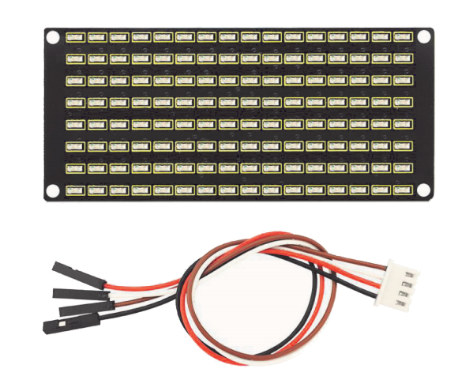 |
|           IR receiver           |  1   | 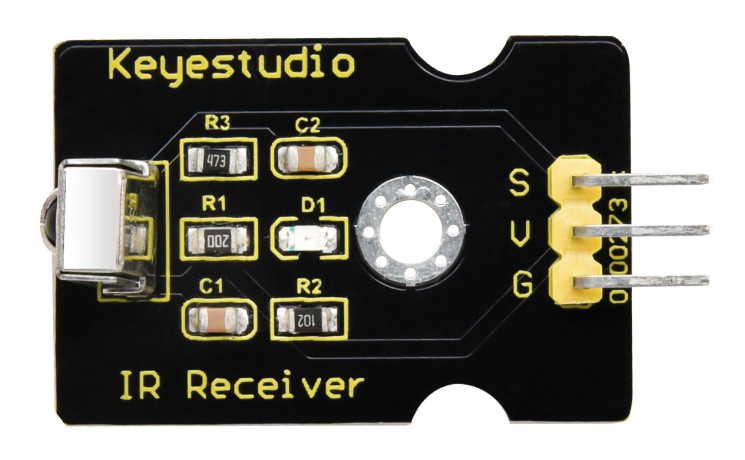 |
|         Remote control          |      | 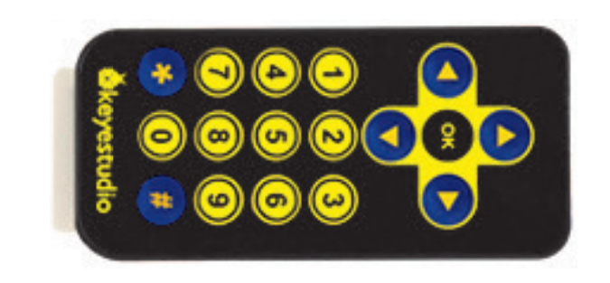 |
|        Caterpillar band         |  1   | 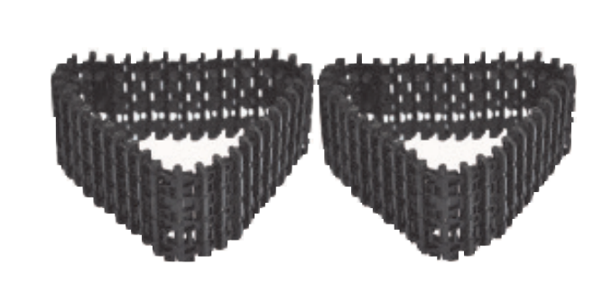 |
|         Battery holder          |  1   | 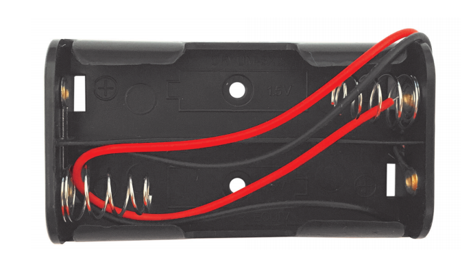 |
|     Tank load-bearing wheel     |  2   | 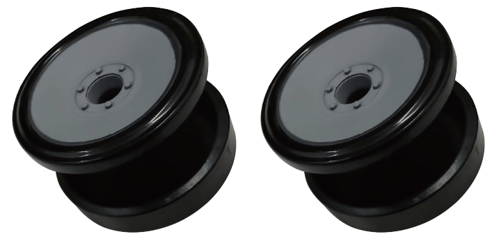 |
|         L-type Bracket          |  1   | 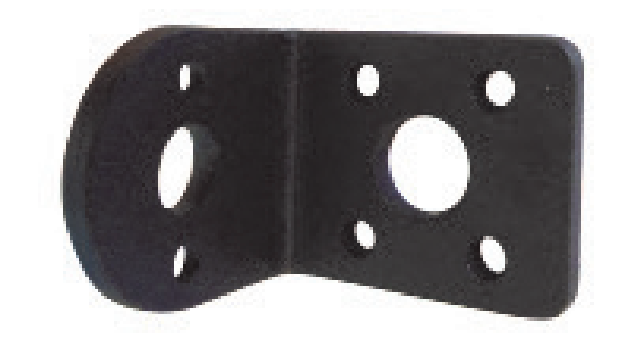 |
| Supportive parts (random color) |  2   | 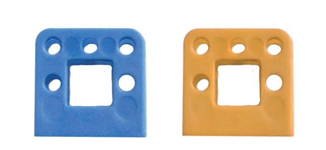 |
|          Metal holder           |  4   | 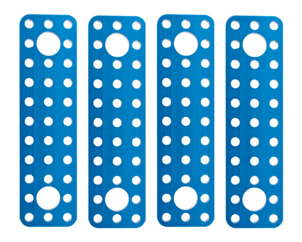 |
|          Winding pipe           |  1   | 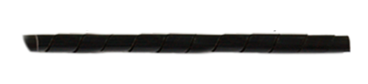 |
|      Plastic Platform (PC)      |  1   | 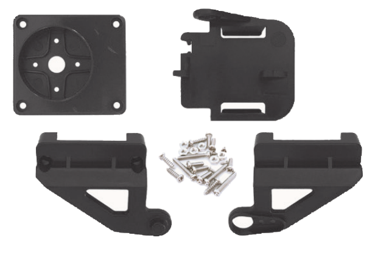 |
|        Aluminum coulper         |  2   | 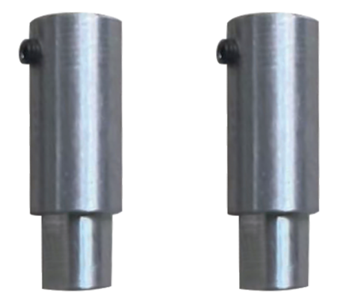 |
|          Aluminum bush          |  2   | 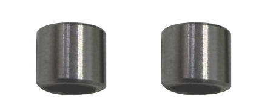 |
|       M4 self-locking nut       |  2   | 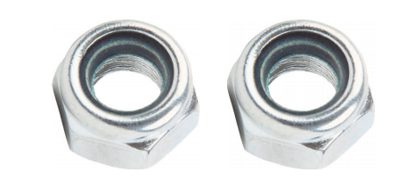 |
|             M3 nut              |  14  | 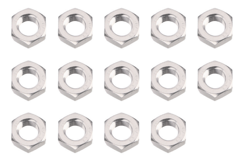 |
|          Acrylic board          |  2   |  |
|    M2*10mm round head screw     |  6   | 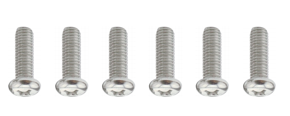 |
|           Screwdriver           |  2   | 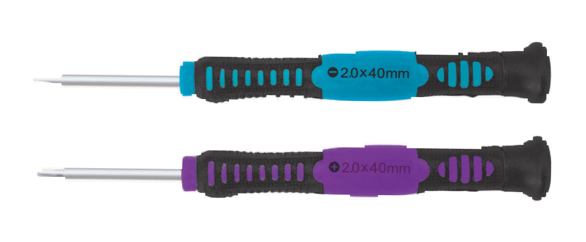 |
|           Nylon cable           |  6   | 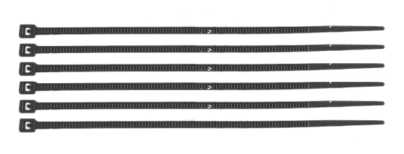 |
|        M1.5/2.5/3 wrench        |  3   | 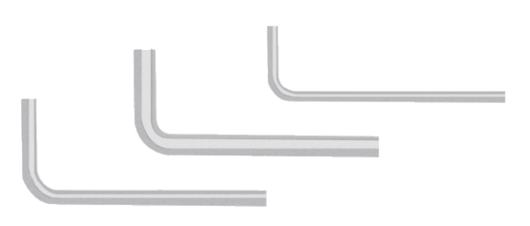 |
|      150mm F-F DuPont wire      |  10  | 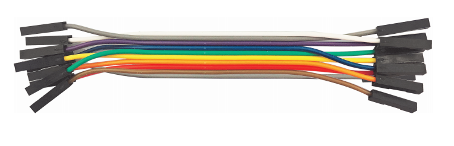 |
|            USB cable            |  1   | 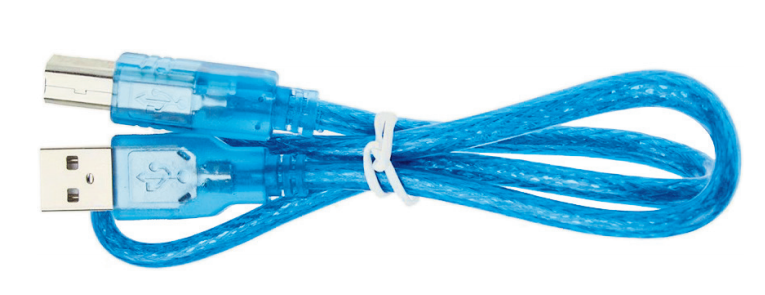 |
|      200mm F-F DuPont wire      |  5   | 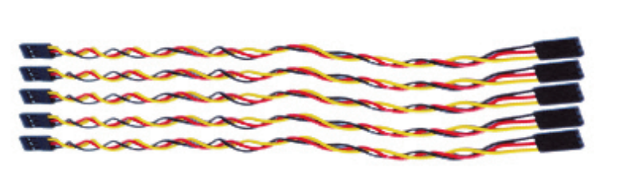 |
|         Flange bearing          |  4   | 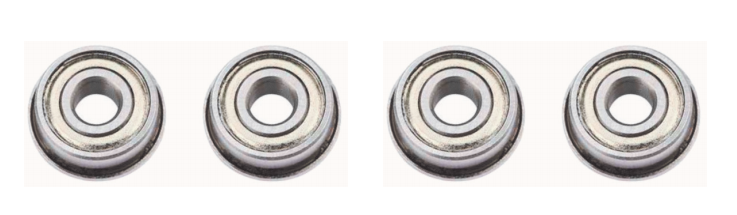 |
|             M2 nut              |  8   | 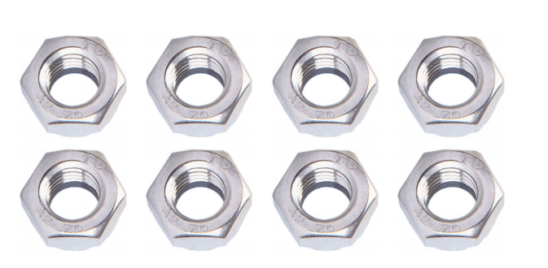 |
|             M4 nut              |  10  | 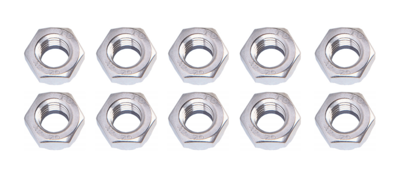 |
|      M3*10mm copper pillar      |  10  | 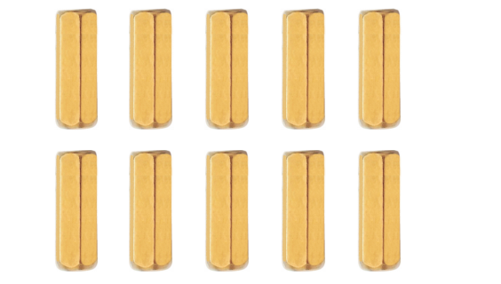 |
|      M3*45mm copper pillar      |  4   | 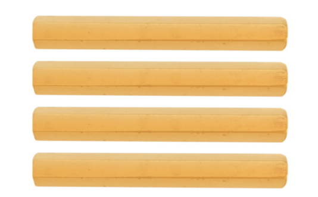 |
|    M3\*10mm flat head screw     |  3   | 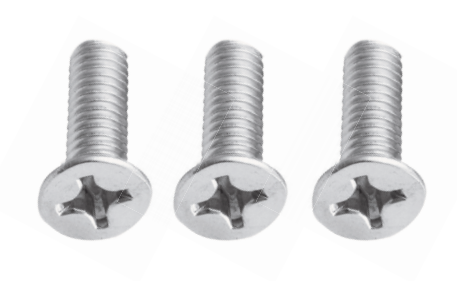 |
|          M3*6mm screw           |  20  | 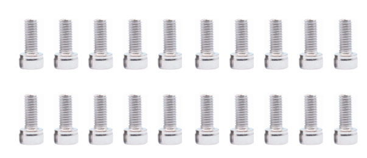 |
|          M4*50mm screw          |  2   | 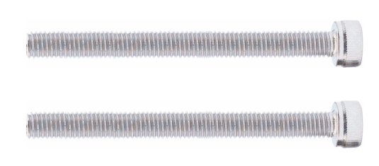 |
|          M4*40mm screw          |  4   | 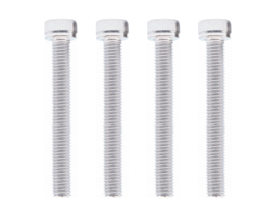 |
|          M3*8mm screw           |  14  | 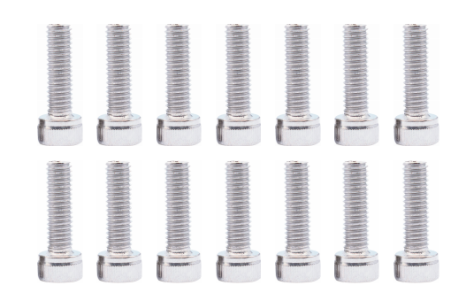 |
|    M3*12mm round head screw     |  8   | 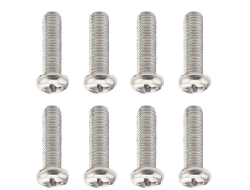 |
|         M4\*112mm Screw         |  4   | 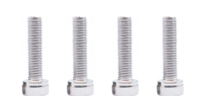 |
|         M3\*25mm Screw          |  4   | 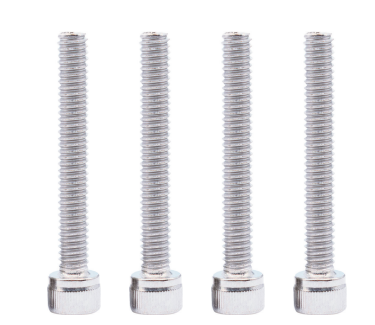 |
|      Decorative cardboard       |  1   |  |

## 1.5 Keyestudio V4.0 Development Board

You need to know that keyestudio V4.0 development board is the core of this smart car.

keyestudio V4.0 development board is an Arduino uno-compatible board, which is based on ATmega328P MCU, and with a cp2102 Chip as a UART-to-USB converter.

It has 14 digital input/output pins (of which 6 can be used as PWM outputs), 6 analog inputs, a 16 MHz quartz crystal, a USB connection, a power jack, 2 ICSP headers and a reset button.

It contains everything needed to support the microcontroller. Simply connect it to a computer with a USB cable or power it via an external DC power jack (DC 7-12V) or via female headers Vin/ GND(DC 7-12V) to get started.

| Microcontroller             | ATmega328P-PU                                            |
| --------------------------- | -------------------------------------------------------- |
| Operating Voltage           | 5V                                                       |
| Input Voltage (recommended) | DC7-12V                                                  |
| Digital I/O Pins            | 14 (D0-D13)  (of which 6 provide PWM output)             |
| PWM Digital I/O Pins        | 6 (D3, D5, D6, D9, D10, D11)                             |
| Analog Input Pins           | 6 (A0-A5)                                                |
| DC Current per I/O Pin      | 20 mA                                                    |
| DC Current for 3.3V Pin     | 50 mA                                                    |
| Flash Memory                | 32 KB (ATmega328P-PU) of which 0.5 KB used by bootloader |
| SRAM                        | 2 KB (ATmega328P-PU)                                     |
| EEPROM                      | 1 KB (ATmega328P-PU)                                     |
| Clock Speed                 | 16 MHz                                                   |
| LED_BUILTIN                 | D13                                                      |

