# 1. Product introduction

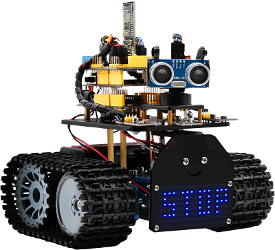

## 1.1 Introduction

Nowadays, technological education such as VR, kids’ programming, and artificial intelligence, has become a mainstream in educational industry. Thereby, people attach more importance to STEAM education.

As Arduino is notably famous in Maker education sector. Keyestuido surf this current and launch a smart mini tank robot which is a combination of Arduino and programming.

So what is Arduino? Arduino is an open-source electronics platform based on easy-to-use hardware and software. Arduino boards are able to read inputs - light on a sensor, a finger on a button, or a Twitter message - and turn it into an output - activating a motor, turning on an LED, publishing something online.

Based on this, Keyestudio team has designed a mini tank robot. It has a processor which is programmable using the Arduino IDE, to map its pins to sensors and actuators by a shield that plug in the processor, and it reads sensors and controls the actuators and decides how to operate.

It can perform multiple functions like obstacle avoidance, IR remote control, BT control, light following and so on.

Detailed 15 learning projects, from simple to complex, which guide you to build up your own smart mini tank robot and provide the basic knowledge of sensors and modules. Moreover, it is the best choice for graphical programming education.

## 1.2 Features

1. Multi-purpose function: Multi-purpose function: Obstacle avoidance, following, IR remote control, Bluetooth control, ultrasonic following and facial emoticons display.
2. Simple assembly: No soldering circuit required, complete assembly easily.
3. High Tenacity: Aluminum alloy bracket, metal motors, high quality wheels and tracks.
4. High extension: connect numerous sensors and modules through motor driver shield and sensor shield.
5. Multiple controls: IR remote control, App control(iOS and Android system)
6. Basic programming：C language code of Arduino IDE.

## 1.3 Specification

- Working voltage: 5v
- Input voltage: 7-12V
- Maximum output current: 2A
- Maximum power dissipation: 25W (T=75℃)
- Motor speed: 5V 200 rpm/min
- Motor drive mode: dual H bridge drive (L298P)
- Ultrasonic induction angle: \<15 degrees
- Ultrasonic detection distance: 2cm-400cm
- Infrared remote control distance: 10 meters (measured)
- Bluetooth remote control distance: 50 meters (measured)

## 1.4 Product List

| Electronic Parts |                                                 |      |                                          |
| ---------------- | ----------------------------------------------- | ---- | ---------------------------------------- |
| No.              | Name                                            | QTY  | Picture                                  |
| 1                | KEYESTUDIO V4.0 Development Board               | 1    | 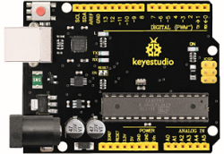 |
| 2                | L298P Shield                                    | 1    | 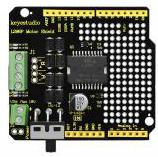 |
| 3                | V5 Sensor Shield                                | 1    | 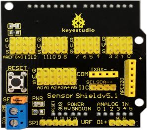 |
| 4                | HC-SR04 Ultrasonic Sensor                       | 1    | 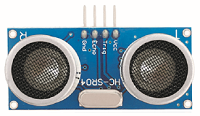 |
| 5                | HM-10 Bluetooth-4.0 Module                      | 1    | 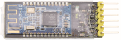 |
| 6                | Remote Control                                  | 1    | 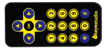 |
| 7                | 8X16 LED Panel                                  | 1    | 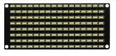 |
| 8                | HX-2.54 4P Female Dupont Line                   | 1    | 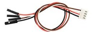 |
| 9                | 9G Servo Motor                                  | 1    | 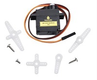 |
| 10               | IR Receiver Module                              | 1    | 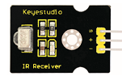 |
| 11               | Photocell Sensor                                | 2    | 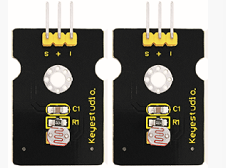 |
| 12               | Red LED                                         | 1    | 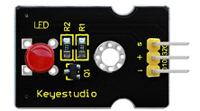 |
| Components       |                                                 |      |                                          |
| 1                | Acrylic Board                                   | 1    |  |
| 2                | Tank Robot Acrylic Board                        | 1    | 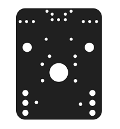 |
| 3                | Metal Holder                                    | 4    | 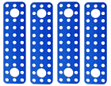 |
| 4                | L-type Bracket                                  | 1    | 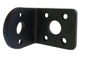 |
| 5                | Tank Driver Wheel                               | 2    | 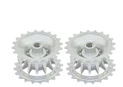 |
| 6                | Tank Load-bearing Wheel                         | 2    | 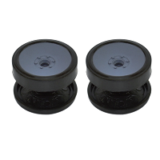 |
| 7                | Caterpillar Band                                | 2    | 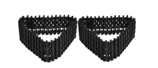 |
| 8                | Metal Motor                                     | 2    | 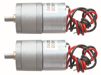 |
| 9                | Plastic Platform (PC)                           | 1    | 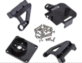 |
| 10               | USB Cable (1m)                                  | 1    | 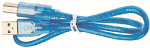 |
| 11               | 2.54 3pin F-F Dupont Wire 20cm                  | 5    | 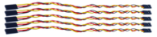 |
| 12               | F-F Dupont Wire (15CM)                          | 10   | 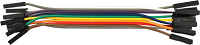 |
| 13               | Supportive Parts (27\*27\*16MM, Blue)           | 2    | 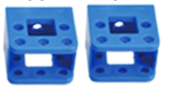 |
| 14               | 18650 2-Slot Battery Holder                     | 1    | 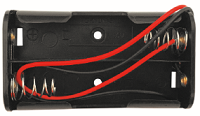 |
| 15               | （**Not included**）18650 Battery               | 2    | 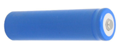 |
| Nuts/Screws      |                                                 |      |                                          |
| 1                | Copper Bush                                     | 2    | 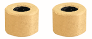 |
| 2                | Flange Bearing                                  | 4    | 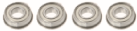 |
| 3                | Hexagon Copper Bush(M3\*10MM)                   | 10   | 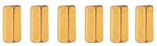 |
| 4                | Hexagon Copper Bush (M3\*45MM)                  | 4    | 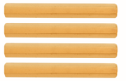 |
| 5                | Copper Coupler                                  | 2    | 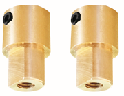 |
| 6                | M3\*10MM Flat Head Screws                       | 3    | 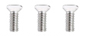 |
| 7                | Inner Hexagon Screws (M3\*6MM)                  | 20   | 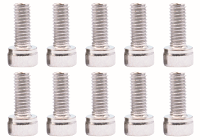 |
| 8                | Inner Hexagon Screws (M3\*8MM)                  | 10   | 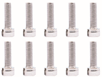 |
| 9                | Inner Hexagon Screws (M3\*25MM)                 | 4    | 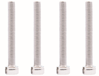 |
| 10               | Inner Hexagon Screws (M4\*12MM)                 | 4    | 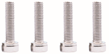 |
| 11               | Inner Hexagon Screws (M4\*40MM)                 | 4    | 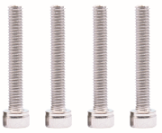 |
| 12               | Inner Hexagon Screws (M4\*50MM)                 | 2    | 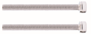 |
| 13               | M3 Nuts                                         | 14   | 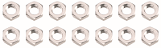 |
| 14               | M4 Self-locking Nuts                            | 2    | 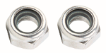 |
| 15               | M2 Nuts                                         | 8    | 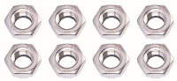 |
| 16               | M4 Nuts                                         | 10   | 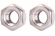 |
| 17               | M2\*10MM Round Head Screws                      | 6    | 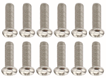 |
| 18               | M3\*12MM Round Head Screws                      | 8    | 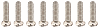 |
| Tools            |                                                 |      |                                          |
| 1                | 2.0\*40MM Blue and Black Slotted Screwdriver    | 1    | 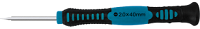 |
| 2                | 2.0\*40MM Purple and Black Phillips Screwdriver | 1    | 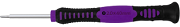 |
| 3                | M1.5 Hex Key Nickel Plated Allen Wrench         | 1    |  |
| 4                | M2.5 Hex Key Nickel Plated Allen Wrench         | 1    |  |
| 5                | M3 Hex Key Nickel Plated Allen Wrench           | 1    |  |
| 6                | Nylon Cable Ties                                | 6    | 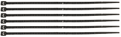 |
| 7                | 8MM Winding Pipe                                | 12CM | 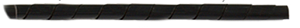 |
| 8                | Decorative Cardboard                            | 1    |  |

## 1.5 Keyestudio V4.0 Development Board

You need to know that keyestudio V4.0 development board is the core of this smart car.

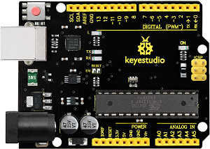

keyestudio V4.0 development board is an Arduino uno-compatible board, which is based on ATmega328P MCU, and with a cp2102 Chip as a UART-to-USB converter.

It has 14 digital input/output pins (of which 6 can be used as PWM outputs), 6 analog inputs, a 16 MHz quartz crystal, a USB connection, a power jack, 2 ICSP headers and a reset button.

It contains everything needed to support the microcontroller. Simply connect it to a computer with a USB cable or power it via an external DC power jack (DC 7-12V) or via female headers Vin/ GND(DC 7-12V) to get started.

| Microcontroller             | ATmega328P-PU                                            |
| --------------------------- | -------------------------------------------------------- |
| Operating Voltage           | 5V                                                       |
| Input Voltage (recommended) | DC7-12V                                                  |
| Digital I/O Pins            | 14 (D0-D13)  (of which 6 provide PWM output)             |
| PWM Digital I/O Pins        | 6 (D3, D5, D6, D9, D10, D11)                             |
| Analog Input Pins           | 6 (A0-A5)                                                |
| DC Current per I/O Pin      | 20 mA                                                    |
| DC Current for 3.3V Pin     | 50 mA                                                    |
| Flash Memory                | 32 KB (ATmega328P-PU) of which 0.5 KB used by bootloader |
| SRAM                        | 2 KB (ATmega328P-PU)                                     |
| EEPROM                      | 1 KB (ATmega328P-PU)                                     |
| Clock Speed                 | 16 MHz                                                   |
| LED_BUILTIN                 | D13                                                      |

