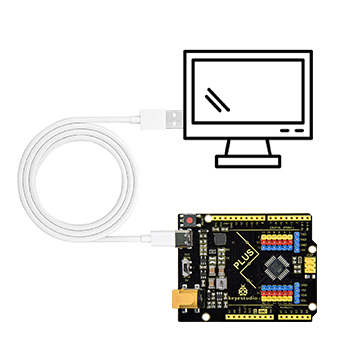
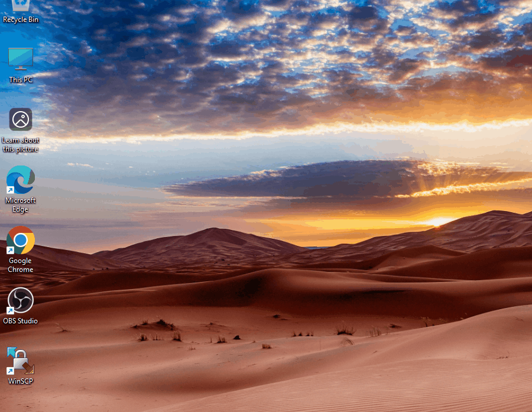
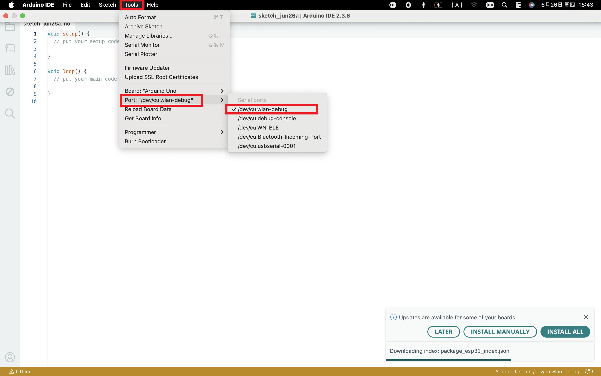
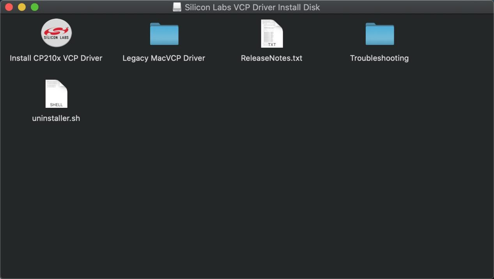
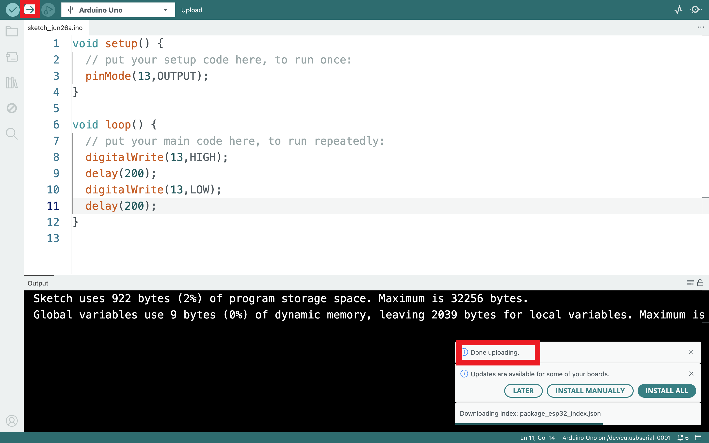

# 3. ドライバのインストール

> ドライバのインストールについては、開発ボードをコンピュータに接続すると、通常はドライバが自動的にインストールされるため、この手順は最初はスキップできます。接続後にボードが認識されない場合は、このセクションを参照してドライバをインストールしてください。

## 3.1 Windows システム

**ドライバの確認**

1. マザーボードをコンピュータに接続します。

2. デバイスマネージャーを開きます。デバイスマネージャーを開いて、**「Silicon Labs CP210x USB to UART Bridge (COMx)」**というプロンプトが表示されれば、ドライバがインストールされていることが証明されます。**「ドライバのインストール」**の部分はスキップしてください。

**手動ドライバのインストール**

1. ドライバのダウンロード

- Windows システム：[Windows システムドライバ](./Windows.7z)

2. マザーボードをコンピュータに接続し、デバイスマネージャーを開きます。画像のドライバの前に黄色い感嘆符がある場合は、ドライバがインストールされていないことが証明されます。ドライバをダウンロードして手動でインストールしてください。

## 3.2 MAC システム

**1 ドライバの確認**

開発ボードをコンピュータに接続し、[ツール] ---> [ポート] に従って開発ボードのポートを選択します（注意：どのポートが開発ボードであるかが確認できない場合は、マザーボードをコンピュータに接続して、すべてのポートを写真に撮って記録し、その後開発ボードを取り外して、再度すべてのポートを写真に撮って記録し、比較して消えたポートを見つけてください。消えたポートが開発ボードのポートです。その後、そのポートを選択してください）ポートが認識できない場合は、コンピュータの USB ポートを別のものに変更するか、周辺のケーブルを交換して再度認識を試みてください。それでも動作しない場合は、以下の手順に従ってドライバをインストールしてください。

**2 手動ドライバのインストール**

1. ドライバのダウンロード

​       Mac システム：[Mac システムドライバ](./Mac.7z)

2. ダウンロードしたドライバ zip パッケージをダブルクリックして解凍します

3. その後、インストールが完了するまで**「次へ」**をクリックし続けます

この時点で、ボードを再度接続するとポートが認識されます。

4. 次に Arduino IDE に移動し、「ツール」をクリックして、ボード Arduino Uno と認識された開発ボードのポートを選択します。

5. をクリックしてコードをアップロードし、「アップロード完了」と表示されます。

