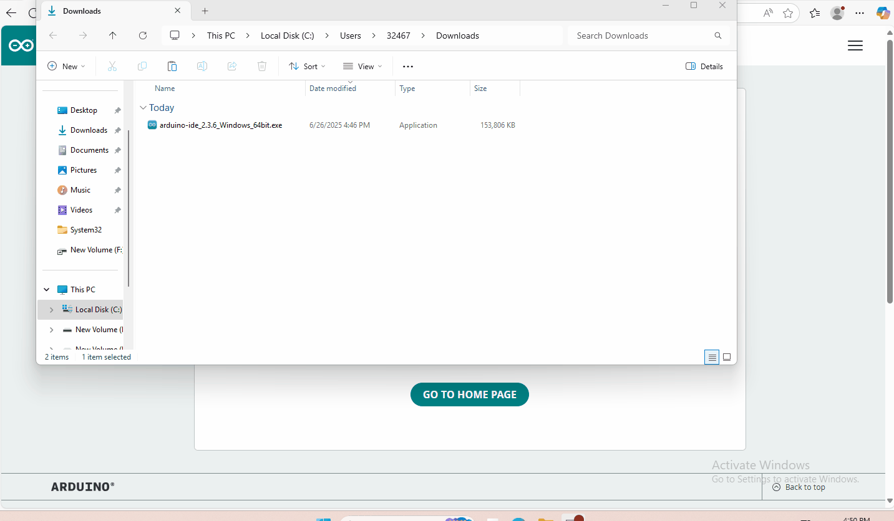
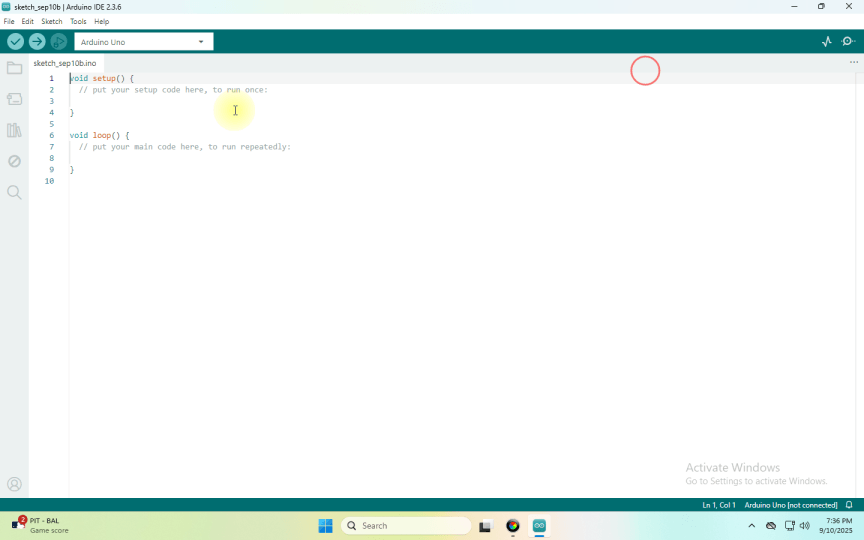

4. Arduino
==========

4.1 Data download
-----------------

Arduino information contains library files and project code ,please
click to download for follow-up study.

Data download: :download:`Arduino Data <./Arduino.7z>`

APP download:

Tank Car Android download: `Tank
Car <https://xiazai.keyesrobot.cn/APP/Tank%20Car.apk>`__

HC_BLE download: :download:`APP <./APP.7z>`

4.2 Software Download
---------------------

When we get control board, we need to download Arduino IDE and driver
firstly.

You could download Arduino IDE from the official website:
https://www.arduino.cc/en/software.

There are various versions for Arduino,just download a suitable version
for your system,we will take WINDOWS system as an example to show you
how to download and install.

|image1|

You just need to click JUSTDOWNLOAD,then click the downloaded file to
install it.

And when the ZIP file is downloaded,you can directly unzip and start it.

|image2|

4.3 Set Arduino IDE
-------------------

Connecting the board to the computer.

|image3|

4.4 Add Library
---------------

What are Libraries ?

Libraries are a collection of code that makes it easy for you to connect
to a sensor,display, module, etc.

There are hundreds of additional libraries available on the Internet for
download.

We will introduce the most simple way for you to add libraries .

|image4|

.. |image1| image:: ./media/Animati.gif

.. |image3| image:: ./media/Anima.gif

4.5 Project
---------------

.. toctree::
    :maxdepth: 1

    Project/Project1
    Project/Project2
    Project/Project3
    Project/Project4
    Project/Project5
    Project/Project6
    Project/Project7
    Project/Project8
    Project/Project9
    Project/Project10
    Project/Project11
    Project/Project12
    Project/Project13
    Project/Project14
    Project/Project15