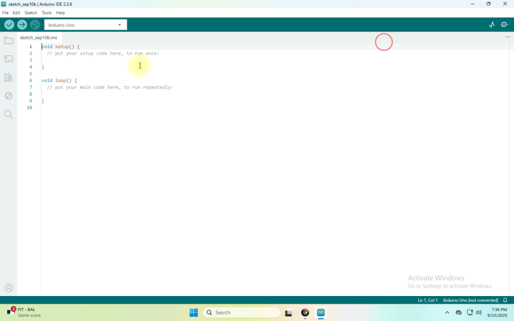

4. Arduino
==========

Aquí tienes la traducción al español del contenido que has proporcionado. He mantenido intactos los enlaces, nombres de archivos y marcadores de posición de imágenes tal como solicitaste:

4.1 Descarga de datos
---------------------

La información de Arduino contiene archivos de biblioteca y código del proyecto, por favor haz clic para descargar para el estudio posterior.

Descarga de datos: :download:`Arduino Data <./Arduino.7z>`

Descarga de la APP:

Descarga de Tank Car para Android: `Tank
Car <https://xiazai.keyesrobot.cn/APP/Tank%20Car.apk>`__

Descarga de HC_BLE: :download:`APP <./APP.7z>`

4.2 Descarga de software
------------------------

Cuando tengamos la placa de control, primero necesitamos descargar el IDE de Arduino y el controlador.

Puedes descargar el IDE de Arduino desde el sitio web oficial:
https://www.arduino.cc/en/software.

Hay varias versiones para Arduino, simplemente descarga una versión adecuada para tu sistema; tomaremos el sistema WINDOWS como ejemplo para mostrarte cómo descargar e instalar.

|image1|

Solo necesitas hacer clic en JUSTDOWNLOAD, luego haz clic en el archivo descargado para instalarlo.

Y cuando se descargue el archivo ZIP, puedes descomprimirlo y ejecutarlo directamente.

|image2|

4.3 Configurar Arduino IDE
--------------------------

Conecta la placa al ordenador.

|image3|

4.4 Añadir biblioteca
---------------------

¿Qué son las bibliotecas?

Las bibliotecas son una colección de código que te facilita la conexión con un sensor, pantalla, módulo, etc.

Hay cientos de bibliotecas adicionales disponibles en Internet para descargar.

Te presentaremos la forma más sencilla de añadir bibliotecas.

|image4|

.. |image1| image:: ./media/Animati.gif
.. |image2| image:: ./media/Animat.gif
.. |image3| image:: ./media/Anima.gif

4.5 Proyectos
---------------

.. toctree::
    :maxdepth: 1

    Project/Project1
    Project/Project2
    Project/Project3
    Project/Project4
    Project/Project5
    Project/Project6
    Project/Project7
    Project/Project8
    Project/Project9
    Project/Project10
    Project/Project11
    Project/Project12
    Project/Project13
    Project/Project14
    Project/Project15