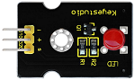
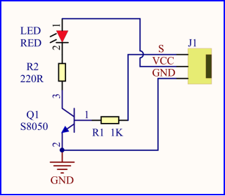
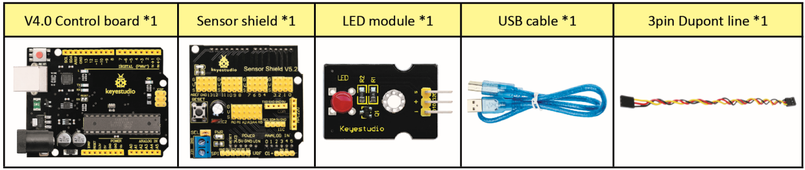
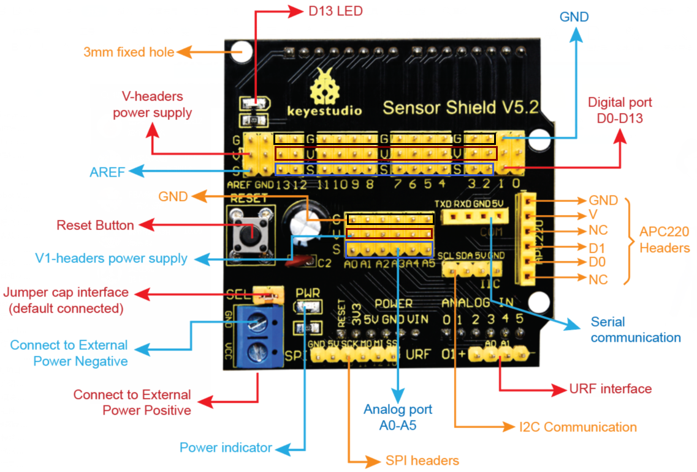
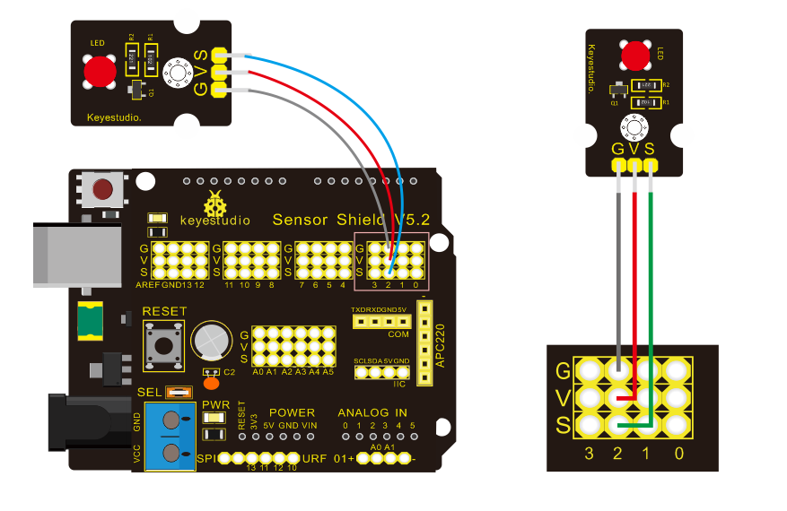
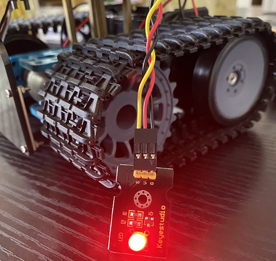
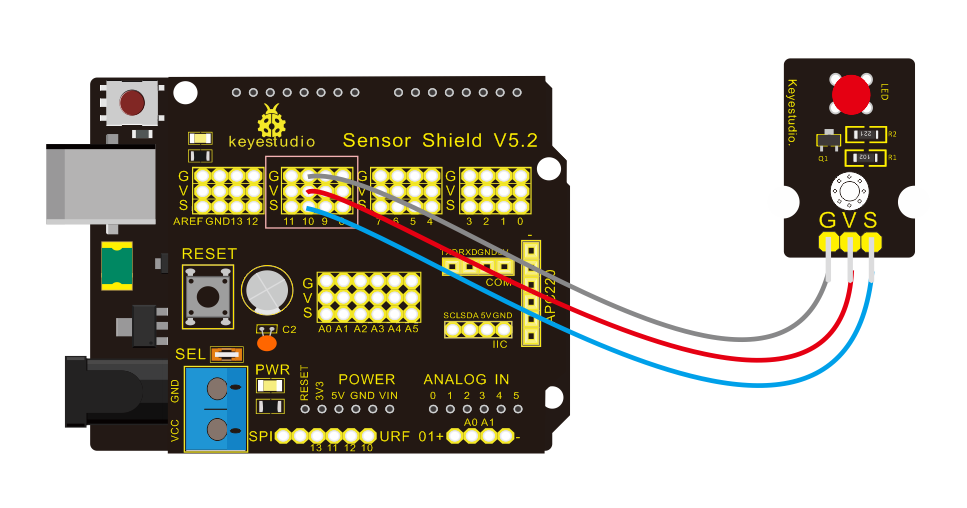

### Project 1 LED Blinks



**Description**

For starters and enthusiasts, LED Blink is a fundamental program. LED, the abbreviation of light emitting diodes, consists of Ga, As, P, N chemical compounds and so on. The LED can flash in diverse color by altering the delay time in the test code. When in control, power on GND and VCC, the LED will be on if S end is in high level; nevertheless, it will go off.

**Specification**



- Control interface: digital port
- Working voltage: DC 3.3-5V
- Pin spacing: 2.54mm
- LED display color: red

**Components**



**V5 Sensor Shield**

It will be troublesome when we combine Arduino development boards with numerous sensors. However, the V5 sensor shield, compatible with Arduino development board, addresses this problem perfectly. Just stack V5 board on it.

This sensor shield can be inserted into 3pin sensor modules and breaks out some communication pins, like serial, IIC, and SPI communication as well.

**Pins Description**



**Connection Diagram**



Seen from the above diagram, LED is linked with D2.

 **Test Code**

```
/*
 keyestudio Mini Tank Robot V2
 lesson 1.1
 Blink
 http://www.keyestudio.com
*/
void setup()
{ 
    pinMode(2, OUTPUT);// initialize digital pin 2 as an output.
}

void loop() // the loop function runs over and over again forever
{
   digitalWrite(2, HIGH); // turn the LED on (HIGH is the voltage level)
   delay(1000); // wait for a second
   digitalWrite(2, LOW); // turn the LED off by making the voltage LOW
   delay(1000); // wait for a second
}
```

 **Test Result**

(There will be contradiction about serial communication between code and Bluetooth when uploading code. Therefore, don’t link with Bluetooth module before uploading code.)

Upload the program on the development board, LED flickers at the interval of 1s.



**Code Explanation**

**pinMode(2，OUTPUT) -** Set pin2 to OUTPUT

**digitalWrite(2，HIGH) -** When set pin2 to HIGH level(output 5V) or to LOW level(output 0V)

**Extension Practice**

We succeed in blinking LED. Next, let’s observe what LED will change if we modify pins and delay time.

**Connection Diagram**



We’ve altered pins and connected LED to D10.

 **Test Code**

```
/*
 keyestudio Mini Tank Robot V2
 lesson 1.2
 delay
 http://www.keyestudio.com
*/
void setup() // initialize digital pin 10 as an output.
{  
   pinMode(10, OUTPUT);
}

// the loop function runs over and over again forever
void loop() 
{
   digitalWrite(10, HIGH); // turn the LED on (HIGH is the voltage level)
   delay(100); // wait for 0.1 second
   digitalWrite(10, LOW); // turn the LED off by making the voltage LOW
   delay(100); // wait for 0.1 second
}
```

The test result shows that the LED flashes faster. Therefore, we can draw a conclusion that pins and time delaying affect flash frequency.