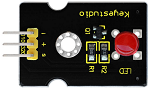
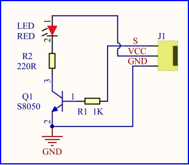
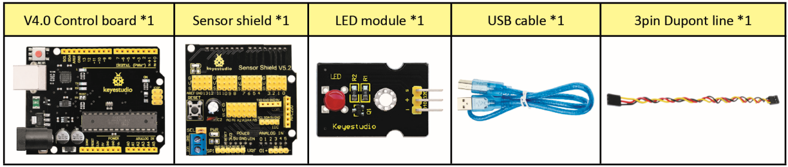
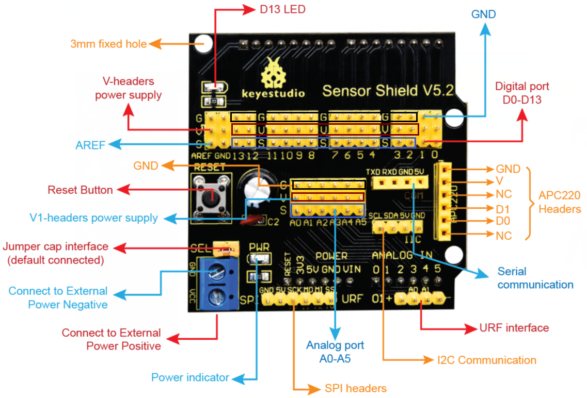
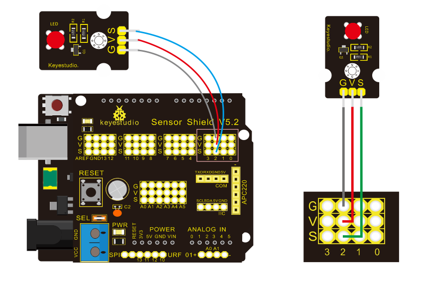
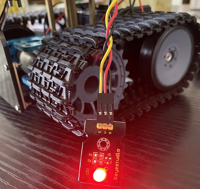
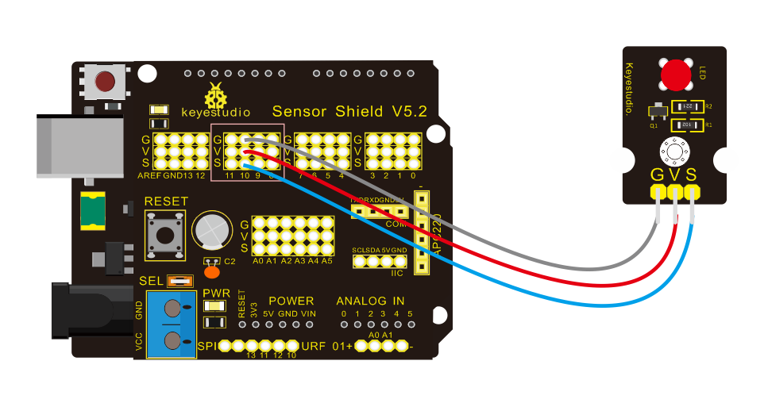

# プロジェクト1 LED点滅



**説明**

初心者と愛好家向けに、LED点滅は基本的なプログラムです。LED（発光ダイオードの略）は、Ga、As、P、N化合物などで構成されています。テストコード内の遅延時間を変更することで、LEDはさまざまな色で点滅させることができます。制御時に、GNDとVCCに電源を供給すると、S端子が高レベルの場合はLEDが点灯します。それ以外の場合は消灯します。

**仕様**



- 制御インターフェース：デジタルポート
- 動作電圧：DC 3.3-5V
- ピン間隔：2.54mm
- LED表示色：赤

**部品**



**V5センサーシールド**

Arduino開発ボードと多数のセンサーを組み合わせる場合、面倒になることがあります。しかし、Arduino開発ボードと互換性のあるV5センサーシールドは、この問題を完全に解決します。V5ボードをその上に積み重ねるだけです。

このセンサーシールドは3ピンセンサーモジュールを挿入でき、シリアル、IIC、SPI通信などの通信ピンを引き出すことができます。

**ピン説明**



**接続図**



上の図から、LEDはD2に接続されていることがわかります。

**テストコード**

```c
/*
 keyestudio Mini Tank Robot V2.1
 lesson 1.1
 Blink
 http://www.keyestudio.com
*/
void setup()
{ 
    pinMode(2, OUTPUT);// デジタルピン2を出力として初期化します
}

void loop() // ループ関数は永遠に繰り返し実行されます
{
   digitalWrite(2, HIGH); // LEDをオンにします（HIGHは電圧レベル）
   delay(1000); // 1秒待機します
   digitalWrite(2, LOW); // 電圧をLOWにしてLEDをオフにします
   delay(1000); // 1秒待機します
}
```

**テスト結果**

（コードをアップロードする際、シリアル通信とBluetoothの間に矛盾が生じる可能性があります。したがって、コードをアップロードする前にBluetoothモジュールを接続しないでください。）

プログラムを開発ボードにアップロードすると、LEDは1秒間隔で点滅します。



**コード説明**

**pinMode(2，OUTPUT) -** ピン2をOUTPUTに設定します

**digitalWrite(2，HIGH) -** ピン2をHIGHレベル（5V出力）またはLOWレベル（0V出力）に設定します

**応用練習**

LEDの点滅に成功しました。次に、ピンと遅延時間を変更した場合、LEDがどのように変わるかを観察しましょう。

**接続図**



ピンを変更し、LEDをD10に接続しました。

**テストコード**

```c
/*
 keyestudio Mini Tank Robot V2.1
 lesson 1.2
 delay
 http://www.keyestudio.com
*/
void setup() // デジタルピン10を出力として初期化します
{  
   pinMode(10, OUTPUT);
}

// ループ関数は永遠に繰り返し実行されます
void loop() 
{
   digitalWrite(10, HIGH); // LEDをオンにします（HIGHは電圧レベル）
   delay(100); // 0.1秒待機します
   digitalWrite(10, LOW); // 電圧をLOWにしてLEDをオフにします
   delay(100); // 0.1秒待機します
}
```

テスト結果から、LEDがより速く点滅することがわかります。したがって、ピンと時間遅延が点滅周波数に影響することが結論づけられます。