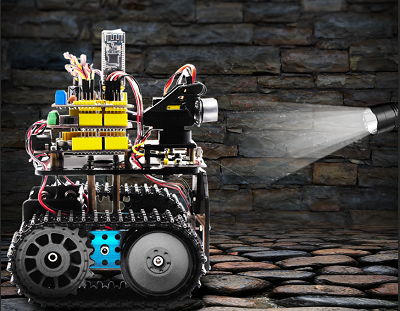
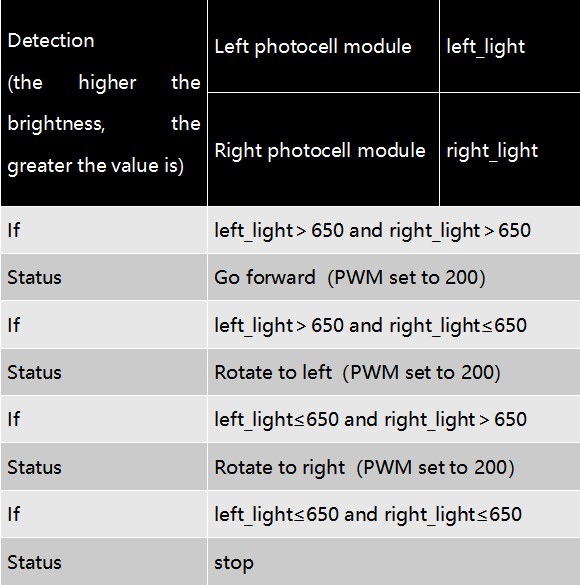
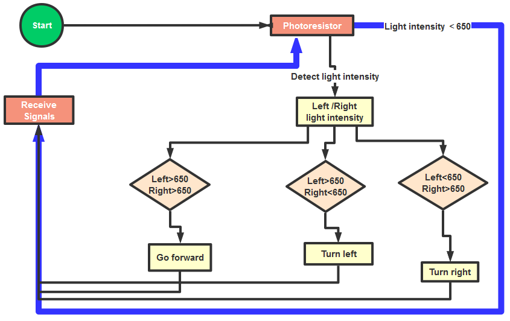
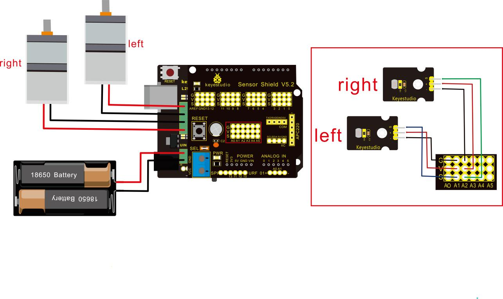

### Project 10 Light Following Robot



**Description**

We’ve introduce how to use various sensors, modules.

In this lesson, we combine with hardware knowledge -- photoresistor module, motor driving, to build a light-following robot!

Just need to use 2 photoresistor modules to detect the light intensity at the both side of robot. Read the analog value to rotate the 2 motors, thus drive the tank robot run.

**The specific logic of light following robot is shown as the table below:**



We make a flow chart based on the above logic table, as shown below:



**Connection Diagram**



<span style="color: rgb(255, 76, 65);">Attention:</span>

The 4Pin terminal block is marked with silkscreen 1234. The red line of right rear motor is connected to terminal 1, black line is linked with end 2. The red line of left front motor is attached to terminal 3, black line is linked with port 4.

| Left photo resistor      |      | Sensor Shield     |
| ------------------------ | ---- | ----------------- |
| -                        | →    | G（GND）          |
| +                        | →    | V（VCC）          |
| S                        | →    | A1                |
|                          |      |                   |
| **Right Photo resistor** |      | **Sensor Shield** |
| -                        | →    | G（GND）          |
| +                        | →    | V（VCC）          |
| S                        | →    | A2                |

**Test Code**

```
/*
 keyestudio Mini Tank Robot v2.0
 lesson 10
 Light-following tank
 http://www.keyestudio.com
*/ 
#define light_L_Pin A1   //define the pin of left photo resistor
#define light_R_Pin A2   //define the pin of right photo resistor
#define ML_Ctrl 13  //define the direction control pin of left motor
#define ML_PWM 11   //define the PWM control pin of left motor
#define MR_Ctrl 12  //define the direction control pin of right motor
#define MR_PWM 3   //define the PWM control pin of right motor
int left_light; 
int right_light;
void setup(){
  Serial.begin(9600);
  pinMode(light_L_Pin, INPUT);
  pinMode(light_R_Pin, INPUT);
  pinMode(ML_Ctrl, OUTPUT);
  pinMode(ML_PWM, OUTPUT);
  pinMode(MR_Ctrl, OUTPUT);
  pinMode(MR_PWM, OUTPUT);
}
void loop(){
  left_light = analogRead(light_L_Pin);
  right_light = analogRead(light_R_Pin);
  Serial.print("left_light_value = ");
  Serial.println(left_light);
  Serial.print("right_light_value = ");
  Serial.println(right_light);
  if (left_light > 650 && right_light > 650) //the value detected photo resistor，go front
  {  
    Car_front();
  } 
  else if (left_light > 650 && right_light <= 650)  //the value detected photo resistor，turn left
  {
    Car_left();
  } 
  else if (left_light <= 650 && right_light > 650) //the value detected photo resistor，turn right
  {
    Car_right();
  } 
  else  //other situations, stop
  {
    Car_Stop();
  }
}
void Car_front()
{
  digitalWrite(MR_Ctrl,LOW);
  analogWrite(MR_PWM,200);
  digitalWrite(ML_Ctrl,LOW);
  analogWrite(ML_PWM,200);
}
void Car_left()
{
  digitalWrite(MR_Ctrl,LOW);
  analogWrite(MR_PWM,200);
  digitalWrite(ML_Ctrl,HIGH);
  analogWrite(ML_PWM,200);
}
void Car_right()
{
  digitalWrite(MR_Ctrl,HIGH);
  analogWrite(MR_PWM,200);
  digitalWrite(ML_Ctrl,LOW);
  analogWrite(ML_PWM,200);
}
void Car_Stop()
{
  digitalWrite(MR_Ctrl,LOW);
  analogWrite(MR_PWM,0);
  digitalWrite(ML_Ctrl,LOW);
  analogWrite(ML_PWM,0);
}
//****************************************************************
```

**Test Result**

Upload code on keyestudio V4.0 development board, DIP switch is dialed to right end and power on, the smart robot follows light to move.

