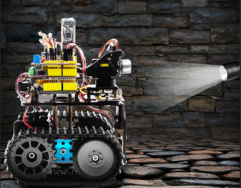
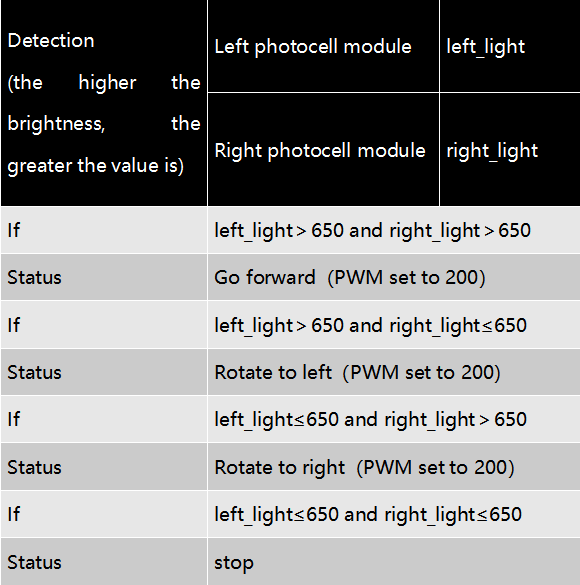
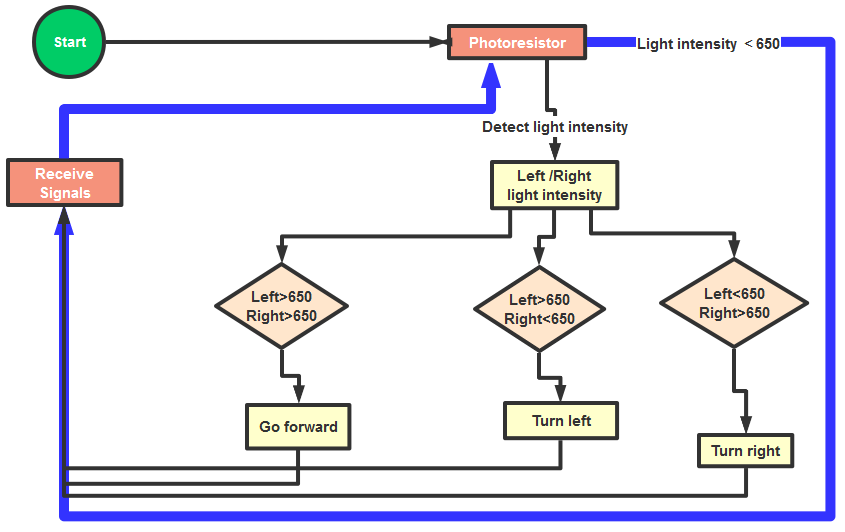
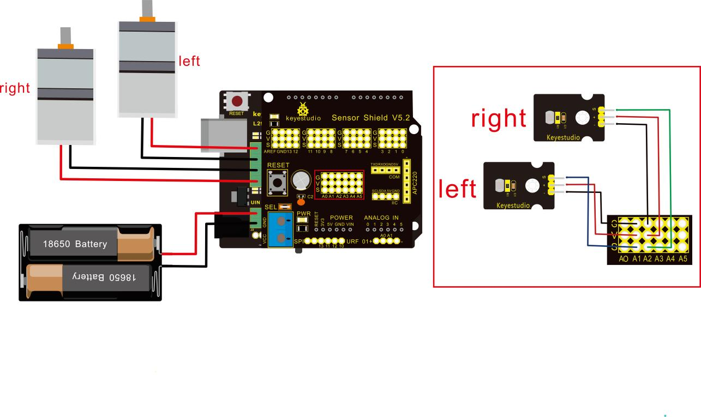

# Projekt 10 Lichtfolge-Roboter



**Beschreibung**

Wir haben bereits gezeigt, wie man verschiedene Sensoren und Module verwendet.

In dieser Lektion kombinieren wir unser Hardware-Wissen – Fotowiderstandsmodul, Motorsteuerung – um einen Lichtfolge-Roboter zu bauen!

Wir benötigen nur 2 Fotowiderstandsmodule, um die Lichtintensität auf beiden Seiten des Roboters zu erfassen. Durch das Auslesen der Analogwerte steuern wir die 2 Motoren an und lassen den Panzerroboter fahren.

**Die spezifische Logik des Lichtfolge-Roboters ist in der folgenden Tabelle dargestellt:**



Wir erstellen ein Flussdiagramm basierend auf der obigen Logiktabelle, wie unten gezeigt:



**Schaltplan**



**Achtung:**

Der 4-polige Anschlussblock ist mit dem Siebdruck 1234 gekennzeichnet. Die rote Leitung des rechten Hintermotor ist mit Anschluss 1 verbunden, die schwarze Leitung mit Anschluss 2. Die rote Leitung des linken Vordermotor ist mit Anschluss 3 verbunden, die schwarze Leitung mit Anschluss 4.

| Linker Fotowiderstand    |      | Sensor Shield     |
| ------------------------ | ---- | ----------------- |
| -                        | →    | G（GND）          |
| +                        | →    | V（VCC）          |
| S                        | →    | A1                |
|                          |      |                   |
| **Rechter Fotowiderstand** |      | **Sensor Shield** |
| -                        | →    | G（GND）          |
| +                        | →    | V（VCC）          |
| S                        | →    | A2                |

**Test-Code**

```c
/*
 keyestudio Mini Tank Robot V2.1
 Lektion 10
 Lichtfolge-Panzer
 http://www.keyestudio.com
*/ 
#define light_L_Pin A1   // definiere den Pin des linken Fotowiderstand
#define light_R_Pin A2   // definiere den Pin des rechten Fotowiderstand
#define ML_Ctrl 13  // definiere den Richtungssteuerpin des linken Motors
#define ML_PWM 11   // definiere den PWM-Steuerpin des linken Motors
#define MR_Ctrl 12  // definiere den Richtungssteuerpin des rechten Motors
#define MR_PWM 3   // definiere den PWM-Steuerpin des rechten Motors
int left_light; 
int right_light;
void setup(){
  Serial.begin(9600);
  pinMode(light_L_Pin, INPUT);
  pinMode(light_R_Pin, INPUT);
  pinMode(ML_Ctrl, OUTPUT);
  pinMode(ML_PWM, OUTPUT);
  pinMode(MR_Ctrl, OUTPUT);
  pinMode(MR_PWM, OUTPUT);
}
void loop(){
  left_light = analogRead(light_L_Pin);
  right_light = analogRead(light_R_Pin);
  Serial.print("left_light_value = ");
  Serial.println(left_light);
  Serial.print("right_light_value = ");
  Serial.println(right_light);
  if (left_light > 650 && right_light > 650) // der vom Fotowiderstand erfasste Wert, fahre vorwärts
  {  
    Car_front();
  } 
  else if (left_light > 650 && right_light <= 650)  // der vom Fotowiderstand erfasste Wert, drehe nach links
  {
    Car_left();
  } 
  else if (left_light <= 650 && right_light > 650) // der vom Fotowiderstand erfasste Wert, drehe nach rechts
  {
    Car_right();
  } 
  else  // andere Situationen, stoppe
  {
    Car_Stop();
  }
}
void Car_front()
{
  digitalWrite(MR_Ctrl,LOW);
  analogWrite(MR_PWM,200);
  digitalWrite(ML_Ctrl,LOW);
  analogWrite(ML_PWM,200);
}
void Car_left()
{
  digitalWrite(MR_Ctrl,LOW);
  analogWrite(MR_PWM,200);
  digitalWrite(ML_Ctrl,HIGH);
  analogWrite(ML_PWM,200);
}
void Car_right()
{
  digitalWrite(MR_Ctrl,HIGH);
  analogWrite(MR_PWM,200);
  digitalWrite(ML_Ctrl,LOW);
  analogWrite(ML_PWM,200);
}
void Car_Stop()
{
  digitalWrite(MR_Ctrl,LOW);
  analogWrite(MR_PWM,0);
  digitalWrite(ML_Ctrl,LOW);
  analogWrite(ML_PWM,0);
}
//****************************************************************
```

**Test-Ergebnis**

Laden Sie den Code auf das keyestudio V4.0 Entwicklungsboard hoch, stellen Sie den DIP-Schalter auf die rechte Position und schalten Sie die Stromversorgung ein. Der intelligente Roboter folgt dem Licht und bewegt sich.