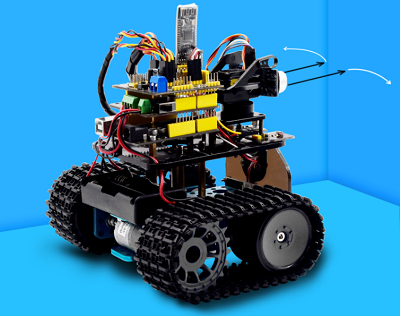
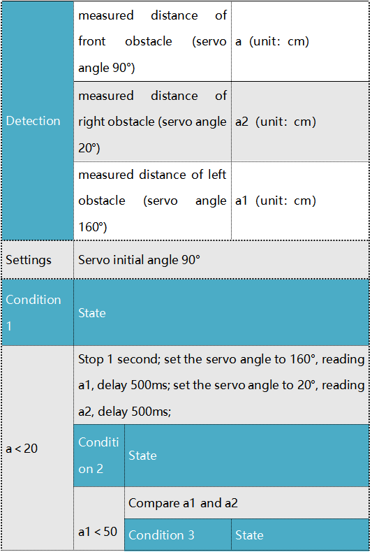
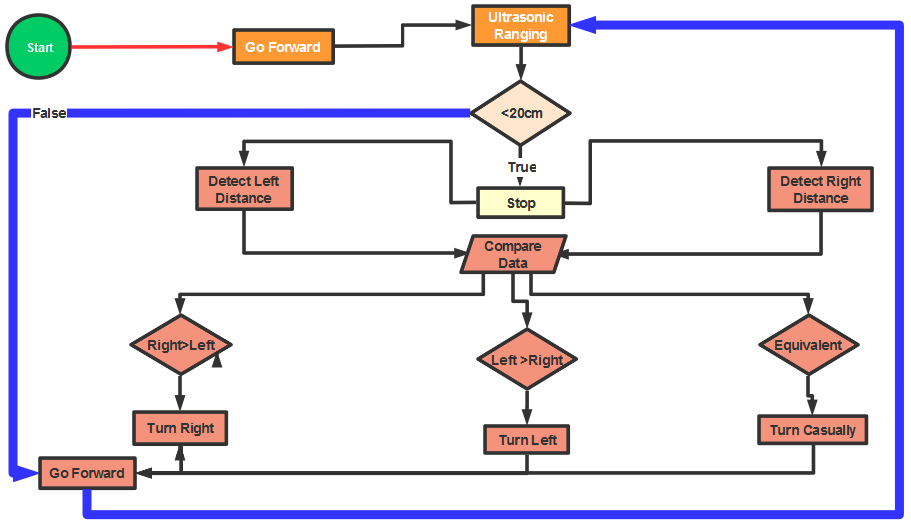
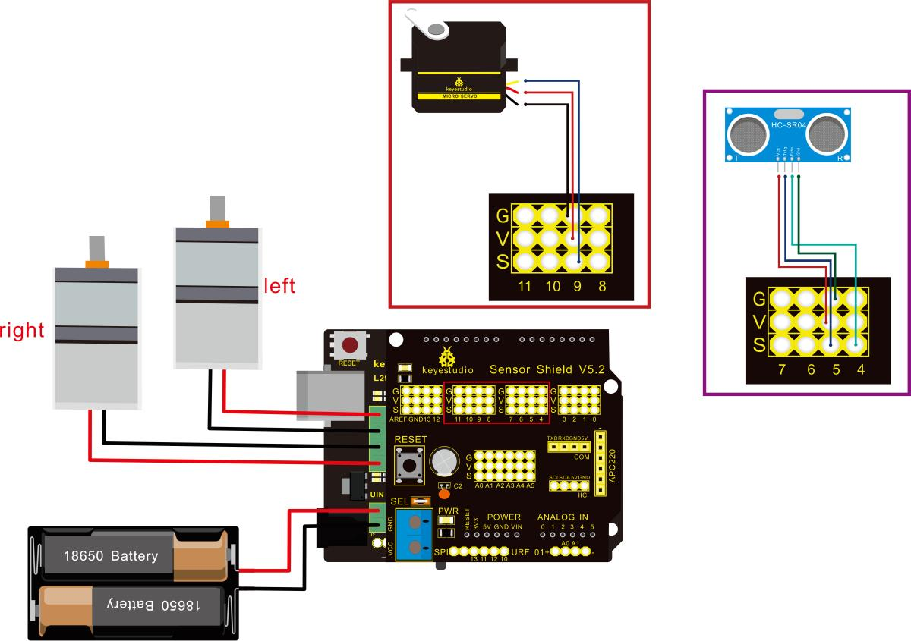

### Project 11 Ultrasonic Avoiding Tank



**Description**

In this program, the ultrasonic sensor detects the distance of obstacle to send signals that control the robot car. Next, let’s show you how to make an obstacle avoidance car.

**The specific logic of ultrasonic avoiding robot is as shown below:**



 **Flow chart**



**Connection Diagram：**



Note: “-”、“+” and “S” pins of servo are respectively attached to G（GND）, V（VCC）and D9 of expansion board. The VCC, Trig, Echo and Gnd of ultrasonic sensor are linked with 5v(V), 5(S), Echo and Gnd(G) of expansion board.

**Test Code:**

```
/*
 keyestudio Mini Tank Robot v2.0
 lesson 11
 ultrasonic_avoid_tank
 http://www.keyestudio.com
*/
int random2;
int a;
int a1;
int a2;
#define ML_Ctrl 13  //define the direction control pin of left motor
#define ML_PWM 11   //define PWM control pin of left motor
#define MR_Ctrl 12  //define the direction control pin of right motor
#define MR_PWM 3   //define PWM control pin of right motor

#define Trig 5  //ultrasonic trig Pin
#define Echo 4  //ultrasonic echo Pin
int distance;
#define servoPin 9  //servo Pin
int pulsewidth;
/************the function to run motor**************/
void Car_front()
{
  digitalWrite(MR_Ctrl,LOW);
  analogWrite(MR_PWM,200);
  digitalWrite(ML_Ctrl,LOW);
  analogWrite(ML_PWM,200);
}
void Car_back()
{
  digitalWrite(MR_Ctrl,HIGH);
  analogWrite(MR_PWM,200);
  digitalWrite(ML_Ctrl,HIGH);
  analogWrite(ML_PWM,200);
}
void Car_left()
{
  digitalWrite(MR_Ctrl,LOW);
  analogWrite(MR_PWM,255);
  digitalWrite(ML_Ctrl,HIGH);
  analogWrite(ML_PWM,255);
}
void Car_right()
{
  digitalWrite(MR_Ctrl,HIGH);
  analogWrite(MR_PWM,255);
  digitalWrite(ML_Ctrl,LOW);
  analogWrite(ML_PWM,255);
}
void Car_Stop()
{
  digitalWrite(MR_Ctrl,LOW);
  analogWrite(MR_PWM,0);
  digitalWrite(ML_Ctrl,LOW);
  analogWrite(ML_PWM,0);
}

//The function to control servo
void procedure(int myangle) {
  for (int i = 0; i <= 50; i = i + (1)) {
    pulsewidth = myangle * 11 + 500;
    digitalWrite(servoPin,HIGH);
    delayMicroseconds(pulsewidth);
    digitalWrite(servoPin,LOW);
    delay((20 - pulsewidth / 1000));
  }
}
//The function to control ultrasonic sensor
float checkdistance() {
  digitalWrite(Trig, LOW);
  delayMicroseconds(2);
  digitalWrite(Trig, HIGH);
  delayMicroseconds(10);
  digitalWrite(Trig, LOW);
  float distance = pulseIn(Echo, HIGH) / 58.00;  //58.20, that is, 2*29.1=58.2
  delay(10);
  return distance;
}
  //****************************************************************
void setup(){
  pinMode(servoPin, OUTPUT);
  procedure(90); //set servo to 90°
  
  pinMode(Trig, OUTPUT);
  pinMode(Echo, INPUT);
  pinMode(ML_Ctrl, OUTPUT);
  pinMode(ML_PWM, OUTPUT);
  pinMode(MR_Ctrl, OUTPUT);
  pinMode(MR_PWM, OUTPUT);
}
void loop(){
  random2 = random(1, 100);
  a = checkdistance();  //assign the front distance detected by ultrasonic sensor to variable a
  
  if (a < 20) //when the front distance detected is less than 20 
  {
      Car_Stop();  //robot stops
      delay(500); //delay in 500ms
      procedure(160);  //Ultrasonic platform turns left
      for (int j = 1; j <= 10; j = j + (1)) { //for statement, the data will be more accurate if ultrasonic sensor detect a few times.
        a1 = checkdistance();  //assign the left distance detected by ultrasonic sensor to variable a1
      }
      delay(300);
      procedure(20); //Ultrasonic platform turns right
      for (int k = 1; k <= 10; k = k + (1)) {
        a2 = checkdistance(); //assign the right distance detected by ultrasonic sensor to variable a2
      }
      
      if (a1 < 50 || a2 < 50)  //robot will turn to the longer distance side when left or right distance is less than 50cm. 
      {
        if (a1 > a2) //left distance is greater than right side      
        {
          procedure(90);  //Ultrasonic platform turns back to right ahead         
Car_left();  //robot turns left
          delay(500);  //turn left for 500ms
          Car_front(); //go front
        } 
        else 
        {
          procedure(90);
          Car_right(); //robot turns right
          delay(500);
          Car_front();  //go front
        }
      } 
      else  //If both side is greater than or equal to 50cm, turn left or right randomly
      {
        if ((long) (random2) % (long) (2) == 0)  //When the random number is even
        {
          procedure(90);
          Car_left(); //tank robot turns left
          delay(500);
          Car_front(); //go front
        } 
        else 
        {
          procedure(90);
          Car_right(); //robot turns right
          delay(500);
          Car_front(); //go front
       }
     }
  } 
  else  //If the front distance is greater than or equal to 20cm, robot car will go front
  {
      Car_front(); //go front
  }
}
```

 **Test Result**

Upload code successfully, DIP switch is dialed to the right end and power on, tank robot goes forward and automatically avoids the obstacle.