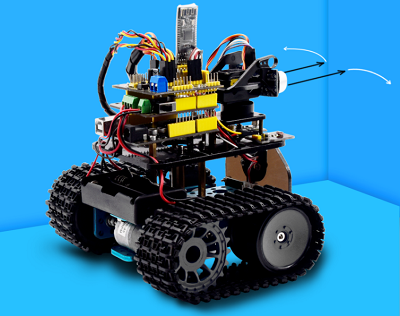
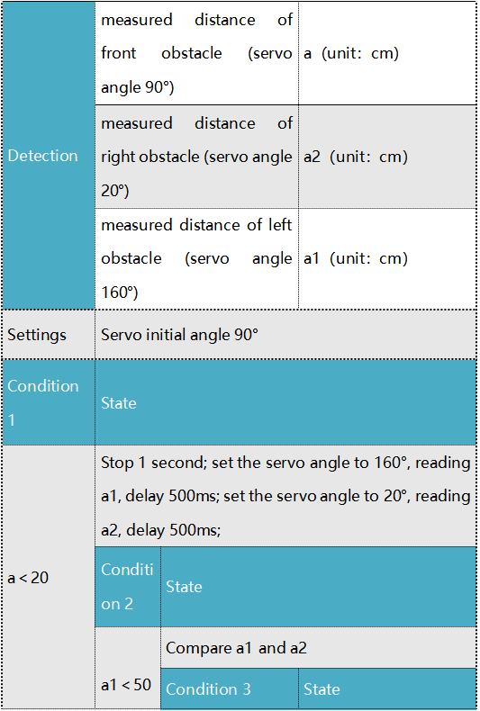
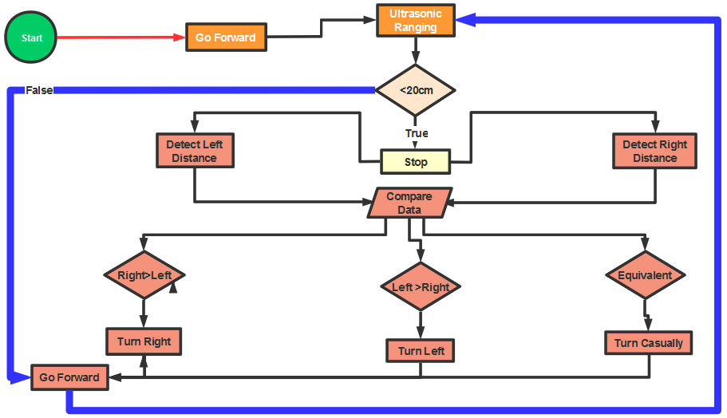
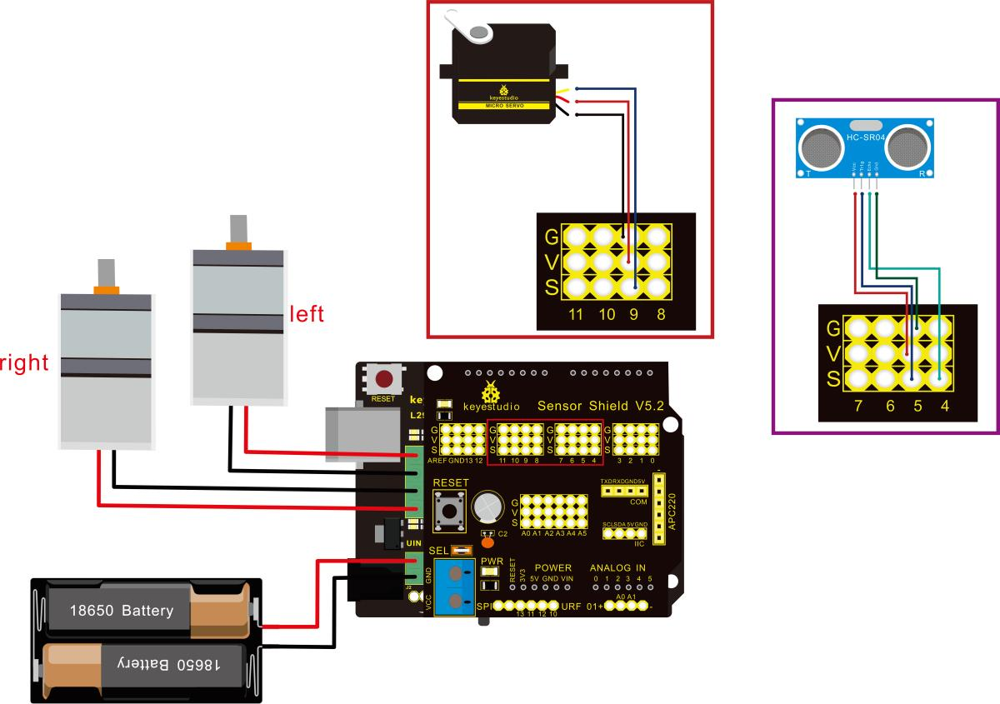

# Project 11 Ultrasonic Avoiding Tank



**Beschrijving**

In dit programma detecteert de ultrasone sensor de afstand tot obstakels en stuurt signalen die de robotauto besturen. Hieronder laten we je zien hoe je een auto maakt die obstakels vermijdt.

**De specifieke logica van de ultrasone vermijdingsrobot is als volgt:**



 **Stroomdiagram**



**Verbindingsschema:**



Opmerking: De "-", "+" en "S" pinnen van de servo zijn respectievelijk verbonden met G (GND), V (VCC) en D9 van de uitbreidingskaart. De VCC, Trig, Echo en Gnd van de ultrasone sensor zijn verbonden met 5v (V), 5 (S), Echo en Gnd (G) van de uitbreidingskaart.

**Testcode:**

```c
/*
 keyestudio Mini Tank Robot V2.1
 les 11
 ultrasonic_avoid_tank
 http://www.keyestudio.com
*/
int random2;
int a;
int a1;
int a2;
#define ML_Ctrl 13  // definieer de richtingscontrolepinnen van de linkermotor
#define ML_PWM 11   // definieer PWM-controlepinnen van de linkermotor
#define MR_Ctrl 12  // definieer de richtingscontrolepinnen van de rechtermotor
#define MR_PWM 3   // definieer PWM-controlepinnen van de rechtermotor

#define Trig 5  // ultrasone trig pin
#define Echo 4  // ultrasone echo pin
int distance;
#define servoPin 9  // servo pin
int pulsewidth;
/************de functie om de motor uit te voeren**************/
void Car_front()
{
  digitalWrite(MR_Ctrl,LOW);
  analogWrite(MR_PWM,200);
  digitalWrite(ML_Ctrl,LOW);
  analogWrite(ML_PWM,200);
}
void Car_back()
{
  digitalWrite(MR_Ctrl,HIGH);
  analogWrite(MR_PWM,200);
  digitalWrite(ML_Ctrl,HIGH);
  analogWrite(ML_PWM,200);
}
void Car_left()
{
  digitalWrite(MR_Ctrl,LOW);
  analogWrite(MR_PWM,255);
  digitalWrite(ML_Ctrl,HIGH);
  analogWrite(ML_PWM,255);
}
void Car_right()
{
  digitalWrite(MR_Ctrl,HIGH);
  analogWrite(MR_PWM,255);
  digitalWrite(ML_Ctrl,LOW);
  analogWrite(ML_PWM,255);
}
void Car_Stop()
{
  digitalWrite(MR_Ctrl,LOW);
  analogWrite(MR_PWM,0);
  digitalWrite(ML_Ctrl,LOW);
  analogWrite(ML_PWM,0);
}

// De functie om de servo te besturen
void procedure(int myangle) {
  for (int i = 0; i <= 50; i = i + (1)) {
    pulsewidth = myangle * 11 + 500;
    digitalWrite(servoPin,HIGH);
    delayMicroseconds(pulsewidth);
    digitalWrite(servoPin,LOW);
    delay((20 - pulsewidth / 1000));
  }
}
// De functie om de ultrasone sensor te besturen
float checkdistance() {
  digitalWrite(Trig, LOW);
  delayMicroseconds(2);
  digitalWrite(Trig, HIGH);
  delayMicroseconds(10);
  digitalWrite(Trig, LOW);
  float distance = pulseIn(Echo, HIGH) / 58.00;  // 58.20, dat wil zeggen, 2*29.1=58.2
  delay(10);
  return distance;
}
  //****************************************************************
void setup(){
  pinMode(servoPin, OUTPUT);
  procedure(90); // stel servo in op 90°
  
  pinMode(Trig, OUTPUT);
  pinMode(Echo, INPUT);
  pinMode(ML_Ctrl, OUTPUT);
  pinMode(ML_PWM, OUTPUT);
  pinMode(MR_Ctrl, OUTPUT);
  pinMode(MR_PWM, OUTPUT);
}
void loop(){
  random2 = random(1, 100);
  a = checkdistance();  // wijs de voorafstand gedetecteerd door de ultrasone sensor toe aan variabele a
  
  if (a < 20) // wanneer de voorafstand minder dan 20 is
  {
      Car_Stop();  // robot stopt
      delay(500); // vertraging van 500ms
      procedure(160);  // ultrasone platform draait naar links
      for (int j = 1; j <= 10; j = j + (1)) { // for-statement, de gegevens zijn nauwkeuriger als de ultrasone sensor meerdere keren detecteert.
        a1 = checkdistance();  // wijs de linkerafstand gedetecteerd door de ultrasone sensor toe aan variabele a1
      }
      delay(300);
      procedure(20); // ultrasone platform draait naar rechts
      for (int k = 1; k <= 10; k = k + (1)) {
        a2 = checkdistance(); // wijs de rechterafstand gedetecteerd door de ultrasone sensor toe aan variabele a2
      }
      
      if (a1 < 50 || a2 < 50)  // robot draait naar de kant met de langere afstand wanneer de linker- of rechterafstand minder dan 50cm is.
      {
        if (a1 > a2) // linkerafstand is groter dan rechterkant
        {
          procedure(90);  // ultrasone platform draait terug naar rechts vooruit
Car_left();  // robot draait naar links
          delay(500);  // draai 500ms naar links
          Car_front(); // ga vooruit
        } 
        else 
        {
          procedure(90);
          Car_right(); // robot draait naar rechts
          delay(500);
          Car_front();  // ga vooruit
        }
      } 
      else  // als beide zijden groter dan of gelijk aan 50cm zijn, draai willekeurig naar links of rechts
      {
        if ((long) (random2) % (long) (2) == 0)  // wanneer het willekeurige getal even is
        {
          procedure(90);
          Car_left(); // tankrobot draait naar links
          delay(500);
          Car_front(); // ga vooruit
        } 
        else 
        {
          procedure(90);
          Car_right(); // robot draait naar rechts
          delay(500);
          Car_front(); // ga vooruit
       }
     }
  } 
  else  // als de voorafstand groter dan of gelijk aan 20cm is, gaat de robotauto vooruit
  {
      Car_front(); // ga vooruit
  }
}
```

 **Testresultaat**

Code succesvol geüpload, DIP-schakelaar staat op de rechterkant en voeding ingeschakeld, tankrobot gaat vooruit en vermijdt automatisch het obstakel.