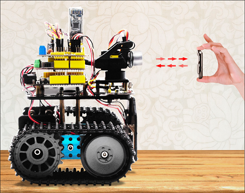
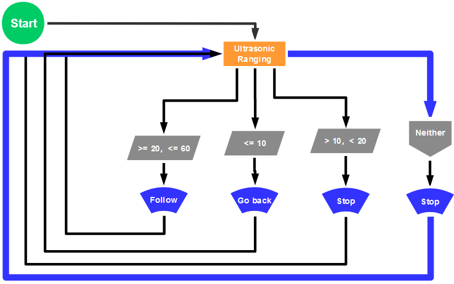
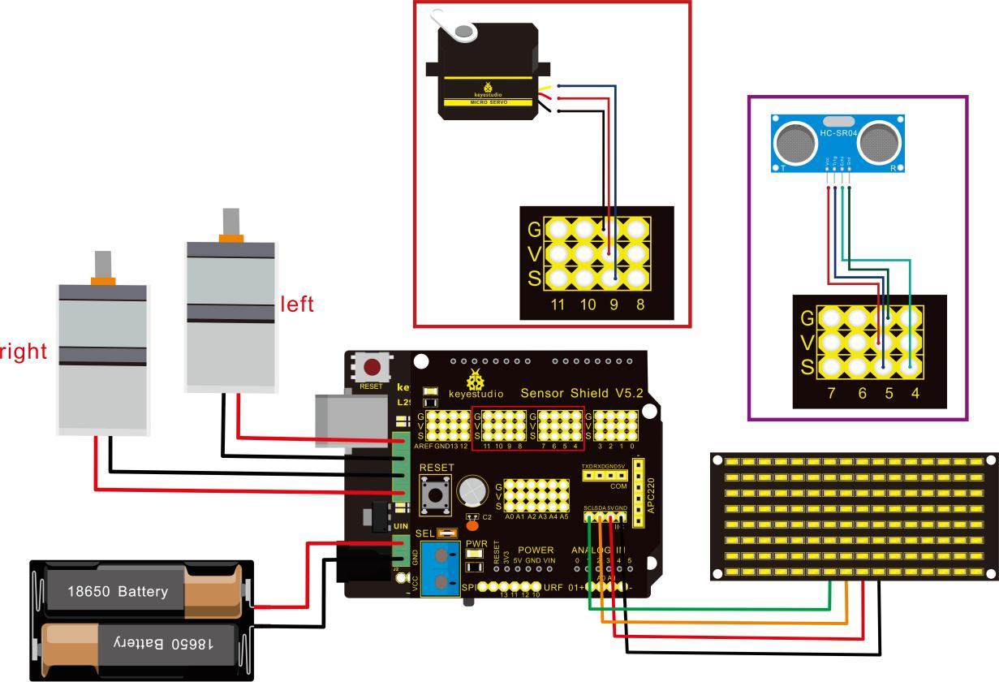

### Project 12 Ultrasonic Following Tank



**Description**

In project 11, we made an obstacle avoidance car. In fact, we only need to alter a test code to transform an obstacle avoidance car into a following car. In this lesson, we will make an ultrasonic following robot. The ultrasonic sensor detects the distance between smart car and the obstacle to drive tank car to move.

**The specific logic of ultrasonic follow robot is as shown below:**

| **Detection** | **Measured distance of front obstacles** | **Distance (unit: cm)** |
| ------------- | ---------------------------------------- | ----------------------- |
| Settings      | Servo angle 90°                          |                         |
|               | 8X16 LED panel shows the icon “V”        |                         |
| If            | 20≤ distance ≤60                         |                         |
| Status        | Go front（set PWM to 200）               |                         |
| If            | 10\<distance＜20                         |                         |
|               | distance＞60                             |                         |
| Status        | stop                                     |                         |
| If            | distance ≤10                             |                         |
| Status        | Stop（set PWM to 200）                   |                         |

**Flow chart**



**Connection Diagram**



Wire-up note:

| 1.8x16 LED panel |      | V5 Sensor Shield |
| ---------------- | ---- | ---------------- |
| GND              | →    | -（GND）         |
| VCC              | →    | +（VCC）         |
| SDA              | →    | SDA              |
| SCL              | →    | SCL              |

**Test Code**

```
 /*
 keyestudio Mini Tank Robot v2.0
 lesson 12
 ultrasonic follow tank
 http://www.keyestudio.com
*/ 
//Array, used to store the data of the pattern, can be calculated by yourself or obtained from the modulus tool
unsigned char start01[] = {0x01,0x02,0x04,0x08,0x10,0x20,0x40,0x80,0x80,0x40,0x20,0x10,0x08,0x04,0x02,0x01};
unsigned char front[] = {0x00,0x00,0x00,0x00,0x00,0x24,0x12,0x09,0x12,0x24,0x00,0x00,0x00,0x00,0x00,0x00};
unsigned char back[] = {0x00,0x00,0x00,0x00,0x00,0x24,0x48,0x90,0x48,0x24,0x00,0x00,0x00,0x00,0x00,0x00};
unsigned char left[] = {0x00,0x00,0x00,0x00,0x00,0x00,0x44,0x28,0x10,0x44,0x28,0x10,0x44,0x28,0x10,0x00};
unsigned char right[] = {0x00,0x10,0x28,0x44,0x10,0x28,0x44,0x10,0x28,0x44,0x00,0x00,0x00,0x00,0x00,0x00};
unsigned char STOP01[] = {0x2E,0x2A,0x3A,0x00,0x02,0x3E,0x02,0x00,0x3E,0x22,0x3E,0x00,0x3E,0x0A,0x0E,0x00};
unsigned char clear[] = {0x00,0x00,0x00,0x00,0x00,0x00,0x00,0x00,0x00,0x00,0x00,0x00,0x00,0x00,0x00,0x00};
#define SCL_Pin  A5  //Set clock pin to A5
#define SDA_Pin  A4  //Set data pin to A4

#define ML_Ctrl 13  //define the direction control pin of left motor
#define ML_PWM 11   //define PWM control pin of left motor
#define MR_Ctrl 12  //define the direction control pin of right motor
#define MR_PWM 3   //define PWM control pin of right motor
#define Trig 5  //ultrasonic trig Pin
#define Echo 4  //ultrasonic echo Pin
int distance;
int pulsewidth;
#define servoPin 9  //servo Pin
void setup(){
  Serial.begin(9600);
  pinMode(SCL_Pin,OUTPUT);
  pinMode(SDA_Pin,OUTPUT);
  matrix_display(clear); //Clear the display
  matrix_display(start01);  //display start pattern
  pinMode(servoPin, OUTPUT);
  procedure(90); //set servo to 90°
  pinMode(Trig, OUTPUT);
  pinMode(Echo, INPUT);
  pinMode(ML_Ctrl, OUTPUT);
  pinMode(ML_PWM, OUTPUT);
  pinMode(MR_Ctrl, OUTPUT);
  pinMode(MR_PWM, OUTPUT);
}
void loop(){
  distance = checkdistance();  //assign the distance detected by ultrasonic sensor to distance
  if (distance >= 20 && distance <= 60) //range to go front
  {
    Car_front();
  }
  else if (distance > 10 && distance < 20)  //range to stop
  {
    Car_Stop();
  }
  else if (distance <= 10)  //range to go back
  {
    Car_back();
  }
  else  //other situations, stop
  {
    Car_Stop();
  }
}
/***********the function for motor running****************/
void Car_front()
{
  digitalWrite(MR_Ctrl,LOW);
  analogWrite(MR_PWM,200);
  digitalWrite(ML_Ctrl,LOW);
  analogWrite(ML_PWM,200);
}
void Car_back()
{
  digitalWrite(MR_Ctrl,HIGH);
  analogWrite(MR_PWM,200);
  digitalWrite(ML_Ctrl,HIGH);
  analogWrite(ML_PWM,200);
}
void Car_left()
{
  digitalWrite(MR_Ctrl,LOW);
  analogWrite(MR_PWM,200);
  digitalWrite(ML_Ctrl,HIGH);
  analogWrite(ML_PWM,200);
}
void Car_right()
{
  digitalWrite(MR_Ctrl,HIGH);
  analogWrite(MR_PWM,200);
  digitalWrite(ML_Ctrl,LOW);
  analogWrite(ML_PWM,200);
}
void Car_Stop()
{
  digitalWrite(MR_Ctrl,LOW);
  analogWrite(MR_PWM,0);
  digitalWrite(ML_Ctrl,LOW);
  analogWrite(ML_PWM,0);
}

/******************dot matrix********************/
// the function for dot matrix display
void matrix_display(unsigned char matrix_value[])
{
  IIC_start(); // call the function that data transmission start
  IIC_send(0xc0);  //Choose address
  
  for(int i = 0;i < 16;i++) //pattern data has 16 bits
  {
     IIC_send(matrix_value[i]); //data to convey patterns
  }

  IIC_end();   //end to convey data pattern
  
  IIC_start();
  IIC_send(0x8A);  //select pulse width4/16, control display
  IIC_end();
}

//The condition starting to transmit data
void IIC_start()
{
  digitalWrite(SCL_Pin,HIGH);
  delayMicroseconds(3);
  digitalWrite(SDA_Pin,HIGH);
  delayMicroseconds(3);
  digitalWrite(SDA_Pin,LOW);
  delayMicroseconds(3);
}

// transmit data
void IIC_send(unsigned char send_data)
{
  for(char i = 0;i < 8;i++)  //Each byte has 8 bits
  {
      digitalWrite(SCL_Pin,LOW);  //pull down clock pin SCL Pin to change the signals of SDA      
delayMicroseconds(3);
      if(send_data & 0x01)  //set high and low level of SDA_Pin according to 1 or 0 of every bit
      {
        digitalWrite(SDA_Pin,HIGH);
      }
      else
      {
        digitalWrite(SDA_Pin,LOW);
      }
      delayMicroseconds(3);
      digitalWrite(SCL_Pin,HIGH); //pull up clock pin SCL_Pin to stop transmitting data
      delayMicroseconds(3);
      send_data = send_data >> 1;  // detect bit by bit, so move the data right by one
  }
}
//The sign that data transmission ends
void IIC_end()
{
  digitalWrite(SCL_Pin,LOW);
  delayMicroseconds(3);
  digitalWrite(SDA_Pin,LOW);
  delayMicroseconds(3);
  digitalWrite(SCL_Pin,HIGH);
  delayMicroseconds(3);
  digitalWrite(SDA_Pin,HIGH);
  delayMicroseconds(3);
}
/***************end dot matrix display******************/
//The function to control servo
void procedure(int myangle) {
  for (int i = 0; i <= 50; i = i + (1)) {
    pulsewidth = myangle * 11 + 500;
    digitalWrite(servoPin,HIGH);
    delayMicroseconds(pulsewidth);
    digitalWrite(servoPin,LOW);
    delay((20 - pulsewidth / 1000));
  }}
//The function to control ultrasonic sensor function controlling ultrasonic
float checkdistance() {
  digitalWrite(Trig, LOW);
  delayMicroseconds(2);
  digitalWrite(Trig, HIGH);
  delayMicroseconds(10);
  digitalWrite(Trig, LOW);
  float distance = pulseIn(Echo, HIGH) / 58.20;  //58.20, that is , 2*29.1=58.2
  delay(10);
  return distance;
}
//****************************************************************
```

 **Test Result**

Upload code successfully, DIP switch is dialed to the right end, the servo rotates to 90°, “V” is shown on 8X16 LED panel and smart car moves as the obstacle moves.