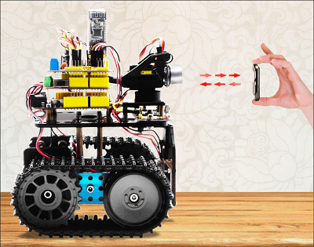
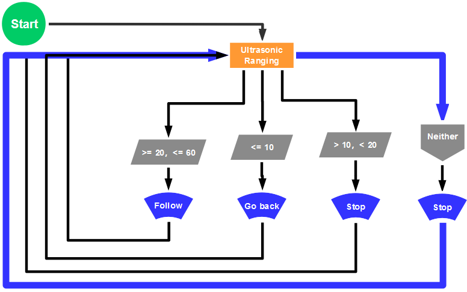
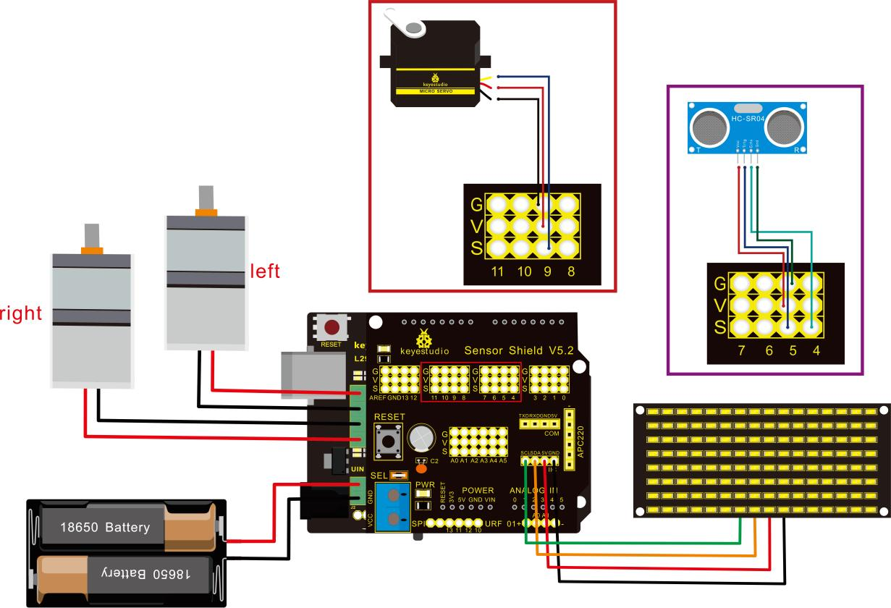

# Projet 12 Robot Tank de Suivi Ultrasonique



**Description**

Dans le projet 11, nous avons créé une voiture d'évitement d'obstacles. En fait, nous n'avons besoin que de modifier un code de test pour transformer une voiture d'évitement d'obstacles en voiture de suivi. Dans cette leçon, nous allons créer un robot de suivi ultrasonique. Le capteur ultrasonique détecte la distance entre la voiture intelligente et l'obstacle pour faire bouger le robot tank.

**La logique spécifique du robot de suivi ultrasonique est présentée ci-dessous :**

| **Détection** | **Distance mesurée des obstacles à l'avant** | **Distance (unité : cm)** |
| ------------- | ---------------------------------------- | ----------------------- |
| Paramètres      | Angle du servo 90°                          |                         |
|               | Le panneau LED 8X16 affiche l'icône "V"        |                         |
| Si            | 20≤ distance ≤60                         |                         |
| État        | Avancer（définir PWM à 200）               |                         |
| Si            | 10\<distance＜20                         |                         |
|               | distance＞60                             |                         |
| État        | Arrêter                                     |                         |
| Si            | distance ≤10                             |                         |
| État        | Reculer（définir PWM à 200）                   |                         |

**Organigramme**



**Schéma de Connexion**



Note de câblage :

| Panneau LED 8x16 |      | Bouclier Capteur V5 |
| ---------------- | ---- | ---------------- |
| GND              | →    | -（GND）         |
| VCC              | →    | +（VCC）         |
| SDA              | →    | SDA              |
| SCL              | →    | SCL              |

**Code de Test**

```c
 /*
 keyestudio Mini Tank Robot V2.1
 leçon 12
 robot tank de suivi ultrasonique
 http://www.keyestudio.com
*/ 
//Tableau, utilisé pour stocker les données du motif, peut être calculé par vous-même ou obtenu à partir de l'outil de modulation
unsigned char start01[] = {0x01,0x02,0x04,0x08,0x10,0x20,0x40,0x80,0x80,0x40,0x20,0x10,0x08,0x04,0x02,0x01};
unsigned char front[] = {0x00,0x00,0x00,0x00,0x00,0x24,0x12,0x09,0x12,0x24,0x00,0x00,0x00,0x00,0x00,0x00};
unsigned char back[] = {0x00,0x00,0x00,0x00,0x00,0x24,0x48,0x90,0x48,0x24,0x00,0x00,0x00,0x00,0x00,0x00};
unsigned char left[] = {0x00,0x00,0x00,0x00,0x00,0x00,0x44,0x28,0x10,0x44,0x28,0x10,0x44,0x28,0x10,0x00};
unsigned char right[] = {0x00,0x10,0x28,0x44,0x10,0x28,0x44,0x10,0x28,0x44,0x00,0x00,0x00,0x00,0x00,0x00};
unsigned char STOP01[] = {0x2E,0x2A,0x3A,0x00,0x02,0x3E,0x02,0x00,0x3E,0x22,0x3E,0x00,0x3E,0x0A,0x0E,0x00};
unsigned char clear[] = {0x00,0x00,0x00,0x00,0x00,0x00,0x00,0x00,0x00,0x00,0x00,0x00,0x00,0x00,0x00,0x00};
#define SCL_Pin  A5  //Définir la broche d'horloge à A5
#define SDA_Pin  A4  //Définir la broche de données à A4

#define ML_Ctrl 13  //définir la broche de contrôle de direction du moteur gauche
#define ML_PWM 11   //définir la broche de contrôle PWM du moteur gauche
#define MR_Ctrl 12  //définir la broche de contrôle de direction du moteur droit
#define MR_PWM 3   //définir la broche de contrôle PWM du moteur droit
#define Trig 5  //broche Trig ultrasonique
#define Echo 4  //broche Echo ultrasonique
int distance;
int pulsewidth;
#define servoPin 9  //broche du servo
void setup(){
  Serial.begin(9600);
  pinMode(SCL_Pin,OUTPUT);
  pinMode(SDA_Pin,OUTPUT);
  matrix_display(clear); //Effacer l'affichage
  matrix_display(start01);  //afficher le motif de démarrage
  pinMode(servoPin, OUTPUT);
  procedure(90); //définir le servo à 90°
  pinMode(Trig, OUTPUT);
  pinMode(Echo, INPUT);
  pinMode(ML_Ctrl, OUTPUT);
  pinMode(ML_PWM, OUTPUT);
  pinMode(MR_Ctrl, OUTPUT);
  pinMode(MR_PWM, OUTPUT);
}
void loop(){
  distance = checkdistance();  //assigner la distance détectée par le capteur ultrasonique à distance
  if (distance >= 20 && distance <= 60) //plage pour avancer
  {
    Car_front();
  }
  else if (distance > 10 && distance < 20)  //plage pour arrêter
  {
    Car_Stop();
  }
  else if (distance <= 10)  //plage pour reculer
  {
    Car_back();
  }
  else  //autres situations, arrêter
  {
    Car_Stop();
  }
}
/***********la fonction pour le fonctionnement du moteur****************/
void Car_front()
{
  digitalWrite(MR_Ctrl,LOW);
  analogWrite(MR_PWM,200);
  digitalWrite(ML_Ctrl,LOW);
  analogWrite(ML_PWM,200);
}
void Car_back()
{
  digitalWrite(MR_Ctrl,HIGH);
  analogWrite(MR_PWM,200);
  digitalWrite(ML_Ctrl,HIGH);
  analogWrite(ML_PWM,200);
}
void Car_left()
{
  digitalWrite(MR_Ctrl,LOW);
  analogWrite(MR_PWM,200);
  digitalWrite(ML_Ctrl,HIGH);
  analogWrite(ML_PWM,200);
}
void Car_right()
{
  digitalWrite(MR_Ctrl,HIGH);
  analogWrite(MR_PWM,200);
  digitalWrite(ML_Ctrl,LOW);
  analogWrite(ML_PWM,200);
}
void Car_Stop()
{
  digitalWrite(MR_Ctrl,LOW);
  analogWrite(MR_PWM,0);
  digitalWrite(ML_Ctrl,LOW);
  analogWrite(ML_PWM,0);
}

/******************matrice de points********************/
// la fonction pour l'affichage de la matrice de points
void matrix_display(unsigned char matrix_value[])
{
  IIC_start(); // appeler la fonction qui démarre la transmission de données
  IIC_send(0xc0);  //Choisir l'adresse
  
  for(int i = 0;i < 16;i++) //les données du motif ont 16 bits
  {
     IIC_send(matrix_value[i]); //données pour transmettre les motifs
  }

  IIC_end();   //terminer la transmission du motif de données
  
  IIC_start();
  IIC_send(0x8A);  //sélectionner la largeur d'impulsion 4/16, contrôler l'affichage
  IIC_end();
}

//La condition pour commencer à transmettre les données
void IIC_start()
{
  digitalWrite(SCL_Pin,HIGH);
  delayMicroseconds(3);
  digitalWrite(SDA_Pin,HIGH);
  delayMicroseconds(3);
  digitalWrite(SDA_Pin,LOW);
  delayMicroseconds(3);
}

// transmettre les données
void IIC_send(unsigned char send_data)
{
  for(char i = 0;i < 8;i++)  //Chaque octet a 8 bits
  {
      digitalWrite(SCL_Pin,LOW);  //abaisser la broche d'horloge SCL Pin pour changer les signaux de SDA      
delayMicroseconds(3);
      if(send_data & 0x01)  //définir le niveau haut et bas de SDA_Pin selon 1 ou 0 de chaque bit
      {
        digitalWrite(SDA_Pin,HIGH);
      }
      else
      {
        digitalWrite(SDA_Pin,LOW);
      }
      delayMicroseconds(3);
      digitalWrite(SCL_Pin,HIGH); //relever la broche d'horloge SCL_Pin pour arrêter la transmission de données
      delayMicroseconds(3);
      send_data = send_data >> 1;  // détecter bit par bit, donc décaler les données vers la droite d'un
  }
}
//Le signe que la transmission de données se termine
void IIC_end()
{
  digitalWrite(SCL_Pin,LOW);
  delayMicroseconds(3);
  digitalWrite(SDA_Pin,LOW);
  delayMicroseconds(3);
  digitalWrite(SCL_Pin,HIGH);
  delayMicroseconds(3);
  digitalWrite(SDA_Pin,HIGH);
  delayMicroseconds(3);
}
/***************fin de l'affichage de la matrice de points******************/
//La fonction pour contrôler le servo
void procedure(int myangle) {
  for (int i = 0; i <= 50; i = i + (1)) {
    pulsewidth = myangle * 11 + 500;
    digitalWrite(servoPin,HIGH);
    delayMicroseconds(pulsewidth);
    digitalWrite(servoPin,LOW);
    delay((20 - pulsewidth / 1000));
  }}
//La fonction pour contrôler la fonction du capteur ultrasonique contrôlant l'ultrasonique
float checkdistance() {
  digitalWrite(Trig, LOW);
  delayMicroseconds(2);
  digitalWrite(Trig, HIGH);
  delayMicroseconds(10);
  digitalWrite(Trig, LOW);
  float distance = pulseIn(Echo, HIGH) / 58.20;  //58.20, c'est-à-dire, 2*29.1=58.2
  delay(10);
  return distance;
}
//****************************************************************
```

 **Résultat du Test**

Après avoir téléchargé le code avec succès, le commutateur DIP est basculé vers l'extrémité droite, le servo tourne à 90°, "V" s'affiche sur le panneau LED 8X16 et la voiture intelligente se déplace en suivant l'obstacle.