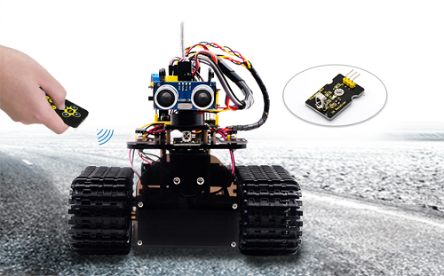
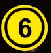
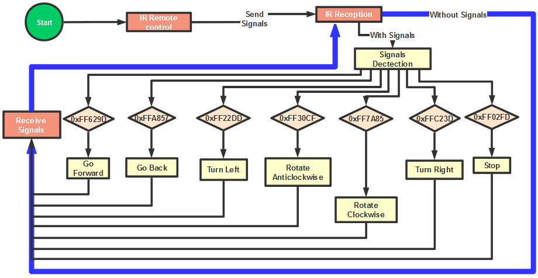
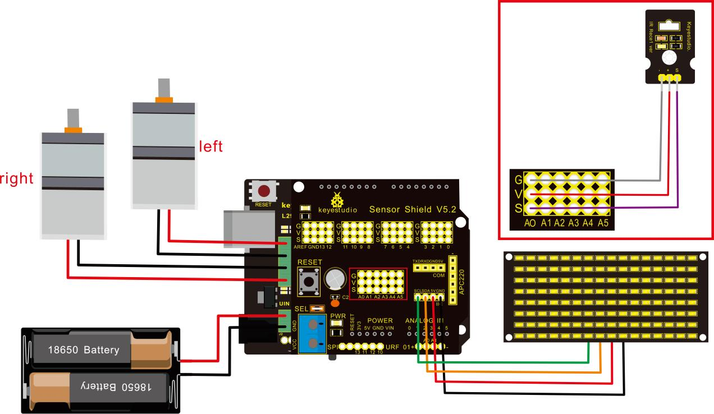

# Proyecto 13 Robot Tanque con Control Remoto IR



**Descripción**

El control remoto por infrarrojos es uno de los controles más ubicuos, aplicado en televisores, ventiladores eléctricos y algunos electrodomésticos. En este proyecto, crearemos un automóvil inteligente controlado por IR. Dado que conocemos cada valor de tecla en el control remoto IR, podemos controlar el automóvil inteligente y mostrar patrones en la matriz de puntos mediante el valor de tecla correspondiente.

**La lógica específica del robot de control remoto infrarrojo se muestra a continuación:**

| Configuración inicial                  | Ángulo del servo 90°                    |                                     |
| -------------------------------------- | --------------------------------------- | ----------------------------------- |
|                                        | Panel de matriz LED 8X16 muestra un icono "V" |                                     |
| **Control remoto**                     | **Valor de tecla**                      | **Estado de tecla**                 |
|  | FF629D                                  | Ir hacia adelante (PWM establecido a 200) |
|                                        |                                         | Panel LED 8X16 muestra icono frontal |
|  | FFA857                                  | Ir hacia atrás (PWM establecido a 200) |
|                                        |                                         | Panel LED 8X16 muestra icono trasero |
|  | FF22DD                                  | Girar a la izquierda                |
|                                        |                                         | Panel LED 8X16 muestra icono hacia la izquierda |
|  | FFC23D                                  | Girar a la derecha                  |
|                                        |                                         | Panel LED 8X16 muestra icono hacia la derecha |
|  | FF02FD                                  | Detener                             |
|                                        |                                         | Panel LED 8X16 muestra "STOP"       |
|  | FF30CF                                  | Rotar a la izquierda (PWM establecido a 200) |
|                                        |                                         | Panel LED 8X16 muestra icono hacia la izquierda |
|  | FF7A85                                  | Rotar a la derecha (PWM establecido a 200) |
|                                        |                                         | Panel LED 8X16 muestra icono hacia la derecha |

**Diagrama de flujo**



**Diagrama de conexión**



Atención: GND, VCC, SDA, SCL del panel LED 8x16 están respectivamente conectados con - (GND), + (VCC), SDA, SCL. Y "-", "+" y S del módulo receptor IR están conectados a G (GND), V (VCC) y A0 en el escudo de sensores. En caso de puertos digitales insuficientes, los puertos analógicos pueden tratarse como puertos digitales. A0 equivale a digital 14, A1 es como digital 15.

**Código de prueba**

```c
/*
 keyestudio Mini Tank Robot V2.1
 lección 13
 tanque con control remoto IR
 http://www.keyestudio.com
*/

#include <IRremoteTank.h>
IRrecv irrecv(A0);  // establecer IRrecv irrecv a A0
decode_results results;
long ir_rec;  // guardar el valor IR recibido

// Array, utilizado para almacenar los datos del patrón, puede calcularse por sí mismo u obtenerse de la herramienta de módulo
unsigned char start01[] = {0x01,0x02,0x04,0x08,0x10,0x20,0x40,0x80,0x80,0x40,0x20,0x10,0x08,0x04,0x02,0x01};
unsigned char front[] = {0x00,0x00,0x00,0x00,0x00,0x24,0x12,0x09,0x12,0x24,0x00,0x00,0x00,0x00,0x00,0x00};
unsigned char back[] = {0x00,0x00,0x00,0x00,0x00,0x24,0x48,0x90,0x48,0x24,0x00,0x00,0x00,0x00,0x00,0x00};
unsigned char left[] = {0x00,0x00,0x00,0x00,0x00,0x00,0x44,0x28,0x10,0x44,0x28,0x10,0x44,0x28,0x10,0x00};
unsigned char right[] = {0x00,0x10,0x28,0x44,0x10,0x28,0x44,0x10,0x28,0x44,0x00,0x00,0x00,0x00,0x00,0x00};
unsigned char STOP01[] = {0x2E,0x2A,0x3A,0x00,0x02,0x3E,0x02,0x00,0x3E,0x22,0x3E,0x00,0x3E,0x0A,0x0E,0x00};
unsigned char clear[] = {0x00,0x00,0x00,0x00,0x00,0x00,0x00,0x00,0x00,0x00,0x00,0x00,0x00,0x00,0x00,0x00};
#define SCL_Pin  A5  // Establecer pin de reloj a A5
#define SDA_Pin  A4  // Establecer pin de datos a A4

#define ML_Ctrl 13  // definir el pin de control de dirección del motor izquierdo
#define ML_PWM 11   // definir el pin de control PWM del motor izquierdo
#define MR_Ctrl 12  // definir el pin de control de dirección del motor derecho
#define MR_PWM 3    // definir el pin de control PWM del motor derecho

#define servoPin 9 // pin del servo
int pulsewidth; // guardar el valor de ancho de pulso del servo

void setup(){
  Serial.begin(9600);
  irrecv.enableIRIn();  // Inicializar la biblioteca de recepción IR
  
  pinMode(ML_Ctrl, OUTPUT);
  pinMode(ML_PWM, OUTPUT);
  pinMode(MR_Ctrl, OUTPUT);
  pinMode(MR_PWM, OUTPUT);
  
  pinMode(SCL_Pin,OUTPUT);
  pinMode(SDA_Pin,OUTPUT);
  matrix_display(clear); // Limpiar pantalla
  matrix_display(start01);  // mostrar imagen de inicio
  
  pinMode(servoPin, OUTPUT);
  procedure(90);  // El servo rota a 90°
}

void loop(){
  if (irrecv.decode(&results)) // recibir el valor del control remoto IR
  {
    ir_rec=results.value;
    String type="UNKNOWN";
    String typelist[14]={"UNKNOWN", "NEC", "SONY", "RC5", "RC6", "DISH", "SHARP", "PANASONIC", "JVC", "SANYO", "MITSUBISHI", "SAMSUNG", "LG", "WHYNTER"};
    if(results.decode_type>=1&&results.decode_type<=13){
      type=typelist[results.decode_type];
    }
    Serial.print("IR TYPE:"+type+"  ");
    Serial.println(ir_rec,HEX);
    irrecv.resume();
  }
  
  if (ir_rec == 0xFF629D) // Ir hacia adelante
  {
    Car_front();
    matrix_display(front);  // Mostrar imagen frontal
  }
  if (ir_rec == 0xFFA857)  // El robot retrocede
  {
    Car_back();
    matrix_display(front);  // Ir hacia atrás
  }
  if (ir_rec == 0xFF22DD)   // El robot gira a la izquierda
  {
    Car_T_left();
    matrix_display(left);  // Mostrar imagen de giro a la izquierda
  }
  if (ir_rec == 0xFFC23D)   // El robot gira a la derecha
  {
    Car_T_right();
    matrix_display(right);  // Mostrar imagen de giro a la derecha
  }
  if (ir_rec == 0xFF02FD)   // El robot se detiene
  { 
    Car_Stop();
    matrix_display(STOP01);  // mostrar imagen de parada
  }
  if (ir_rec == 0xFF30CF)   // el robot rota en sentido antihorario
  {
    Car_left();
    matrix_display(left);  // mostrar imagen de rotación antihoraria
  }
  if (ir_rec == 0xFF7A85)  // el robot rota en sentido horario
  {
    Car_right();
    matrix_display(right);  // mostrar imagen de rotación horaria
 }
}
/******************Control del servo*******************/
void procedure(int myangle) {
  for (int i = 0; i <= 50; i = i + (1)) {
    pulsewidth = myangle * 11 + 500;
    digitalWrite(servoPin,HIGH);
    delayMicroseconds(pulsewidth);
    digitalWrite(servoPin,LOW);
    delay((20 - pulsewidth / 1000));
  }
}

/******************Matriz de puntos****************/
// esta función se utiliza para la visualización de la matriz de puntos 
void matrix_display(unsigned char matrix_value[])
{
  IIC_start();
  IIC_send(0xc0);  // Elegir dirección
   for(int i = 0;i < 16;i++) // La imagen tiene 16 bits
  {
     IIC_send(matrix_value[i]); // datos para transmitir patrones
  }
  IIC_end();   // finalizar la transmisión del patrón de datos
  
  IIC_start();
  IIC_send(0x8A);  // control de visualización, establecer ancho de pulso a 4/16
  IIC_end();
}

// La condición para comenzar a transmitir datos
void IIC_start()
{
  digitalWrite(SCL_Pin,HIGH);
  delayMicroseconds(3);
  digitalWrite(SDA_Pin,HIGH);
  delayMicroseconds(3);
  digitalWrite(SDA_Pin,LOW);
  delayMicroseconds(3);
}

void IIC_send(unsigned char send_data)
{
  for(char i = 0;i < 8;i++)  // Cada byte tiene 8 bits, 8 bits para cada carácter
  {
      digitalWrite(SCL_Pin,LOW);  // bajar el pin de reloj SCL para cambiar las señales de SDA      
      delayMicroseconds(3);
      if(send_data & 0x01)  // establecer el nivel alto y bajo de SDA_Pin según 1 o 0 de cada bit
      {
        digitalWrite(SDA_Pin,HIGH);
      }
      else
      {
        digitalWrite(SDA_Pin,LOW);
      }
      delayMicroseconds(3);
      digitalWrite(SCL_Pin,HIGH); // subir el pin de reloj SCL_Pin para detener la transmisión de datos
      delayMicroseconds(3);
      send_data = send_data >> 1;  // detectar bit por bit, por lo que desplazar los datos a la derecha en uno
  }
}
// La señal de que la transmisión de datos ha finalizado
void IIC_end()
{
  digitalWrite(SCL_Pin,LOW);
  delayMicroseconds(3);
  digitalWrite(SDA_Pin,LOW);
  delayMicroseconds(3);
  digitalWrite(SCL_Pin,HIGH);
  delayMicroseconds(3);
  digitalWrite(SDA_Pin,HIGH);
  delayMicroseconds(3);
}
/***************la función para ejecutar el motor***************/
void Car_front()
{
  digitalWrite(MR_Ctrl,LOW);
  analogWrite(MR_PWM,200);
  digitalWrite(ML_Ctrl,LOW);
  analogWrite(ML_PWM,200);
}
void Car_back()
{
  digitalWrite(MR_Ctrl,HIGH);
  analogWrite(MR_PWM,200);
  digitalWrite(ML_Ctrl,HIGH);
  analogWrite(ML_PWM,200);
}
void Car_left()
{
  digitalWrite(MR_Ctrl,LOW);
  analogWrite(MR_PWM,255);
  digitalWrite(ML_Ctrl,HIGH);
  analogWrite(ML_PWM,255);
}
void Car_right()
{
  digitalWrite(MR_Ctrl,HIGH);
  analogWrite(MR_PWM,255);
  digitalWrite(ML_Ctrl,LOW);
  analogWrite(ML_PWM,255);
}
void Car_Stop()
{
  digitalWrite(MR_Ctrl,LOW);
  analogWrite(MR_PWM,0);
  digitalWrite(ML_Ctrl,LOW);
  analogWrite(ML_PWM,0);
}
void Car_T_left()
{
  digitalWrite(MR_Ctrl,LOW);
  analogWrite(MR_PWM,255);
  digitalWrite(ML_Ctrl,LOW);
  analogWrite(ML_PWM,180);
}
void Car_T_right()
{
  digitalWrite(MR_Ctrl,LOW);
  analogWrite(MR_PWM,180);
  digitalWrite(ML_Ctrl,LOW);
  analogWrite(ML_PWM,255);
}
 //****************************************************************
```

**Resultado de la prueba**

Cargue el código exitosamente y encienda el robot inteligente, que puede ser controlado por el control remoto IR. Al mismo tiempo, el patrón correspondiente se muestra en el panel LED 8X16.