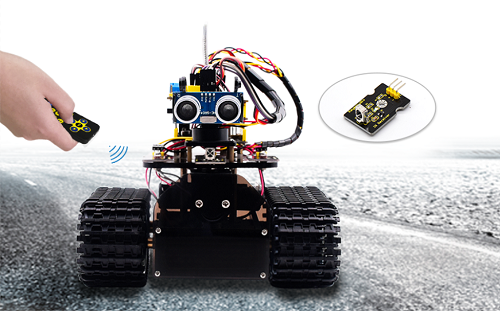
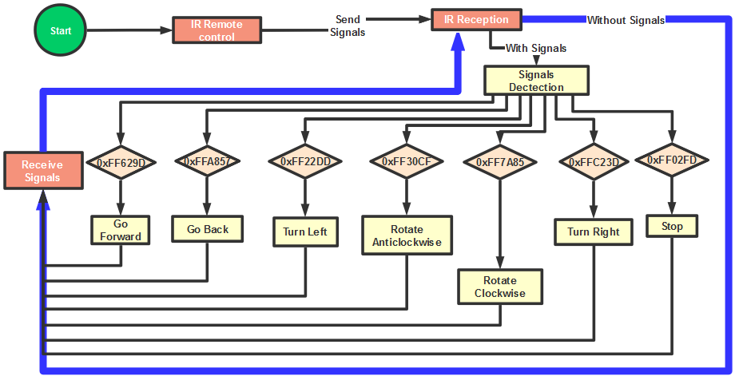
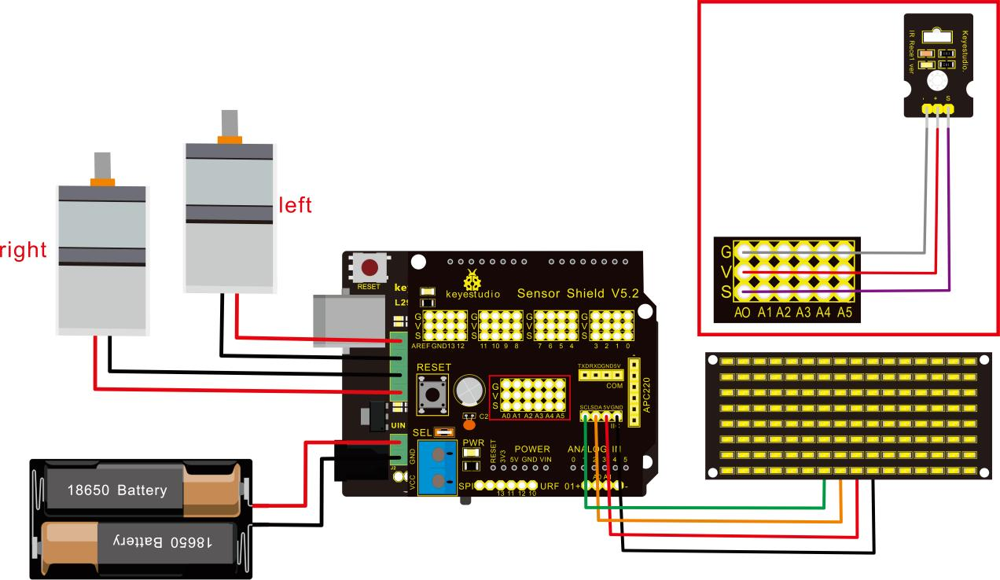

# Projekt 13 IR-Fernbedienungs-Roboter-Panzer



**Beschreibung**

Die IR-Fernbedienung ist eine der am weitesten verbreiteten Steuerungsarten und wird in Fernsehern, Elektroventilatoren und einigen Haushaltsgeräten verwendet. In diesem Projekt werden wir ein intelligentes Auto mit IR-Fernbedienung bauen. Da wir jeden Tastenwert der IR-Fernbedienung kennen, können wir das intelligente Auto steuern und die Muster auf der Dot-Matrix über den entsprechenden Tastenwert anzeigen.

**Die spezifische Logik des Infrarot-Fernbedienungs-Roboters ist unten dargestellt:**

| Anfangseinstellung                     | Servo-Winkel 90°                        |                                     |
| -------------------------------------- | --------------------------------------- | ----------------------------------- |
|                                        | 8X16 LED-Matrix-Panel zeigt ein "V"-Symbol |                                     |
| **Fernbedienung**                      | **Tastenwert**                          | **Tastenzustand**                   |
|  | FF629D                                  | Vorwärts fahren (PWM auf 200 gesetzt) |
|                                        |                                         | 8X16 LED-Panel zeigt Vorwärtssymbol |
|  | FFA857                                  | Rückwärts fahren (PWM auf 200 gesetzt) |
|                                        |                                         | 8X16 LED-Panel zeigt Rückwärtssymbol |
|  | FF22DD                                  | Nach links drehen                   |
|                                        |                                         | 8X16 LED-Panel zeigt Linksdrehsymbol |
|  | FFC23D                                  | Nach rechts drehen                  |
|                                        |                                         | 8X16 LED-Panel zeigt Rechtsdrehsymbol |
|  | FF02FD                                  | Stopp                               |
|                                        |                                         | 8X16 LED-Panel zeigt "STOP"         |
|  | FF30CF                                  | Nach links rotieren (PWM auf 200 gesetzt) |
|                                        |                                         | 8X16 LED-Panel zeigt Linksdrehsymbol |
|  | FF7A85                                  | Nach rechts rotieren (PWM auf 200 gesetzt) |
|                                        |                                         | 8X16 LED-Panel zeigt Rechtsdrehsymbol |

**Ablaufdiagramm**



**Schaltschema**



Achtung: GND, VCC, SDA, SCL des 8x16 LED-Panels sind jeweils mit - (GND), + (VCC), SDA, SCL verbunden. Und "-", "+" und S des IR-Empfängermoduls sind an G (GND), V (VCC) und A0 auf dem Sensor-Shield angeschlossen. Bei unzureichenden digitalen Anschlüssen können die analogen Anschlüsse als digitale Anschlüsse verwendet werden. A0 entspricht Digital 14, A1 entspricht Digital 15.

**Test-Code**

```c
/*
 keyestudio Mini Tank Robot V2.1
 lesson 13
 IR remote tank
 http://www.keyestudio.com
*/

#include <IRremoteTank.h>
IRrecv irrecv(A0);  //set IRrecv irrecv to A0
decode_results results;
long ir_rec;  //save the IR value received

//Array, used to store the data of the pattern, can be calculated by yourself or obtained from the modulus tool
unsigned char start01[] = {0x01,0x02,0x04,0x08,0x10,0x20,0x40,0x80,0x80,0x40,0x20,0x10,0x08,0x04,0x02,0x01};
unsigned char front[] = {0x00,0x00,0x00,0x00,0x00,0x24,0x12,0x09,0x12,0x24,0x00,0x00,0x00,0x00,0x00,0x00};
unsigned char back[] = {0x00,0x00,0x00,0x00,0x00,0x24,0x48,0x90,0x48,0x24,0x00,0x00,0x00,0x00,0x00,0x00};
unsigned char left[] = {0x00,0x00,0x00,0x00,0x00,0x00,0x44,0x28,0x10,0x44,0x28,0x10,0x44,0x28,0x10,0x00};
unsigned char right[] = {0x00,0x10,0x28,0x44,0x10,0x28,0x44,0x10,0x28,0x44,0x00,0x00,0x00,0x00,0x00,0x00};
unsigned char STOP01[] = {0x2E,0x2A,0x3A,0x00,0x02,0x3E,0x02,0x00,0x3E,0x22,0x3E,0x00,0x3E,0x0A,0x0E,0x00};
unsigned char clear[] = {0x00,0x00,0x00,0x00,0x00,0x00,0x00,0x00,0x00,0x00,0x00,0x00,0x00,0x00,0x00,0x00};
#define SCL_Pin  A5  //Set clock pin to A5
#define SDA_Pin  A4  //Set data pin to A4

#define ML_Ctrl 13  //define the direction control pin of left motor
#define ML_PWM 11   //define PWM control pin of left motor
#define MR_Ctrl 12  //define the direction control pin of right motor
#define MR_PWM 3    //define PWM control pin of right motor

#define servoPin 9 //pin of servo
int pulsewidth; //save the pulse width value of servo

void setup(){
  Serial.begin(9600);
  irrecv.enableIRIn();  //Initialize the IR reception library
  
  pinMode(ML_Ctrl, OUTPUT);
  pinMode(ML_PWM, OUTPUT);
  pinMode(MR_Ctrl, OUTPUT);
  pinMode(MR_PWM, OUTPUT);
  
  pinMode(SCL_Pin,OUTPUT);
  pinMode(SDA_Pin,OUTPUT);
  matrix_display(clear); //Clear Screen
  matrix_display(start01);  //show start picture
  
  pinMode(servoPin, OUTPUT);
  procedure(90);  //Servo rotates to 90°
}

void loop(){
  if (irrecv.decode(&results)) //receive the IR remote value
  {
    ir_rec=results.value;
    String type="UNKNOWN";
    String typelist[14]={"UNKNOWN", "NEC", "SONY", "RC5", "RC6", "DISH", "SHARP", "PANASONIC", "JVC", "SANYO", "MITSUBISHI", "SAMSUNG", "LG", "WHYNTER"};
    if(results.decode_type>=1&&results.decode_type<=13){
      type=typelist[results.decode_type];
    }
    Serial.print("IR TYPE:"+type+"  ");
    Serial.println(ir_rec,HEX);
    irrecv.resume();
  }
  
  if (ir_rec == 0xFF629D) //Go forward
  {
    Car_front();
    matrix_display(front);  //Display front image
  }
  if (ir_rec == 0xFFA857)  //Robot car goes back
  {
    Car_back();
    matrix_display(back);  //Go back
  }
  if (ir_rec == 0xFF22DD)   //Robot car turns left
  {
    Car_T_left();
    matrix_display(left);  //Display left-turning image
  }
  if (ir_rec == 0xFFC23D)   //Robot car turns right
  {
    Car_T_right();
    matrix_display(right);  //Display right-turning image
  }
  if (ir_rec == 0xFF02FD)   //Robot car stops
  { 
    Car_Stop();
    matrix_display(STOP01);  //show stop image
  }
  if (ir_rec == 0xFF30CF)   //robot car rotates anticlockwise
  {
    Car_left();
    matrix_display(left);  //show anticlockwise rotation picture
  }
  if (ir_rec == 0xFF7A85)  //robot car rotates clockwise
  {
    Car_right();
    matrix_display(right);  //show clockwise rotation picture
 }
}
/******************Control Servo*******************/
void procedure(int myangle) {
  for (int i = 0; i <= 50; i = i + (1)) {
    pulsewidth = myangle * 11 + 500;
    digitalWrite(servoPin,HIGH);
    delayMicroseconds(pulsewidth);
    digitalWrite(servoPin,LOW);
    delay((20 - pulsewidth / 1000));
  }
}

/******************Dot Matrix****************/
// this function is used for dot matrix display 
void matrix_display(unsigned char matrix_value[])
{
  IIC_start();
  IIC_send(0xc0);  //Choose address
   for(int i = 0;i < 16;i++) //The picture has 16 bits
  {
     IIC_send(matrix_value[i]); //data to convey patterns
  }
  IIC_end();   //end to convey data pattern
  
  IIC_start();
  IIC_send(0x8A);  //display control, set pulse width to 4/16
  IIC_end();
}

//The condition starting to transmit data
void IIC_start()
{
  digitalWrite(SCL_Pin,HIGH);
  delayMicroseconds(3);
  digitalWrite(SDA_Pin,HIGH);
  delayMicroseconds(3);
  digitalWrite(SDA_Pin,LOW);
  delayMicroseconds(3);
}

void IIC_send(unsigned char send_data)
{
  for(char i = 0;i < 8;i++)  //Each byte has 8 bits 8bits for every character
  {
      digitalWrite(SCL_Pin,LOW);  //pull down clock pin SCL Pin to change the signals of SDA      
      delayMicroseconds(3);
      if(send_data & 0x01)  //set high and low level of SDA_Pin according to 1 or 0 of every bit
      {
        digitalWrite(SDA_Pin,HIGH);
      }
      else
      {
        digitalWrite(SDA_Pin,LOW);
      }
      delayMicroseconds(3);
      digitalWrite(SCL_Pin,HIGH); //pull up clock pin SCL_Pin to stop transmitting data
      delayMicroseconds(3);
      send_data = send_data >> 1;  // detect bit by bit, so move the data right by one
  }
}
//The sign that data transmission ends
void IIC_end()
{
  digitalWrite(SCL_Pin,LOW);
  delayMicroseconds(3);
  digitalWrite(SDA_Pin,LOW);
  delayMicroseconds(3);
  digitalWrite(SCL_Pin,HIGH);
  delayMicroseconds(3);
  digitalWrite(SDA_Pin,HIGH);
  delayMicroseconds(3);
}
/***************the function to run motor***************/
void Car_front()
{
  digitalWrite(MR_Ctrl,LOW);
  analogWrite(MR_PWM,200);
  digitalWrite(ML_Ctrl,LOW);
  analogWrite(ML_PWM,200);
}
void Car_back()
{
  digitalWrite(MR_Ctrl,HIGH);
  analogWrite(MR_PWM,200);
  digitalWrite(ML_Ctrl,HIGH);
  analogWrite(ML_PWM,200);
}
void Car_left()
{
  digitalWrite(MR_Ctrl,LOW);
  analogWrite(MR_PWM,255);
  digitalWrite(ML_Ctrl,HIGH);
  analogWrite(ML_PWM,255);
}
void Car_right()
{
  digitalWrite(MR_Ctrl,HIGH);
  analogWrite(MR_PWM,255);
  digitalWrite(ML_Ctrl,LOW);
  analogWrite(ML_PWM,255);
}
void Car_Stop()
{
  digitalWrite(MR_Ctrl,LOW);
  analogWrite(MR_PWM,0);
  digitalWrite(ML_Ctrl,LOW);
  analogWrite(ML_PWM,0);
}
void Car_T_left()
{
  digitalWrite(MR_Ctrl,LOW);
  analogWrite(MR_PWM,255);
  digitalWrite(ML_Ctrl,LOW);
  analogWrite(ML_PWM,150);
}
void Car_T_right()
{
  digitalWrite(MR_Ctrl,LOW);
  analogWrite(MR_PWM,150);
  digitalWrite(ML_Ctrl,LOW);
  analogWrite(ML_PWM,255);
}
 //****************************************************************
```

**Test-Ergebnis**

Nach erfolgreichem Hochladen des Codes und dem Einschalten kann der intelligente Roboter durch die IR-Fernbedienung gesteuert werden. Gleichzeitig wird das entsprechende Muster auf dem 8X16 LED-Panel angezeigt.
