### Project 14 Bluetooth Control Robot

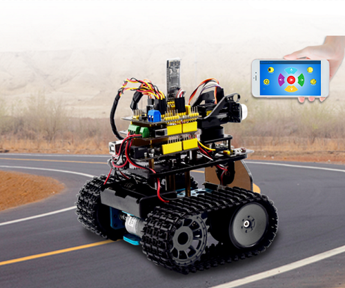

**Description**

We’ve learned the basic knowledge of Bluetooth. In this lesson, we will make a Bluetooth remote smart car. In the experiment, we default the HM-10 Bluetooth module as a Slave and the cellphone as a Host.

keyes BT car is an APP rolled out by keyestudio team. You could control the robot car by it readily.

**APP**

- **Android APP**

  - Please download the APP here.

  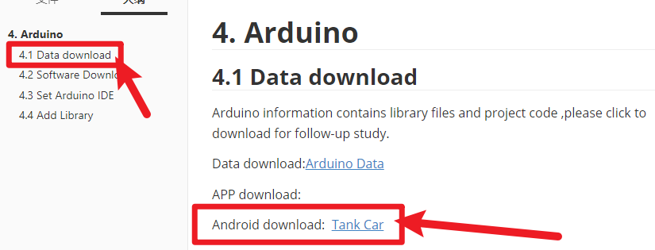

  - Tap the Tank_Car icon to enter the Bluetooth APP. As shown below.

    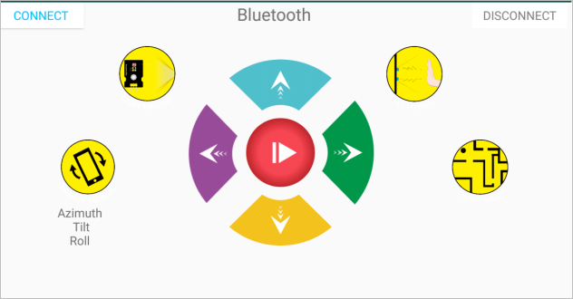

  - Done uploading the code to UNO R3 board, connect the Bluetooth module, the LED on the Bluetooth module will flash. Then tap the option CONNECT on the APP, searching the Bluetooth.

  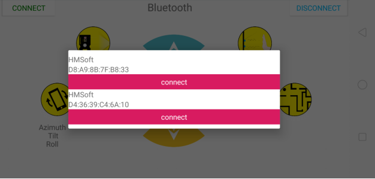

  - Click to connect the Bluetooth. HMSoft connected, Bluetooth LED will turn on normally.

  

  - Tap the button①　, 8x16 LED panel will display the front icon. Release the button, display the “STOP”. 
  - Below is Tank Robot Bluetooth APP interface and we have listed out what function of each key does:

  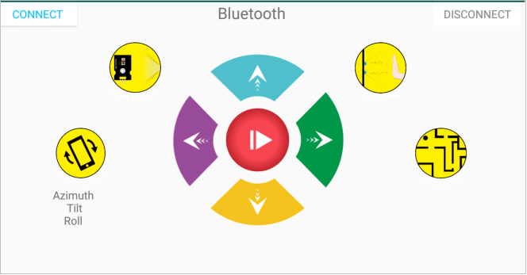

  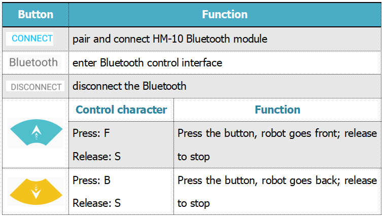

  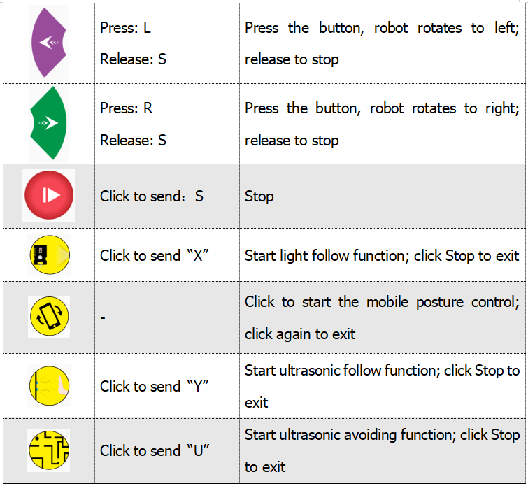

- **iOS APP**

  - Open the APP store

    

  - Click to search keyestudio, and you will see the keyes BT car.

    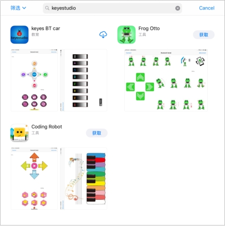

  - Tap to open the keyes BT car

  - To open Bluetooth, click the “Connect” on the upper left corner, searching and connecting Bluetooth.

  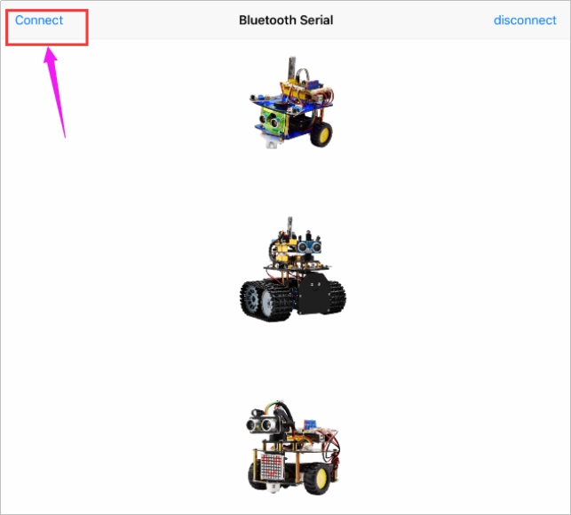

  - Tap the Tank_Car icon to enter the control interface.

    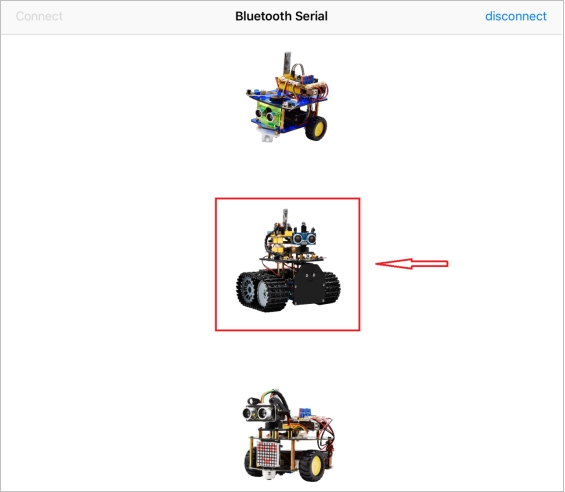

    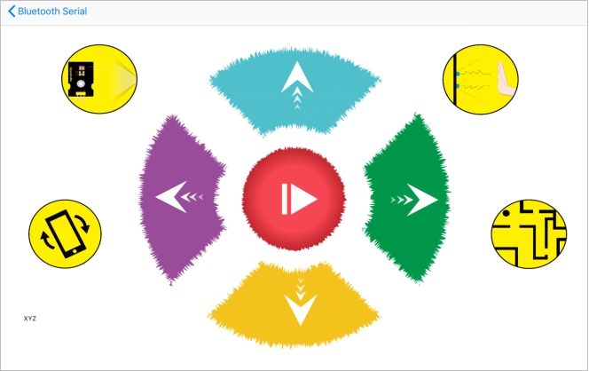

  - Below is Tank Robot Bluetooth APP interface and we have listed out what function of each key does:

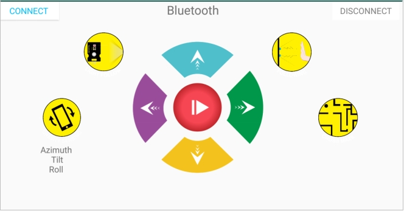


**Test Code**

```
/*
 keyestudio Mini Tank Robot v2.0
 lesson 14.1
 bluetooth test
 http://www.keyestudio.com
*/
char ble_val; //character variables, used to save the value of Bluetooth reception
void setup() 
{
  Serial.begin(9600);
}

void loop() 
{
  if(Serial.available() > 0)  //judge if there is data in buffer area
  { ble_val = Serial.read();  //read the data from serial buffer
    Serial.println(ble_val);  //print out
  }
}//**************************************************************
```

<span style="color: rgb(255, 76, 65);">Pull off the Bluetooth module, upload test code, reconnect Bluetooth module, open serial monitor and set baud rate to 9600. Point at Bluetooth module and press keys on APP, then the corresponding character is as shown below.</span>

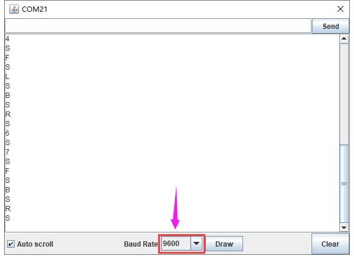

The detected character and corresponding function:

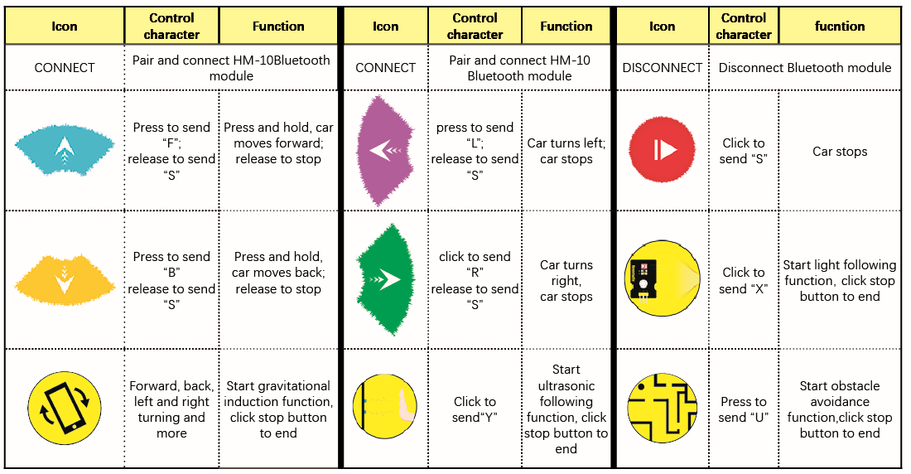

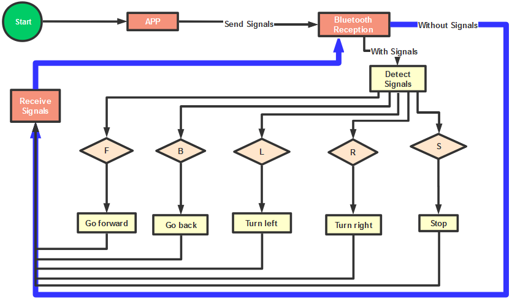

**Connection Diagram**

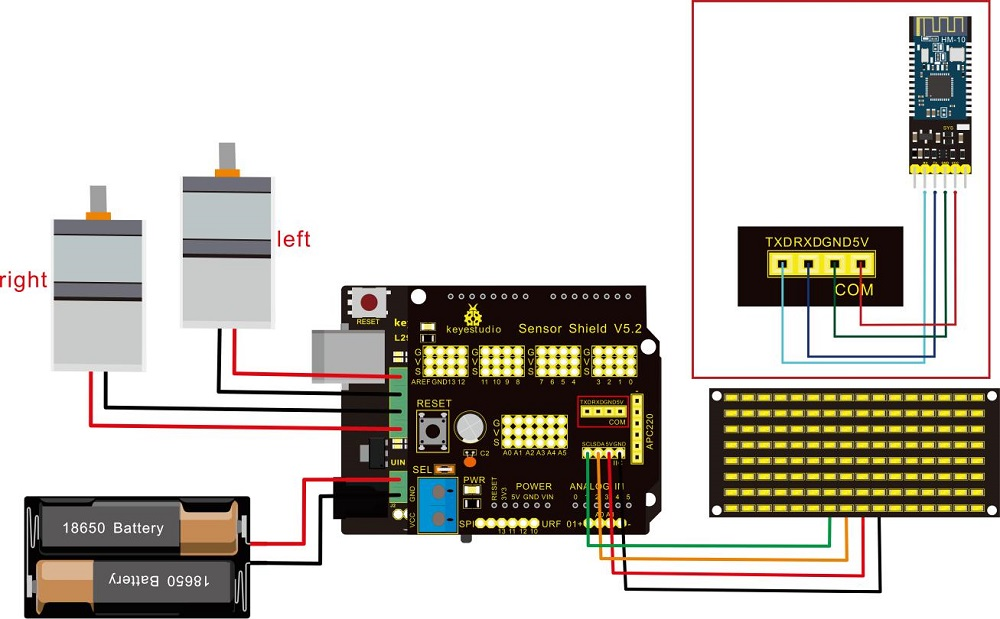

**Wiring Attention：**

| 8x16 LED panel                                               |      | Expansion Board |
| ------------------------------------------------------------ | ---- | --------------- |
| GND                                                          | →    | -（GND）        |
| VCC                                                          | →    | +（VCC）        |
| SDA                                                          | →    | SDA             |
| SCL                                                          | →    | SCL             |
| Insert Bluetooth module vertically, you don’t need to attach to its STATE and BRK pins |      |                 |

 **Test Code**

<span style="color: rgb(255, 76, 65);">Note:</span> Remove the Bluetooth module before uploading test code. Otherwise, you will fail to upload test code.

```
/*
 keyestudio Robot Car v2.0
 lesson 14.2
 bluetooth car
 http://www.keyestudio.com
*/

//Array, used to store the data of pattern, can be calculated by yourself or obtained from the modulus tool
unsigned char start01[] = {0x01,0x02,0x04,0x08,0x10,0x20,0x40,0x80,0x80,0x40,0x20,0x10,0x08,0x04,0x02,0x01};
unsigned char front[] = {0x00,0x00,0x00,0x00,0x00,0x24,0x12,0x09,0x12,0x24,0x00,0x00,0x00,0x00,0x00,0x00};
unsigned char back[] = {0x00,0x00,0x00,0x00,0x00,0x24,0x48,0x90,0x48,0x24,0x00,0x00,0x00,0x00,0x00,0x00};
unsigned char left[] = {0x00,0x00,0x00,0x00,0x00,0x00,0x44,0x28,0x10,0x44,0x28,0x10,0x44,0x28,0x10,0x00};
unsigned char right[] = {0x00,0x10,0x28,0x44,0x10,0x28,0x44,0x10,0x28,0x44,0x00,0x00,0x00,0x00,0x00,0x00};
unsigned char STOP01[] = {0x2E,0x2A,0x3A,0x00,0x02,0x3E,0x02,0x00,0x3E,0x22,0x3E,0x00,0x3E,0x0A,0x0E,0x00};
unsigned char clear[] = {0x00,0x00,0x00,0x00,0x00,0x00,0x00,0x00,0x00,0x00,0x00,0x00,0x00,0x00,0x00,0x00};
#define SCL_Pin  A5  //Set clock pin to A5
#define SDA_Pin  A4  //Set data pin to A4

#define ML_Ctrl 13  //define direction control pin of left motor
#define ML_PWM 11   //define PWM control pin of left motor
#define MR_Ctrl 12  //define direction control pin of right motor
#define MR_PWM 3    //define PWM control pin of right motor

char bluetooth_val; //save the value of Bluetooth reception

void setup(){
  Serial.begin(9600);
  
  pinMode(SCL_Pin,OUTPUT);
  pinMode(SDA_Pin,OUTPUT);
  matrix_display(clear);    //Clear the display
  matrix_display(start01);  //display start pattern

  pinMode(ML_Ctrl, OUTPUT);
  pinMode(ML_PWM, OUTPUT);
  pinMode(MR_Ctrl, OUTPUT);
  pinMode(MR_PWM, OUTPUT);
}

void loop(){
  if (Serial.available())
  {
    bluetooth_val = Serial.read();
    Serial.println(bluetooth_val);
  }
  switch (bluetooth_val) 
  {
     case 'F':  //forward command
        Car_front();
        matrix_display(front);  // show forward design
        break;
     case 'B':  //Back command
        Car_back();
        matrix_display(back);  //show back pattern
        break;
     case 'L':  // left-turning instruction
        Car_left();
        matrix_display(left);  //show “left-turning” sign 
        break;
     case 'R':  //right-turning instruction
        Car_right();
        matrix_display(right);  //display right-turning sign
       break;
     case 'S':  //stop command
        Car_Stop();
        matrix_display(STOP01);  //show stop picture
        break;
  }
}

/**************The function of dot matrix****************/
//this function is used for dot matrix display
void matrix_display(unsigned char matrix_value[])
{
  IIC_start();
  IIC_send(0xc0);  //Choose address
  
  for(int i = 0;i < 16;i++) //pattern data has 16 bits
  {
     IIC_send(matrix_value[i]); //data to convey patterns
  }
  IIC_end();   //end to convey data pattern
  
  IIC_start();
  IIC_send(0x8A);  //display control, set pulse width to 4/16
  IIC_end();
}
//The condition starting to transmit data
void IIC_start()
{
  digitalWrite(SCL_Pin,HIGH);
  delayMicroseconds(3);
  digitalWrite(SDA_Pin,HIGH);
  delayMicroseconds(3);
  digitalWrite(SDA_Pin,LOW);
  delayMicroseconds(3);
}
//transmit data
void IIC_send(unsigned char send_data)
{
  for(char i = 0;i < 8;i++)  //Each byte has 8 bits
  {
      digitalWrite(SCL_Pin,LOW);  //pull down clock pin SCL Pin to change the signals of SDA    
delayMicroseconds(3);
      if(send_data & 0x01)  //set high and low level of SDA_Pin according to 1 or 0 of every bit
      {
        digitalWrite(SDA_Pin,HIGH);
      }
      else
      {
        digitalWrite(SDA_Pin,LOW);
      }
      delayMicroseconds(3);
      digitalWrite(SCL_Pin,HIGH); //pull up clock pin SCL_Pin to stop transmitting data
      delayMicroseconds(3);
      send_data = send_data >> 1;  // Detect bit by bit, so move the data right by one
  }
}
//The sign that data transmission ends
void IIC_end()
{
  digitalWrite(SCL_Pin,LOW);
  delayMicroseconds(3);
  digitalWrite(SDA_Pin,LOW);
  delayMicroseconds(3);
  digitalWrite(SCL_Pin,HIGH);
  delayMicroseconds(3);
  digitalWrite(SDA_Pin,HIGH);
  delayMicroseconds(3);
}
/*************the function to run motor**************/
void Car_front()
{
  digitalWrite(MR_Ctrl,LOW);
  analogWrite(MR_PWM,200);
  digitalWrite(ML_Ctrl,LOW);
  analogWrite(ML_PWM,200);
}
void Car_back()
{
  digitalWrite(MR_Ctrl,HIGH);
  analogWrite(MR_PWM,200);
  digitalWrite(ML_Ctrl,HIGH);
  analogWrite(ML_PWM,200);
}
void Car_left()
{
  digitalWrite(MR_Ctrl,LOW);
  analogWrite(MR_PWM,255);
  digitalWrite(ML_Ctrl,HIGH);
  analogWrite(ML_PWM,255);
}
void Car_right()
{
  digitalWrite(MR_Ctrl,HIGH);
  analogWrite(MR_PWM,255);
  digitalWrite(ML_Ctrl,LOW);
  analogWrite(ML_PWM,255);
}
void Car_Stop()
{
  digitalWrite(MR_Ctrl,LOW);
  analogWrite(MR_PWM,0);
  digitalWrite(ML_Ctrl,LOW);
  analogWrite(ML_PWM,0);
}
void Car_T_left()
{
  digitalWrite(MR_Ctrl,LOW);
  analogWrite(MR_PWM,255);
  digitalWrite(ML_Ctrl,LOW);
  analogWrite(ML_PWM,180);
}
void Car_T_right()
{
  digitalWrite(MR_Ctrl,LOW);
  analogWrite(MR_PWM,180);
  digitalWrite(ML_Ctrl,LOW);
  analogWrite(ML_PWM,255);
}
  //****************************************************************
```

**Test Result**

Upload code successfully, DIP switch is dialed to the right end and power on. After connecting Bluetooth, we could drive smart car to move by Bluetooth App.

Press，tank robot goes forward；

click，smart car goes back；

pressbutton，tank robot turns left；click，robot turns right；

hold，it stops.

Clickto enable gravitational control，tapagain, end gravitational control. At same time,8X16 LED panel on robot car displays the corresponding pattern.