# Proyecto 14 Robot Controlado por Bluetooth

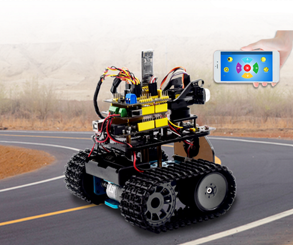

**Descripción**

Hemos aprendido los conocimientos básicos de Bluetooth. En esta lección, crearemos un automóvil inteligente controlado por Bluetooth. En el experimento, consideramos por defecto el módulo Bluetooth HM-10 como Esclavo y el teléfono celular como Host.

El keyestudio BT car es una APP lanzada por el equipo keyestudio. Puedes controlar el automóvil robot fácilmente con ella.

**APP**

- **APP Android**

  - Por favor descarga la APP aquí.

  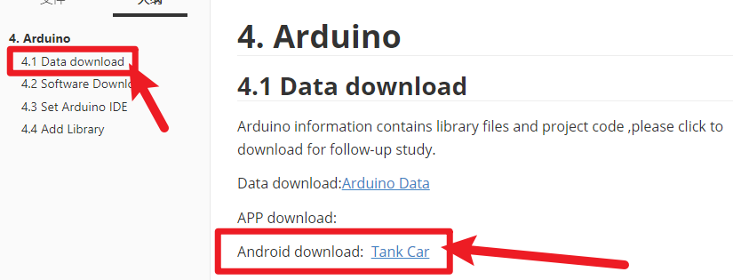

  - Toca el icono Tank_Car para entrar a la APP de Bluetooth. Como se muestra a continuación.

    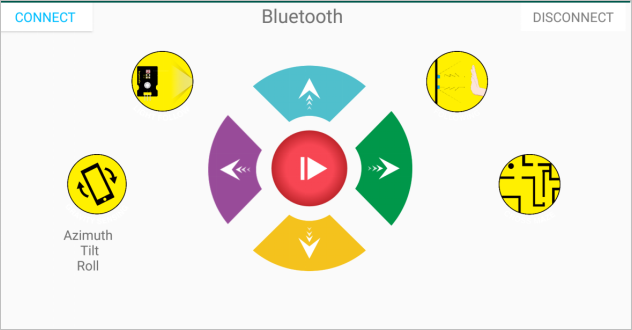

  - Después de cargar el código en la placa UNO R3, conecta el módulo Bluetooth, el LED en el módulo Bluetooth parpadeará. Luego toca la opción CONNECT en la APP, buscando el Bluetooth.

  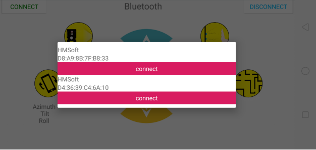

  - Haz clic para conectar el Bluetooth. HMSoft conectado, el LED de Bluetooth se encenderá normalmente.

  

  - Toca el botón①, el panel LED 8x16 mostrará el icono frontal. Suelta el botón, muestra "STOP".
  - A continuación se muestra la interfaz de la APP de Bluetooth del Robot Tank y hemos enumerado la función de cada tecla:

  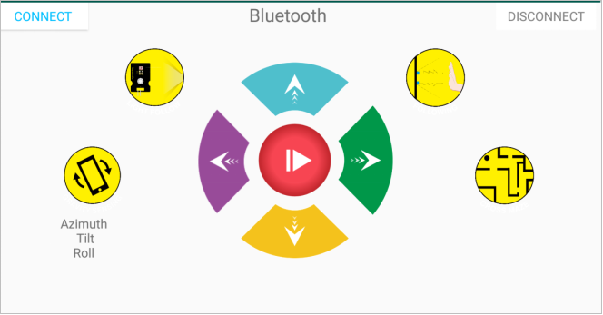

  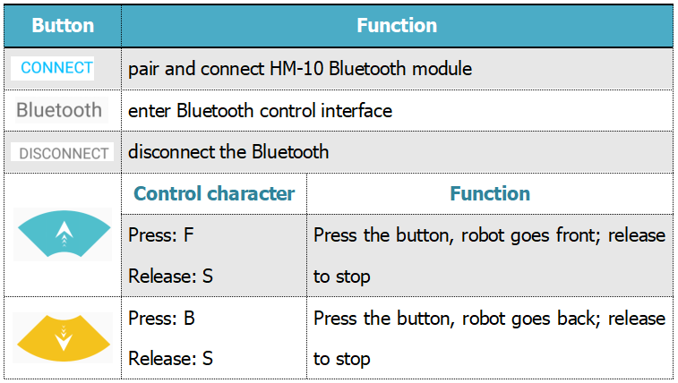

  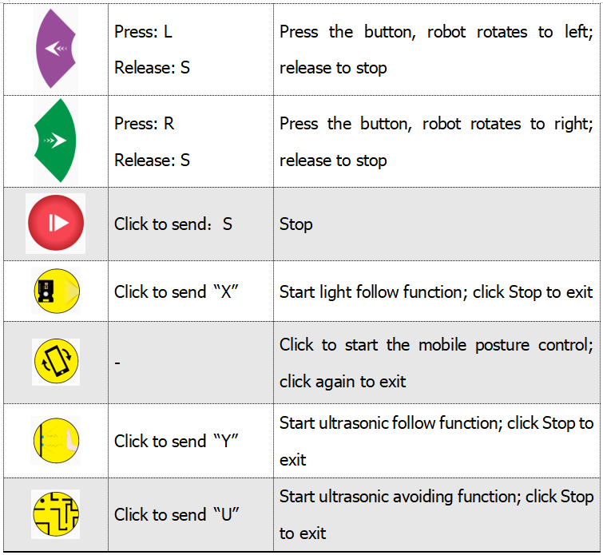

- **APP iOS**

  - Abre la APP store

    

  - Haz clic para buscar keyestudio, y verás el keyes BT car.

    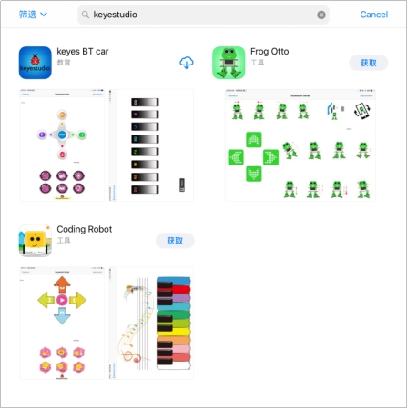

  - Toca para abrir el keyes BT car

  - Para abrir Bluetooth, haz clic en "Connect" en la esquina superior izquierda, buscando y conectando Bluetooth.

  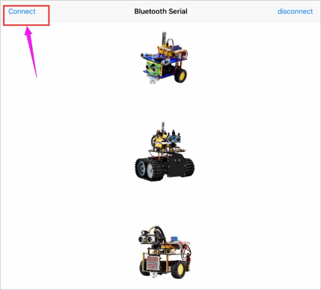

  - Toca el icono Tank_Car para entrar a la interfaz de control.

    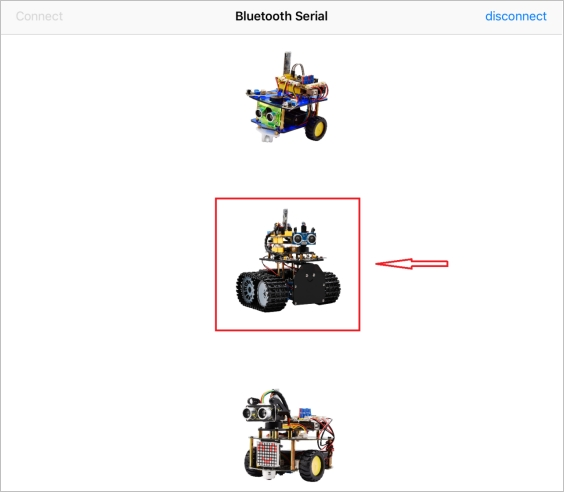

    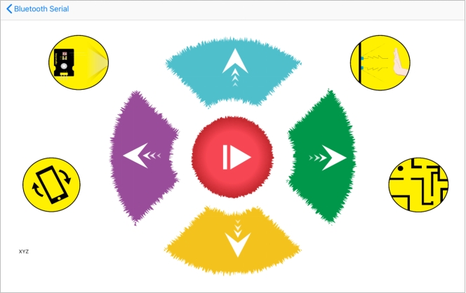

  - A continuación se muestra la interfaz de la APP de Bluetooth del Robot Tank y hemos enumerado la función de cada tecla:

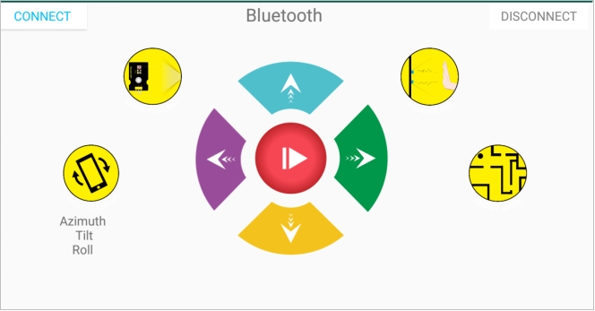


**Código de Prueba**

```c
/*
 keyestudio Mini Tank Robot V2.1
 lección 14.1
 prueba de bluetooth
 http://www.keyestudio.com
*/
char ble_val; //variable de carácter, utilizada para guardar el valor de la recepción de Bluetooth
void setup() 
{
  Serial.begin(9600);
}

void loop() 
{
  if(Serial.available() > 0)  //juzgar si hay datos en el área del búfer
  { ble_val = Serial.read();  //leer los datos del búfer serial
    Serial.println(ble_val);  //imprimir
  }
}//**************************************************************
```

**Desconecta el módulo Bluetooth, carga el código de prueba, reconecta el módulo Bluetooth, abre el monitor serial y establece la velocidad en baudios a 9600. Apunta al módulo Bluetooth y presiona las teclas en la APP, entonces el carácter correspondiente se muestra a continuación.**

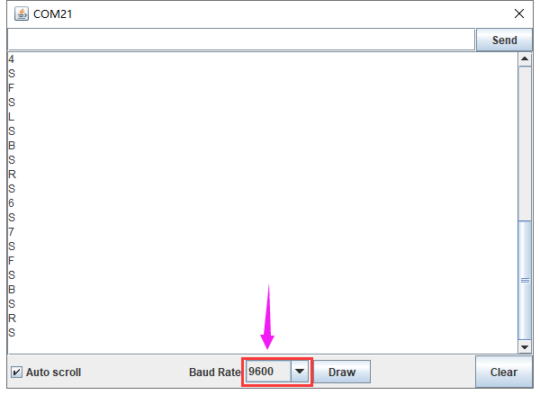

El carácter detectado y la función correspondiente:

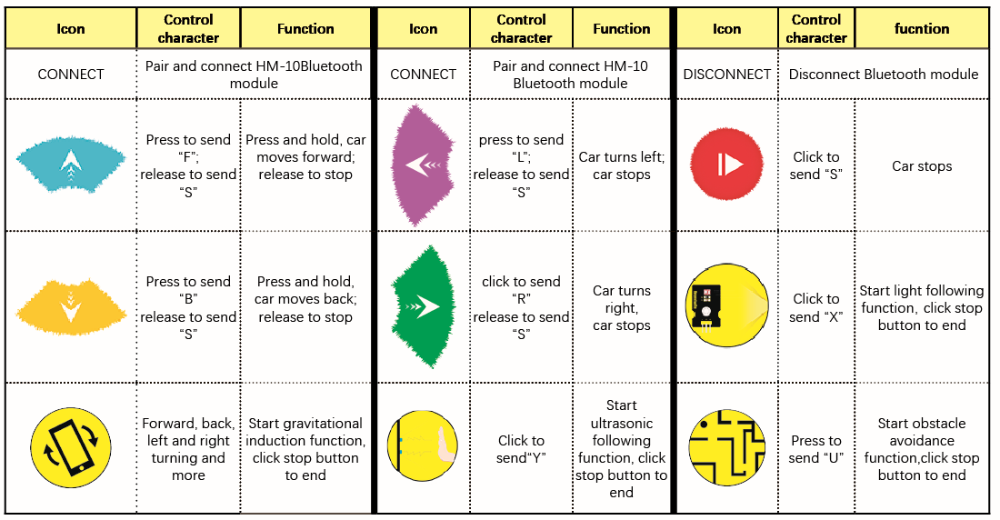

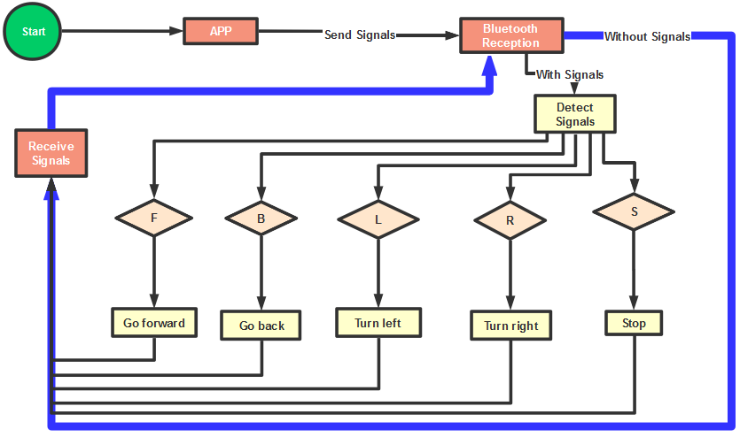

**Diagrama de Conexión**

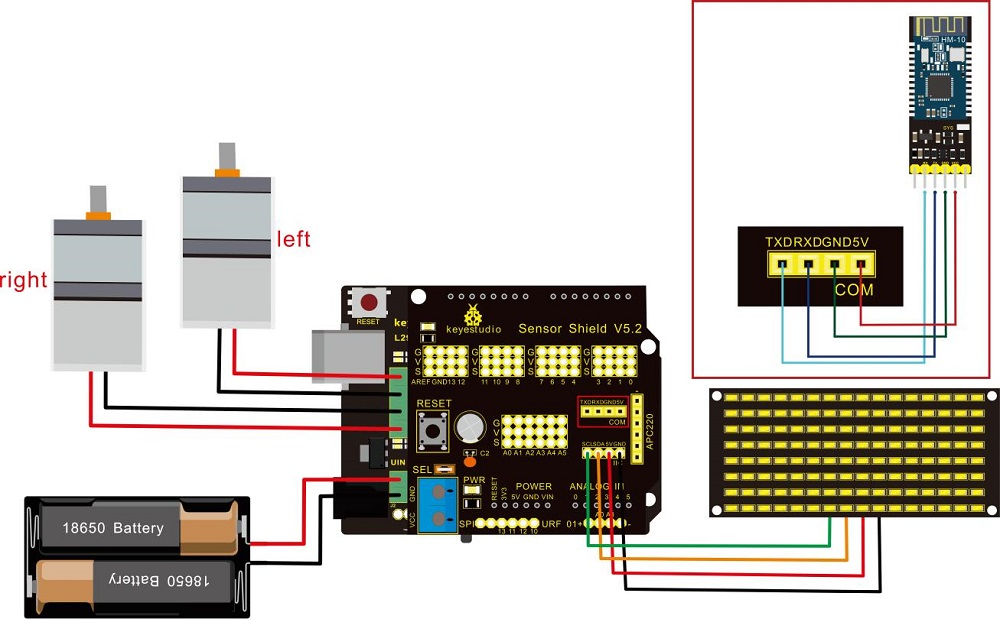

**Atención al Cableado：**

| Panel LED 8x16                                               |      | Placa de Expansión |
| ------------------------------------------------------------ | ---- | --------------- |
| GND                                                          | →    | -（GND）        |
| VCC                                                          | →    | +（VCC）        |
| SDA                                                          | →    | SDA             |
| SCL                                                          | →    | SCL             |
| Inserta el módulo Bluetooth verticalmente, no necesitas conectar sus pines STATE y BRK |      |                 |

**Código de Prueba**

**Nota:** Retira el módulo Bluetooth antes de cargar el código de prueba. De lo contrario, fallarás al cargar el código de prueba.

```c
/*
 keyestudio Robot Car v2.0
 lección 14.2
 coche bluetooth
 http://www.keyestudio.com
*/

//Array, utilizado para almacenar los datos del patrón, puede ser calculado por ti mismo u obtenido de la herramienta de módulo
unsigned char start01[] = {0x01,0x02,0x04,0x08,0x10,0x20,0x40,0x80,0x80,0x40,0x20,0x10,0x08,0x04,0x02,0x01};
unsigned char front[] = {0x00,0x00,0x00,0x00,0x00,0x24,0x12,0x09,0x12,0x24,0x00,0x00,0x00,0x00,0x00,0x00};
unsigned char back[] = {0x00,0x00,0x00,0x00,0x00,0x24,0x48,0x90,0x48,0x24,0x00,0x00,0x00,0x00,0x00,0x00};
unsigned char left[] = {0x00,0x00,0x00,0x00,0x00,0x00,0x44,0x28,0x10,0x44,0x28,0x10,0x44,0x28,0x10,0x00};
unsigned char right[] = {0x00,0x10,0x28,0x44,0x10,0x28,0x44,0x10,0x28,0x44,0x00,0x00,0x00,0x00,0x00,0x00};
unsigned char STOP01[] = {0x2E,0x2A,0x3A,0x00,0x02,0x3E,0x02,0x00,0x3E,0x22,0x3E,0x00,0x3E,0x0A,0x0E,0x00};
unsigned char clear[] = {0x00,0x00,0x00,0x00,0x00,0x00,0x00,0x00,0x00,0x00,0x00,0x00,0x00,0x00,0x00,0x00};
#define SCL_Pin  A5  //Establecer el pin de reloj a A5
#define SDA_Pin  A4  //Establecer el pin de datos a A4

#define ML_Ctrl 13  //definir el pin de control de dirección del motor izquierdo
#define ML_PWM 11   //definir el pin de control PWM del motor izquierdo
#define MR_Ctrl 12  //definir el pin de control de dirección del motor derecho
#define MR_PWM 3    //definir el pin de control PWM del motor derecho

char bluetooth_val; //guardar el valor de la recepción de Bluetooth

void setup(){
  Serial.begin(9600);
  
  pinMode(SCL_Pin,OUTPUT);
  pinMode(SDA_Pin,OUTPUT);
  matrix_display(clear);    //Limpiar la pantalla
  matrix_display(start01);  //mostrar patrón de inicio

  pinMode(ML_Ctrl, OUTPUT);
  pinMode(ML_PWM, OUTPUT);
  pinMode(MR_Ctrl, OUTPUT);
  pinMode(MR_PWM, OUTPUT);
}

void loop(){
  if (Serial.available())
  {
    bluetooth_val = Serial.read();
    Serial.println(bluetooth_val);
  }
  switch (bluetooth_val) 
  {
     case 'F':  //comando de avance
        Car_front();
        matrix_display(front);  //mostrar diseño de avance
        break;
     case 'B':  //comando de retroceso
        Car_back();
        matrix_display(back);  //mostrar patrón de retroceso
        break;
     case 'L':  //instrucción de giro a la izquierda
        Car_left();
        matrix_display(left);  //mostrar signo de "giro a la izquierda"
        break;
     case 'R':  //instrucción de giro a la derecha
        Car_right();
        matrix_display(right);  //mostrar signo de giro a la derecha
       break;
     case 'S':  //comando de parada
        Car_Stop();
        matrix_display(STOP01);  //mostrar imagen de parada
        break;
  }
}

/**************La función de la matriz de puntos****************/
//esta función se utiliza para la visualización de la matriz de puntos
void matrix_display(unsigned char matrix_value[])
{
  IIC_start();
  IIC_send(0xc0);  //Elegir dirección
  
  for(int i = 0;i < 16;i++) //los datos del patrón tienen 16 bits
  {
     IIC_send(matrix_value[i]); //datos para transmitir patrones
  }
  IIC_end();   //finalizar la transmisión del patrón de datos
  
  IIC_start();
  IIC_send(0x8A);  //control de visualización, establecer el ancho de pulso a 4/16
  IIC_end();
}
//La condición para comenzar a transmitir datos
void IIC_start()
{
  digitalWrite(SCL_Pin,HIGH);
  delayMicroseconds(3);
  digitalWrite(SDA_Pin,HIGH);
  delayMicroseconds(3);
  digitalWrite(SDA_Pin,LOW);
  delayMicroseconds(3);
}
//transmitir datos
void IIC_send(unsigned char send_data)
{
  for(char i = 0;i < 8;i++)  //Cada byte tiene 8 bits
  {
      digitalWrite(SCL_Pin,LOW);  //bajar el pin de reloj SCL_Pin para cambiar las señales de SDA    
delayMicroseconds(3);
      if(send_data & 0x01)  //establecer el nivel alto y bajo de SDA_Pin según el 1 o 0 de cada bit
      {
        digitalWrite(SDA_Pin,HIGH);
      }
      else
      {
        digitalWrite(SDA_Pin,LOW);
      }
      delayMicroseconds(3);
      digitalWrite(SCL_Pin,HIGH); //subir el pin de reloj SCL_Pin para detener la transmisión de datos
      delayMicroseconds(3);
      send_data = send_data >> 1;  //Detectar bit por bit, por lo que desplazar los datos a la derecha en uno
  }
}
//El signo de que la transmisión de datos ha finalizado
void IIC_end()
{
  digitalWrite(SCL_Pin,LOW);
  delayMicroseconds(3);
  digitalWrite(SDA_Pin,LOW);
  delayMicroseconds(3);
  digitalWrite(SCL_Pin,HIGH);
  delayMicroseconds(3);
  digitalWrite(SDA_Pin,HIGH);
  delayMicroseconds(3);
}
/*************la función para ejecutar el motor**************/
void Car_front()
{
  digitalWrite(MR_Ctrl,LOW);
  analogWrite(MR_PWM,200);
  digitalWrite(ML_Ctrl,LOW);
  analogWrite(ML_PWM,200);
}
void Car_back()
{
  digitalWrite(MR_Ctrl,HIGH);
  analogWrite(MR_PWM,200);
  digitalWrite(ML_Ctrl,HIGH);
  analogWrite(ML_PWM,200);
}
void Car_left()
{
  digitalWrite(MR_Ctrl,LOW);
  analogWrite(MR_PWM,255);
  digitalWrite(ML_Ctrl,HIGH);
  analogWrite(ML_PWM,255);
}
void Car_right()
{
  digitalWrite(MR_Ctrl,HIGH);
  analogWrite(MR_PWM,255);
  digitalWrite(ML_Ctrl,LOW);
  analogWrite(ML_PWM,255);
}
void Car_Stop()
{
  digitalWrite(MR_Ctrl,LOW);
  analogWrite(MR_PWM,0);
  digitalWrite(ML_Ctrl,LOW);
  analogWrite(ML_PWM,0);
}
void Car_T_left()
{
  digitalWrite(MR_Ctrl,LOW);
  analogWrite(MR_PWM,255);
  digitalWrite(ML_Ctrl,LOW);
  analogWrite(ML_PWM,180);
}
void Car_T_right()
{
  digitalWrite(MR_Ctrl,LOW);
  analogWrite(MR_PWM,180);
  digitalWrite(ML_Ctrl,LOW);
  analogWrite(ML_PWM,255);
}
  //****************************************************************
```

**Resultado de la Prueba**

Carga el código exitosamente, el interruptor DIP se coloca en el extremo derecho y enciende. Después de conectar Bluetooth, podemos conducir el automóvil inteligente mediante la App de Bluetooth.

Presiona, el robot tank avanza；

haz clic en, el automóvil inteligente retrocede；

presiona el botón, el robot tank gira a la izquierda；haz clic en, el robot gira a la derecha；

mantén presionado, se detiene.

Haz clic enpara habilitar el control gravitacional，tocanuevamente, finaliza el control gravitacional. Al mismo tiempo, el panel LED 8X16 en el automóvil robot muestra el patrón correspondiente.