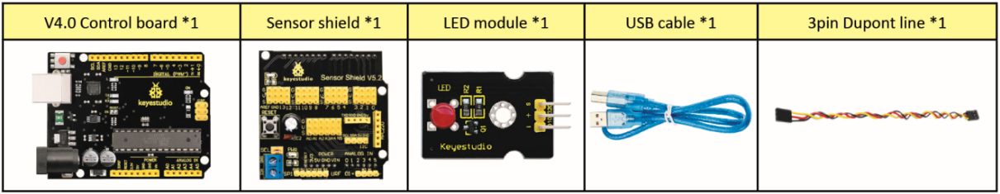
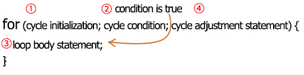
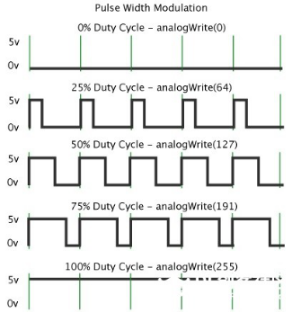

### Project 2 Adjust LED Brightness

**(1) Description**

In previous lesson, we control LED on and off and make it blink.

In this project, we will control the brightness of LED through PWM to simulate breathing effects. Similarly, you can change the step length and delay time in the code so as to demonstrate different breathing effect.

PWM is a means of controlling the analog output via digital means. Digital control is used to generate square waves with different duty cycles (a signal that constantly switches between high and low levels) to control the analog output. In general, the input voltages of ports are 0V and 5V. What if the 3V is required? Or a switch among 1V, 3V and 3.5V? We cannot change resistors constantly. For this reason, we resort to PWM.


For the Arduino digital port voltage output, there are only LOW and HIGH, which correspond to the voltage output of 0V and 5V. You can define LOW as 0 and HIGH as 1, and let the Arduino output five hundred 0 or 1 signals within 1 second.

If output five hundred 1, that is 5V; if all of which is 1, that is 0V. If output 010101010101 in this way then the output port is 2.5V, which is like showing movie. The movie we watch are not completely continuous. It actually outputs 25 pictures per second. In this case, the human can’t tell it, neither does PWM. If want different voltage, need to control the ratio of 0 and 1. The more 0,1 signals output per unit time, the more accurately control.

**(2) Specification**

- Control interface: digital port
- Working voltage: DC 3.3-5V
- Pin spacing: 2.54mm
- Display color: red

**(3) Components**



 **(4) Connection Diagram**


 **(5) Test Code**

```
/*
 keyestudio Mini Tank Robot V2
 lesson 2.2
 pwm-slow
 http://www.keyestudio.com
*/
int ledPin = 10; // Define the LED pin at D10
int value;

void setup () 
{
	pinMode (ledPin, OUTPUT); // initialize ledpin as an output.
}

void loop () 
{
    for (value = 0; value <255; value = value + 1)
    {
        analogWrite (ledPin, value); // LED lights gradually light up
        delay (30); // delay 30MS
    }
    for (value = 255; value> 0; value = value-1)
    {
        analogWrite (ledPin, value); // LED gradually goes out
        delay (30); // delay 30MS
	}
}
```

**Test Result**

Upload test code successfully, LED gradually changes from bright to dark, like human’s breath, rather than turning on and off immediately.

**Code Explanation**

When we need to repeat some statements, we could use FOR statement.

FOR statement format is shown below:



OR cyclic sequence:

Round 1：1 → 2 → 3 → 4

Round 2：2 → 3 → 4

…

Until number 2 is not established, “for”loop is over,

After knowing this order, go back to code:

**for (int value = 0; value < 255; value=value+1){**

**...**

**}**

**for (int value = 255; value >0; value=value-1){**

**...**

**}**

The two“for”statements make value increase from 0 to 255, then reduce from 255 to 0, then increase to 255,....infinitely loop.

There is a new function in the following ----- analogWrite()

We know that digital port only has two state of 0 and 1. So how to send an analog value to a digital value? Here,this function is needed. Let’s observe the Arduino board and find 6 pins marked“\~”which can output PWM signals.

<span style="color: rgb(255, 76, 65);">Function format as follows:</span>

**analogWrite(pin,value)**

analogWrite() is used to write an analog value from 0\~255 for PWM port, so the value is in the range of 0\~255. Attention that you only write the digital pins with PWM function, such as pin 3, 5, 6, 9, 10, 11.

PWM is a technology to obtain analog quantity through digital method. Digital control forms a square wave, and the square wave signal only has two states of turning on and off (that is, high or low levels). By controlling the ratio of the duration of turning on and off, a voltage varying from 0 to 5V can be simulated. The time turning on(academically referred to as high level) is called pulse width, so PWM is also called pulse width modulation.

Through the following five square waves, let’s acknowledge more about PWM.



In the above figure, the green line represents a period, and value of analogWrite() corresponds to a percentage which is called Duty Cycle as well.

Duty cycle implies that high-level duration is divided by low-level duration in a cycle. From top to bottom, the duty cycle of first square wave is 0% and its corresponding value is 0. The LED brightness is lowest, that is, turn off. The more time high level lasts, the brighter the LED. Therefore, the last duty cycle is 100%, which correspond to 255, LED is brightest. 25% means darker.

PWM mostly is used for adjusting the LED brightness or rotation speed of motor.

It plays a vital role in controlling smart robot car. I believe that you can’t wait to enter the next project.


