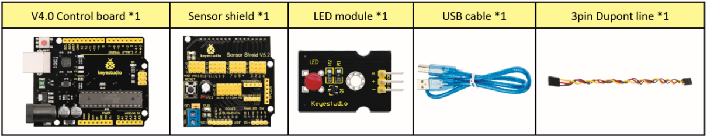
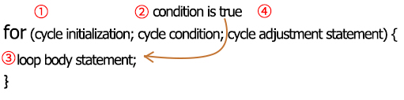
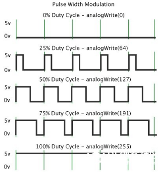

# Progetto 2 Regolare la Luminosità del LED

**(1) Descrizione**

Nella lezione precedente, abbiamo controllato l'accensione e lo spegnimento del LED e lo abbiamo fatto lampeggiare.

In questo progetto, controlleremo la luminosità del LED attraverso PWM per simulare effetti di respirazione. Allo stesso modo, puoi modificare la lunghezza del passo e il tempo di ritardo nel codice per dimostrare diversi effetti di respirazione.

PWM è un mezzo per controllare l'uscita analogica attraverso mezzi digitali. Il controllo digitale viene utilizzato per generare onde quadre con diversi cicli di lavoro (un segnale che commuta costantemente tra livelli alti e bassi) per controllare l'uscita analogica. In generale, le tensioni di ingresso delle porte sono 0V e 5V. Cosa succede se è richiesto 3V? O un passaggio tra 1V, 3V e 3,5V? Non possiamo cambiare costantemente i resistori. Per questo motivo, ricorriamo a PWM.


Per l'uscita di tensione della porta digitale Arduino, ci sono solo LOW e HIGH, che corrispondono all'uscita di tensione di 0V e 5V. Puoi definire LOW come 0 e HIGH come 1, e far sì che Arduino emetta cinquecento segnali 0 o 1 entro 1 secondo.

Se emetti cinquecento 1, cioè 5V; se tutti sono 1, cioè 0V. Se emetti 010101010101 in questo modo, la porta di uscita è 2,5V, il che è come guardare un film. I film che guardiamo non sono completamente continui. In realtà emette 25 fotogrammi al secondo. In questo caso, l'uomo non può accorgersene, né PWM. Se vuoi una tensione diversa, devi controllare il rapporto tra 0 e 1. Più segnali 0 e 1 emetti per unità di tempo, più accuratamente puoi controllare.

**(2) Specifiche**

- Interfaccia di controllo: porta digitale
- Tensione di lavoro: CC 3,3-5V
- Spaziatura dei pin: 2,54 mm
- Colore di visualizzazione: rosso

**(3) Componenti**



 **(4) Diagramma di Collegamento**


 **(5) Codice di Test**

```c
/*
 keyestudio Mini Tank Robot V2.1
 lezione 2.2
 pwm-slow
 http://www.keyestudio.com
*/
int ledPin = 10; // Definire il pin del LED a D10
int value;

void setup () 
{
	pinMode (ledPin, OUTPUT); // inizializzare ledpin come uscita.
}

void loop () 
{
    for (value = 0; value <255; value = value + 1)
    {
        analogWrite (ledPin, value); // Il LED si illumina gradualmente
        delay (30); // ritardo 30MS
    }
    for (value = 255; value> 0; value = value-1)
    {
        analogWrite (ledPin, value); // Il LED si spegne gradualmente
        delay (30); // ritardo 30MS
	}
}
```

**Risultato del Test**

Dopo aver caricato il codice di test con successo, il LED cambia gradualmente da luminoso a scuro, come il respiro umano, piuttosto che accendersi e spegnersi immediatamente.

**Spiegazione del Codice**

Quando abbiamo bisogno di ripetere alcune istruzioni, possiamo usare l'istruzione FOR.

Il formato dell'istruzione FOR è mostrato di seguito:



O sequenza ciclica:

Giro 1：1 → 2 → 3 → 4

Giro 2：2 → 3 → 4

…

Fino a quando il numero 2 non è stabilito, il ciclo "for" è finito,

Dopo aver compreso questo ordine, torna al codice:

**for (int value = 0; value < 255; value=value+1){**

**...**

**}**

**for (int value = 255; value >0; value=value-1){**

**...**

**}**

Le due istruzioni "for" fanno aumentare il valore da 0 a 255, poi diminuire da 255 a 0, poi aumentare a 255, .... ciclo infinito.

C'è una nuova funzione di seguito ----- analogWrite()

Sappiamo che la porta digitale ha solo due stati: 0 e 1. Allora come inviare un valore analogico a un valore digitale? Qui, questa funzione è necessaria. Osserviamo la scheda Arduino e troviamo 6 pin contrassegnati con "\~" che possono emettere segnali PWM.

**Il formato della funzione è il seguente:**

**analogWrite(pin,value)**

analogWrite() viene utilizzato per scrivere un valore analogico da 0\~255 per la porta PWM, quindi il valore è nell'intervallo 0\~255. Presta attenzione a scrivere solo i pin digitali con funzione PWM, come i pin 3, 5, 6, 9, 10, 11.

PWM è una tecnologia per ottenere una quantità analogica attraverso un metodo digitale. Il controllo digitale forma un'onda quadra, e il segnale dell'onda quadra ha solo due stati di accensione e spegnimento (cioè, livelli alti o bassi). Controllando il rapporto tra la durata dell'accensione e dello spegnimento, è possibile simulare una tensione che varia da 0 a 5V. Il tempo di accensione (accademicamente denominato livello alto) è chiamato larghezza di impulso, quindi PWM è anche chiamato modulazione della larghezza di impulso.

Attraverso le seguenti cinque onde quadre, comprendiamo meglio PWM.



Nella figura precedente, la linea verde rappresenta un periodo, e il valore di analogWrite() corrisponde a una percentuale che è anche chiamata Duty Cycle.

Il ciclo di lavoro implica che la durata del livello alto è divisa per la durata del livello basso in un ciclo. Da cima a fondo, il ciclo di lavoro della prima onda quadra è 0% e il suo valore corrispondente è 0. La luminosità del LED è più bassa, cioè spento. Più a lungo dura il livello alto, più luminoso è il LED. Pertanto, l'ultimo ciclo di lavoro è 100%, che corrisponde a 255, il LED è più luminoso. 25% significa più scuro.

PWM è principalmente utilizzato per regolare la luminosità del LED o la velocità di rotazione del motore.

Svolge un ruolo vitale nel controllo dell'auto robot intelligente. Credo che non vedi l'ora di entrare nel prossimo progetto.