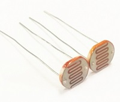
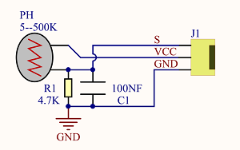
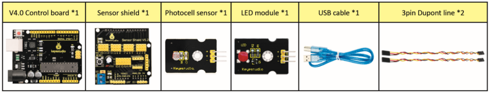
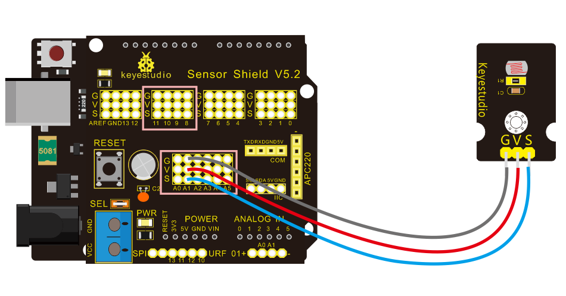
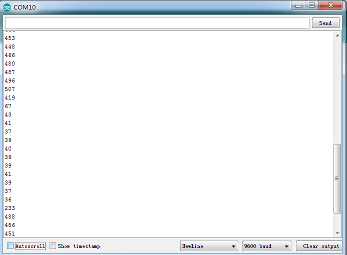
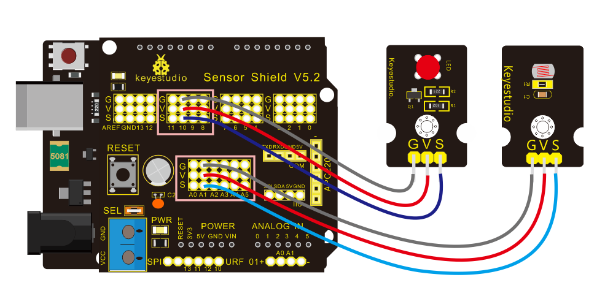

### Project 3 Photoresistor Sensor



 **Description**

The photoresistor is a special resistor made of semiconductor materials such as CdS or Selenide septum. The surface is also coated with moisture-proof resin, which has a photoconductive effect. It is sensitive to ambient light. Its resistance varies from different light intensities.

We use the characteristics of the photo-resistor to design the circuit and generate the photo-resistor module.

Connecting the signal pin of photocell module to Analog port, you will find that the stronger the light intensity, the greater the voltage of analog port, and the greater the analog value .

On the contrary, the weaker the light intensity, the smaller the voltage of analog port, the smaller the analog value is.

Based on that, we can use the photocell module to read the analog value, so get the ambient light intensity.

 **Specification**

\

- Resistance：5K ohm-0.5Mohm
- Interface Type: analog
- Working Voltage: 3.3V-5V
- Easy installation: with screw fixing holes
- Pin spacing: 2.54mm

 **Components**



 **Connection Diagram：**



The two photoresistor sensors are linked with A1 and A2, then finish the experiment via photoresistor connected to A1. Let’s read its analog value.

**Test Code**

```
/*
 keyestudio Mini Tank Robot V2
 lesson 3.1
 photocell
 http://www.keyestudio.com
*/

int sensorPin = A1;    // select the input pin for the photocell
int sensorValue = 0;  // variable to store the value coming from the sensor
void setup() 
{
	Serial.begin(9600);
}

void loop() 
{
    sensorValue = analogRead(sensorPin);  // read the value from the sensor:
    Serial.println(sensorValue);  //Serial port prints the resistance value
    delay(500);
}
//******************************************************
```

 **Test Result**

Upload code on development board, open serial monitor, check if its value diminishes when covering photoresistor. However, the value increases when uncovered.



**Code Explanation**

**analogRead(sensorPin)：** read the analog value of photoresistor via analog ports.

**Serial.begin(9600):** Initialize the serial port, baud rate of serial communication is 9600.

**Serial.println** : Serial port prints and word wrap.

**Extension Practice**

We’ve known how to read the value of photoresistor. Let’s combine the photoresistor with a LED and view the status of LED.



PWM restrains the brightness, so LED is linked with PWM pins. Connect LED to pin 10, keep pin of photoresistor unchanged, then design the code:

```
/*keyestudio Mini Tank Robot V2
lesson 3.2
photocell-analog output
http://www.keyestudio.com
*/
int analogInPin = A1;  // Analog input pin that the photocell is attached to
int analogOutPin = 10; // Analog output pin that the LED is attached to
int sensorValue = 0;        // value read from the pot
int outputValue = 0;        // value output to the PWM (analog out)

void setup() 
{
	Serial.begin(9600);
 }
void loop() 
{
  // read the analog in value:
  sensorValue = analogRead(analogInPin);
  // map it to the range of the analog out:
  outputValue = map(sensorValue, 0, 1023, 0, 255);
  // change the analog out value:
  analogWrite(analogOutPin, outputValue);
  // wait 2 milliseconds before the next loop for the analog-to-digital
  // converter to settle after the last reading:
 Serial.println(sensorValue);  //serial port prints the value of photoresistor
 delay(2);
}
//***************************************************************
```

Upload code, press it by hand to observe the LED brightness.