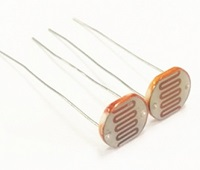
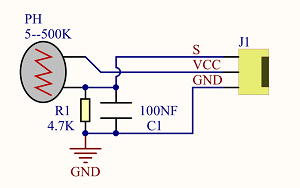
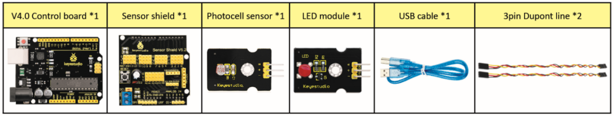
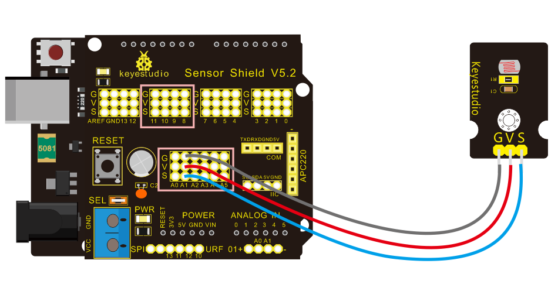
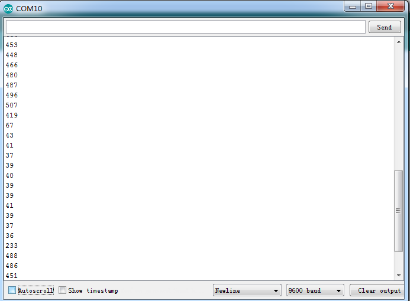
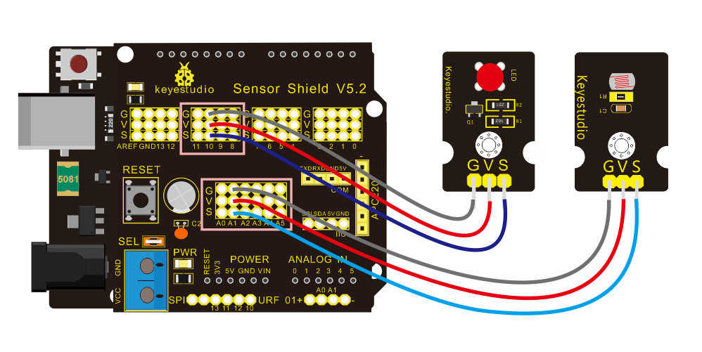

# Proyecto 3 Sensor de Fotoresistencia



 **Descripción**

La fotoresistencia es una resistencia especial fabricada con materiales semiconductores como CdS o septo de selenio. La superficie también está recubierta con resina a prueba de humedad, que tiene un efecto fotoconductor. Es sensible a la luz ambiental. Su resistencia varía según diferentes intensidades de luz.

Utilizamos las características de la fotoresistencia para diseñar el circuito y generar el módulo de fotoresistencia.

Al conectar el pin de señal del módulo de fotocélula a un puerto analógico, descubrirá que cuanto mayor sea la intensidad de luz, mayor será el voltaje del puerto analógico y mayor será el valor analógico.

Por el contrario, cuanto menor sea la intensidad de luz, menor será el voltaje del puerto analógico y menor será el valor analógico.

Basándonos en esto, podemos usar el módulo de fotocélula para leer el valor analógico y así obtener la intensidad de luz ambiental.

 **Especificaciones**



- Resistencia: 5K ohmios - 0,5 Mohmios
- Tipo de interfaz: analógica
- Voltaje de funcionamiento: 3,3V - 5V
- Instalación fácil: con orificios de fijación con tornillo
- Espaciado de pines: 2,54 mm

 **Componentes**



 **Diagrama de conexión:**



Los dos sensores de fotoresistencia están conectados con A1 y A2, luego complete el experimento a través de la fotoresistencia conectada a A1. Leamos su valor analógico.

**Código de prueba**

```c
/*
 keyestudio Mini Tank Robot V2.1
 lección 3.1
 fotocélula
 http://www.keyestudio.com
*/

int sensorPin = A1;    // selecciona el pin de entrada para la fotocélula
int sensorValue = 0;  // variable para almacenar el valor que viene del sensor
void setup() 
{
	Serial.begin(9600);
}

void loop() 
{
    sensorValue = analogRead(sensorPin);  // lee el valor del sensor:
    Serial.println(sensorValue);  // el puerto serie imprime el valor de resistencia
    delay(500);
}
//******************************************************
```

 **Resultado de la prueba**

Cargue el código en la placa de desarrollo, abra el monitor serie y verifique si su valor disminuye al cubrir la fotoresistencia. Sin embargo, el valor aumenta cuando está descubierta.



**Explicación del código**

**analogRead(sensorPin):** lee el valor analógico de la fotoresistencia a través de los puertos analógicos.

**Serial.begin(9600):** inicializa el puerto serie, la velocidad en baudios de la comunicación serie es 9600.

**Serial.println:** el puerto serie imprime y hace un salto de línea.

**Práctica de extensión**

Ya sabemos cómo leer el valor de la fotoresistencia. Combinemos la fotoresistencia con un LED y veamos el estado del LED.



PWM controla el brillo, por lo que el LED está conectado con pines PWM. Conecte el LED al pin 10, mantenga el pin de la fotoresistencia sin cambios, luego diseñe el código:

```c
/*keyestudio Mini Tank Robot V2.1
lección 3.2
fotocélula-salida analógica
http://www.keyestudio.com
*/
int analogInPin = A1;  // pin de entrada analógica al que está conectada la fotocélula
int analogOutPin = 10; // pin de salida analógica al que está conectado el LED
int sensorValue = 0;        // valor leído de la fotocélula
int outputValue = 0;        // valor de salida al PWM (salida analógica)

void setup() 
{
	Serial.begin(9600);
 }
void loop() 
{
  // lee el valor de entrada analógica:
  sensorValue = analogRead(analogInPin);
  // mapéalo al rango de la salida analógica:
  outputValue = map(sensorValue, 0, 1023, 0, 255);
  // cambia el valor de salida analógica:
  analogWrite(analogOutPin, outputValue);
  // espera 2 milisegundos antes del siguiente ciclo para que el convertidor
  // analógico-digital se estabilice después de la última lectura:
 Serial.println(sensorValue);  // el puerto serie imprime el valor de la fotoresistencia
 delay(2);
}
//***************************************************************
```

Cargue el código, presione con la mano para observar el brillo del LED.