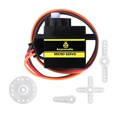
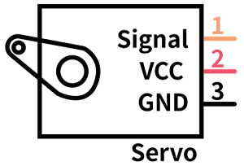
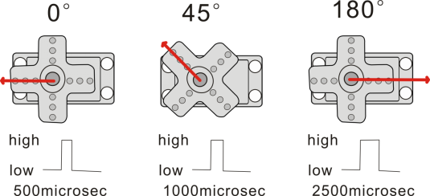
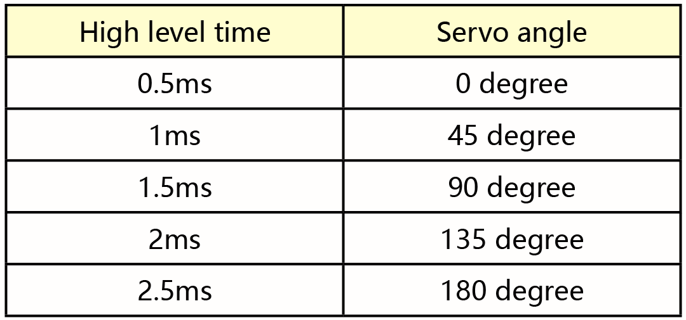
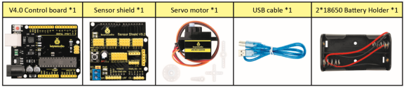
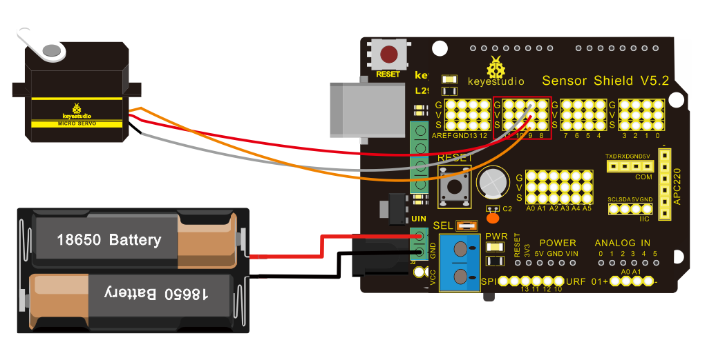

# Proyecto 4 Control de Servo



**Descripción**

El servomotor es un actuador rotativo de control de posición. Está compuesto principalmente por una carcasa, una placa de circuito, un motor sin núcleo, un engranaje y un sensor de posición. Su principio de funcionamiento consiste en que el servo recibe la señal enviada por microcontroladores o receptores y genera una señal de referencia con un período de 20ms y un ancho de 1.5ms; luego compara la tensión de polarización de CC adquirida con la tensión del potenciómetro y obtiene la salida de diferencia de tensión.

Cuando la velocidad del motor es constante, el potenciómetro es accionado para girar a través del engranaje reductor en cascada, lo que hace que la diferencia de tensión sea 0 y el motor deje de girar. En general, el rango de ángulo de rotación del servo es de 0° a 180°.

El ángulo de rotación del servomotor se controla regulando el ciclo de trabajo de la señal PWM (Modulación por Ancho de Pulso). El ciclo estándar de la señal PWM es de 20ms (50Hz). Teóricamente, el ancho se distribuye entre 1ms y 2ms, pero en la práctica está entre 0.5ms y 2.5ms. El ancho corresponde al ángulo de rotación de 0° a 180°. Sin embargo, hay que tener en cuenta que para motores de diferentes marcas, la misma señal puede producir ángulos de rotación distintos.



En general, el servo tiene tres cables: marrón, rojo y naranja. El cable marrón es la conexión a tierra, el rojo es el polo positivo y el naranja es la línea de señal.



Los ángulos correspondientes del servo se muestran a continuación:



**Especificaciones**

- Tensión de trabajo: DC 4.8V \~ 6V
- Rango de ángulo de operación: aproximadamente 180° (a 500 → 2500 μsec)
- Rango de ancho de pulso: 500 → 2500 μsec
- Velocidad sin carga: 0.12 ± 0.01 seg / 60 (DC 4.8V) 0.1 ± 0.01 seg / 60 (DC 6V)
- Corriente sin carga: 200 ± 20mA (DC 4.8V) 220 ± 20mA (DC 6V)
- Par de parada: 1.3 ± 0.01kg · cm (DC 4.8V) 1.5 ± 0.1kg · cm (DC 6V)
- Corriente de parada: ≦ 850mA (DC 4.8V) ≦ 1000mA (DC 6V)
- Corriente en espera: 3 ± 1mA (DC 4.8V) 4 ± 1mA (DC 6V)

**Componentes**



**Diagrama de conexión：**

**Notas de cableado:** el cable marrón del servo se conecta a GND (G), el cable rojo se conecta a 5V (V) y el cable naranja se conecta al pin digital 9.

El servo debe conectarse a una fuente de alimentación externa debido a su alta demanda de corriente para el accionamiento. En general, la corriente de la placa de desarrollo no es suficiente. Si no se conecta la alimentación externa, la placa de desarrollo podría quemarse.

**Código de prueba 1**

```c
/*
keyestudio Mini Tank Robot V2.1
lesson 4.1
Servo
http://www.keyestudio.com
*/
#define servoPin 9  //pin del servo
int pos; //variable del ángulo del servo
int pulsewidth; // variable del ancho de pulso del servo

void setup() 
{
  pinMode(servoPin, OUTPUT);  //configurar el pin del servo como SALIDA
  procedure(0); //establecer el ángulo del servo en 0°
}

void loop() 
{
  for (pos = 0; pos <= 180; pos += 1) // va de 0 grados a 180 grados
  { 
    // en pasos de 1 grado
    procedure(pos);              // indicar al servo que vaya a la posición en la variable 'pos'
    delay(15);                   //controlar la velocidad de rotación del servo
  }
  for (pos = 180; pos >= 0; pos -= 1) // va de 180 grados a 0 grados
  { 
    procedure(pos);              // indicar al servo que vaya a la posición en la variable 'pos'
    delay(15);                    
  }
}
// función para controlar el servo
void procedure(int myangle) 
{
  pulsewidth = myangle * 11 + 500;  //calcular el valor del ancho de pulso
  digitalWrite(servoPin,HIGH);
  delayMicroseconds(pulsewidth);   //la duración del nivel alto es el ancho de pulso
  digitalWrite(servoPin,LOW);
  delay((20 - pulsewidth / 1000));  // el ciclo es de 20ms, el nivel bajo dura el tiempo restante
}
```

Una vez cargado el código correctamente, el servo oscila en el rango de 0° a 180°.

```c
/*
 keyestudio Mini Tank Robot V2.1
 lesson 4.2
 servo
 http://www.keyestudio.com
*/
#include <Servo.h>
Servo myservo;  // crear objeto servo para controlar un servo
// en la mayoría de las placas se pueden crear hasta doce objetos servo
int pos = 0;    // variable para almacenar la posición del servo

void setup() 
{
  myservo.attach(9);  // asocia el servo en el pin 9 al objeto servo
}

void loop() 
{
  for (pos = 0; pos <= 180; pos += 1)  // va de 0 grados a 180 grados
  {
    // en pasos de 1 grado
    myservo.write(pos);              // indicar al servo que vaya a la posición en la variable 'pos'
    delay(15);                       // espera 15ms para que el servo alcance la posición
  }
  for (pos = 180; pos >= 0; pos -= 1) { // va de 180 grados a 0 grados
    myservo.write(pos);              // indicar al servo que vaya a la posición en la variable 'pos'
    delay(15);                       // espera 15ms para que el servo alcance la posición
  }
}
```

**Resultado de la prueba**

Una vez cargado el código correctamente y con la alimentación conectada, el servo oscila en el rango de 0° a 180°.

El resultado es el mismo. Normalmente lo controlamos mediante el archivo de biblioteca.

**Explicación del código**

Arduino incluye **\#include \<Servo.h\>** (funciones y declaraciones del servo)

A continuación se presentan algunas instrucciones comunes de la función servo:

1. attach（interfaz）——Establece la interfaz del servo; los puertos 9 y 10 están disponibles.
2. write（ángulo）——Instrucción para establecer el ángulo de rotación del servo.
3. read（）——Instrucción para leer el ángulo del servo; lee el valor del comando de "write()".
4. **Nota:** El formato de escritura mencionado es "nombre de variable del servo, instrucción específica（）", por ejemplo: myservo.attach(9).