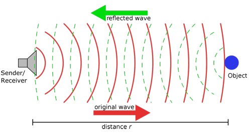
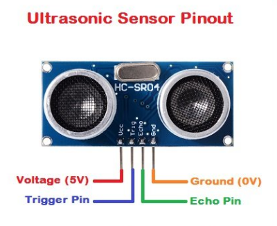
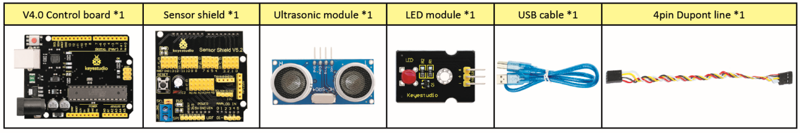
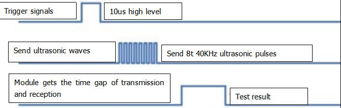
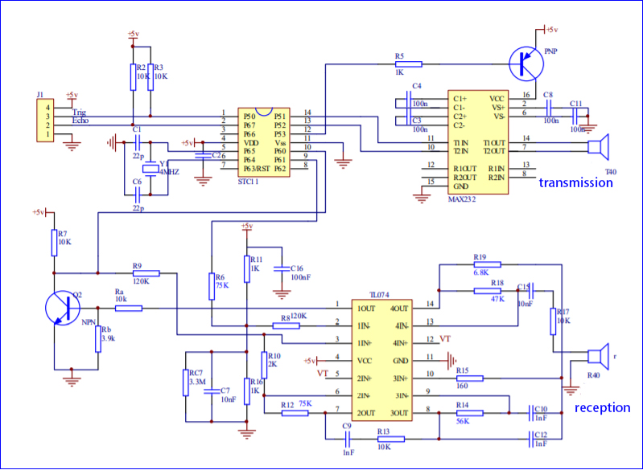
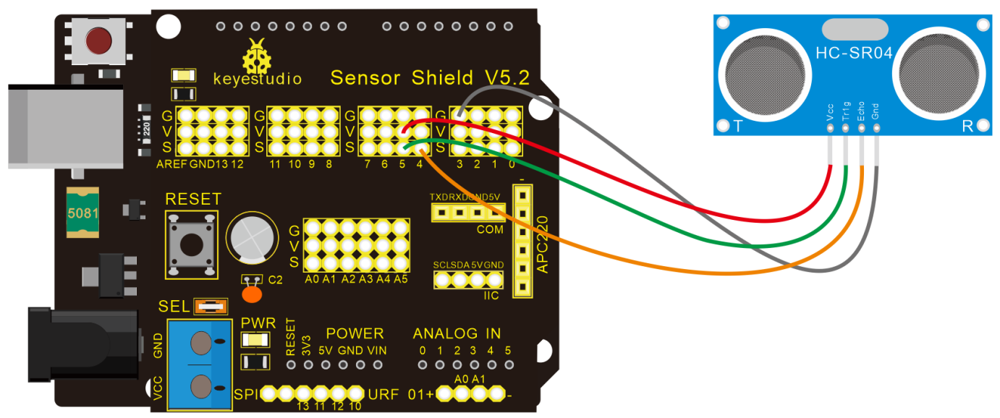
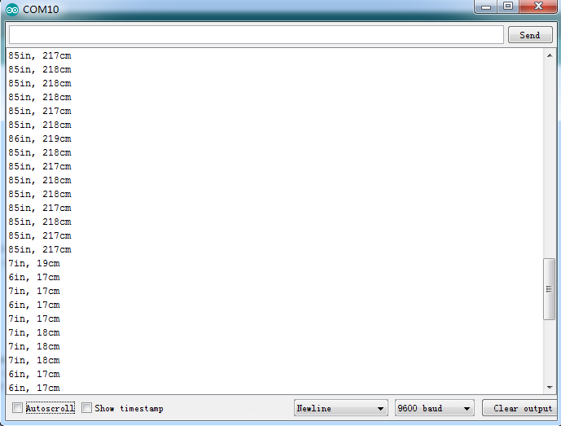
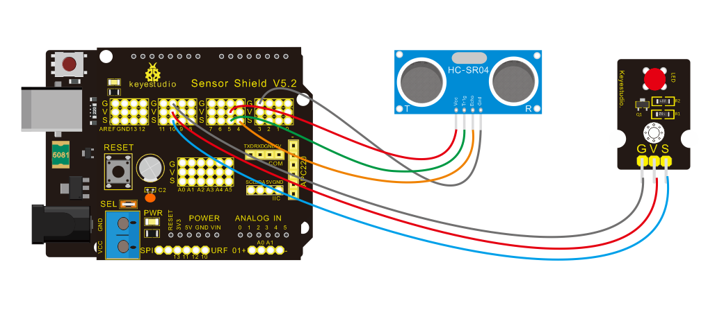

# Progetto 5 Sensore Ultrasonico

**Descrizione**



Il sensore ultrasonico HC-SR04 utilizza il sonar per determinare la distanza da un oggetto, come fanno i pipistrelli. Offre un eccellente rilevamento della distanza senza contatto con alta precisione e letture stabili in un pacchetto facile da usare. È completo di moduli trasmettitore e ricevitore ultrasonico.

L'HC-SR04 o il sensore ultrasonico viene utilizzato in un'ampia gamma di progetti elettronici per creare applicazioni di rilevamento degli ostacoli e misurazione della distanza, nonché varie altre applicazioni. Qui abbiamo portato il metodo semplice per misurare la distanza con Arduino e il sensore ultrasonico e come utilizzare il sensore ultrasonico con Arduino.

**Specifiche**



- Alimentazione: +5V DC
- Corrente di riposo: <2mA
- Corrente di lavoro: 15mA
- Angolo effettivo: <15°
- Distanza di rilevamento: 2cm – 400 cm
- Risoluzione: 0,3 cm
- Angolo di misurazione: 30 gradi
- Larghezza dell'impulso di ingresso del trigger: 10uS

**Componenti**



**Il principio del sensore ultrasonico**

Come mostrato nell'immagine sopra, è come due occhi. Uno è l'estremità trasmittente, l'altro è l'estremità ricevente.

Il modulo ultrasonico emetterà onde ultrasoniche dopo aver ricevuto un segnale di trigger. Quando le onde ultrasoniche incontrano l'oggetto e vengono riflesse, il modulo emette un segnale di eco, quindi può determinare la distanza dell'oggetto dalla differenza di tempo tra il segnale di trigger e il segnale di eco.

La t è il tempo in cui il segnale emesso incontra l'ostacolo e ritorna. La velocità di propagazione del suono nell'aria è di circa 343m/s, e distanza = velocità * tempo. Tuttavia, l'onda ultrasonica viene emessa e ritorna, il che è 2 volte la distanza. Pertanto, deve essere diviso per 2, la distanza misurata dall'onda ultrasonica = (velocità * tempo)/2.

1. Metodo di utilizzo e diagramma temporale del modulo ultrasonico:

2. Impostare il tempo di ritardo del pin Trig dell'SR04 a 10μs almeno, che può attivarlo per rilevare la distanza.
3. Dopo l'attivazione, il modulo invierà automaticamente otto impulsi ultrasonici a 40KHz e rileverà se c'è un segnale di ritorno. Questo passaggio verrà completato automaticamente dal modulo.
4. Se il segnale ritorna, il pin Echo emetterà un livello alto, e la durata del livello alto è il tempo dall'emissione dell'onda ultrasonica al ritorno.



Diagramma del circuito del sensore ultrasonico:



**Diagramma di Collegamento**



Guida al cablaggio:

- Sensore ultrasonico keyestudio V5 shield sensore
- VCC → 5v(V)
- Trig → 5(S)
- Echo → 4(S)
- Gnd → Gnd(G)

**Codice di Test**

```c
/*
keyestudio Mini Tank Robot V2.1
lezione 5
Sensore ultrasonico
http://www.keyestudio.com
*/
int trigPin = 5; // Trigger
int echoPin = 4; // Echo
long duration, cm, inches;

void setup() 
{
    // Inizio porta seriale
    Serial.begin (9600);
    // Definisci ingressi e uscite
    pinMode(trigPin, OUTPUT);
    pinMode(echoPin, INPUT);
}
void loop() 
{
    // Il sensore viene attivato da un impulso HIGH di 10 o più microsecondi.
    // Fornisci un breve impulso LOW in anticipo per garantire un impulso HIGH pulito:
    digitalWrite(trigPin, LOW);
    delayMicroseconds(2);
    digitalWrite(trigPin, HIGH);
    delayMicroseconds(10);
    digitalWrite(trigPin, LOW);
    // Leggi il segnale dal sensore: un impulso HIGH la cui durata è il tempo (in microsecondi) dall'invio del ping alla ricezione del suo eco da un oggetto.
    duration = pulseIn(echoPin, HIGH);
    // Converti il tempo in una distanza
    cm = (duration/2) / 29.1; // Dividi per 29.1 o moltiplica per 0.0343
    inches = (duration/2) / 74; // Dividi per 74 o moltiplica per 0.0135
    Serial.print(inches);
    Serial.print("in, ");
    Serial.print(cm);
    Serial.print("cm");
    Serial.println();
    delay(250);
}
```

**Risultato del Test**

Carica il codice di test sulla scheda di sviluppo, apri il monitor seriale e imposta la velocità in baud a 9600. La distanza rilevata verrà visualizzata, e l'unità è cm e pollici. Ostacola il sensore ultrasonico con la mano, il valore della distanza visualizzato diventa più piccolo.



**Spiegazione del Codice**

**int trigPin = 5;** questo pin è definito per trasmettere onde ultrasoniche, generalmente un'uscita.

**int echoPin = 4;** questo è definito come il pin di ricezione, generalmente un ingresso.

**cm = (duration/2) / 29.1; inches = (duration/2) / 74; per 0.0135**

Possiamo calcolare la distanza utilizzando la seguente formula:

distanza = (tempo di viaggio/2) x velocità del suono

La velocità del suono è: 343m/s = 0.0343 cm/uS = 1/29.1 cm/uS

O in pollici: 13503.9in/s = 0.0135in/uS = 1/74in/uS

Dobbiamo dividere il tempo di viaggio per 2 perché dobbiamo tenere conto del fatto che l'onda è stata inviata, ha colpito l'oggetto e poi è ritornata al sensore.

**Pratica di Estensione:**

Abbiamo misurato la distanza visualizzata dall'ultrasonico. Che ne dici di controllare il LED con la distanza misurata? Proviamo e colleghiamo un modulo luce LED al pin D10.



```c
/*
 keyestudio Mini Tank Robot V2.1
 lezione 5
 Ultrasonico LED
 http://www.keyestudio.com
*/ 
int trigPin = 5;    // Trigger
int echoPin = 4;    // Echo
long duration, cm, inches;

void setup() 
{
  // Inizio porta seriale
  Serial.begin (9600);
  // Definisci ingressi e uscite
  pinMode(trigPin, OUTPUT);
  pinMode(echoPin, INPUT);
}

void loop() 
{
  // Il sensore viene attivato da un impulso HIGH di 10 o più microsecondi.
  // Fornisci un breve impulso LOW in anticipo per garantire un impulso HIGH pulito:
  digitalWrite(trigPin, LOW);
  delayMicroseconds(2);
  digitalWrite(trigPin, HIGH);
  delayMicroseconds(10);
  digitalWrite(trigPin, LOW);
  // Leggi il segnale dal sensore: un impulso HIGH la cui durata è il tempo (in microsecondi) dall'invio del ping alla ricezione del suo eco da un oggetto.
  duration = pulseIn(echoPin, HIGH);
  // Converti il tempo in una distanza
  cm = (duration/2) / 29.1;     // Dividi per 29.1 o moltiplica per 0.0343
  inches = (duration/2) / 74;   // Dividi per 74 o moltiplica per 0.0135
  Serial.print(inches);
  Serial.print("in, ");
  Serial.print(cm);
  Serial.print("cm");
  Serial.println();
  delay(250);
  if (cm>=2 && cm<=10)
  	digitalWrite(10, HIGH);
  delay(1000);
  digitalWrite(10, LOW);
  delay(1000);
}
```

Carica il codice di test sulla scheda di sviluppo e blocca il sensore ultrasonico con la mano, quindi verifica se il LED è acceso.