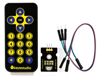
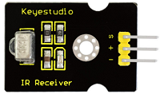
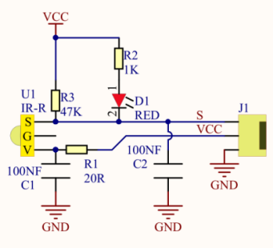
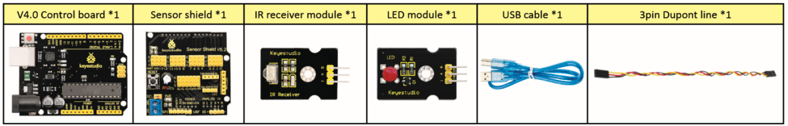
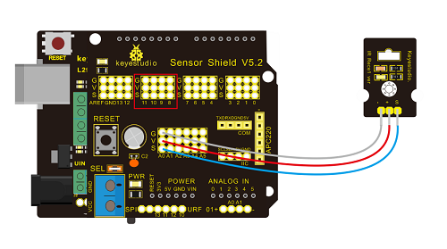
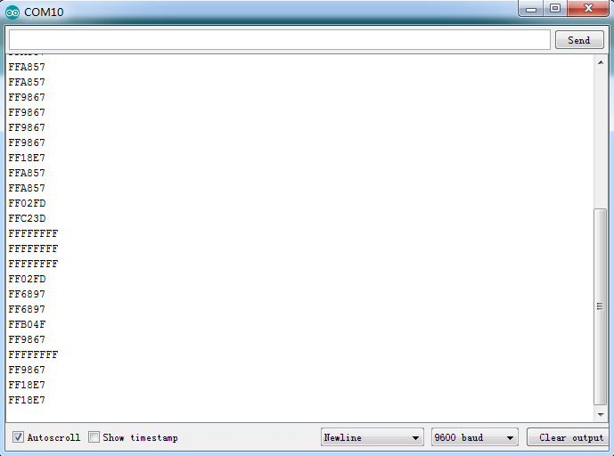
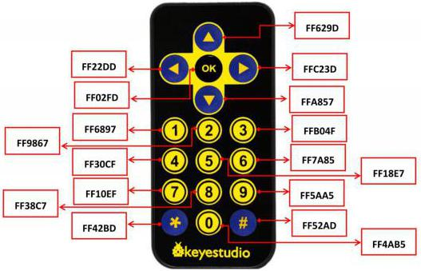
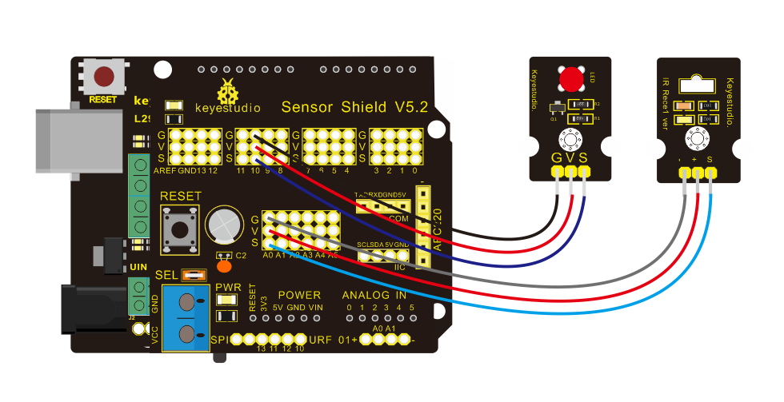

# Project 6 IR-ontvangst

**Beschrijving**

Het is onmiskenbaar dat infrarood afstandsbediening alomtegenwoordig is in het dagelijks leven. Het wordt gebruikt om verschillende huishoudelijke apparaten te bedienen, zoals tv's, stereo's, videorecorders en satellietontvangers. Infrarood afstandsbediening bestaat uit infrarood zend- en ontvangststelsels, dat wil zeggen een infrarood afstandsbediening en infraroodontvangermodule en een microcomputer die in staat is tot decodering.



Het 38K infrarood draagfrequentiesignaal dat door de afstandsbediening wordt uitgezonden, wordt gecodeerd door de coderingsschakeling in de afstandsbediening. Het bestaat uit een pilotsignaal, gebruikerscode, inverse gebruikerscode, datacode en inverse datacode. Het tijdsinterval van de puls wordt gebruikt om onderscheid te maken tussen een 0- of 1-signaal en de codering bestaat uit deze 0- en 1-signalen.

De gebruikerscode van dezelfde afstandsbediening blijft onveranderd, terwijl de datacode de toets kan onderscheiden.

Wanneer op een knop van de afstandsbediening wordt gedrukt, zendt de afstandsbediening een infrarood draagfrequentiesignaal uit. Wanneer de IR-ontvanger het signaal ontvangt, zal het programma het draagfrequentiesignaal decoderen en bepalen welke toets is ingedrukt. De MCU decodeert het ontvangen 01-signaal en bepaalt daardoor welke toets op de afstandsbediening is ingedrukt.

De infrarood ontvanger die we gebruiken is een infrarood ontvangermodule. Deze bestaat voornamelijk uit een infrarood ontvangerkop en is een apparaat dat ontvangst, versterking en demodulatie integreert. De interne IC heeft demodulatie voltooid en kan infrarood ontvangst tot uitvoer bereiken en is compatibel met TTL-signalen.

Bovendien is het geschikt voor infrarood afstandsbediening en infrarood gegevensoverdracht. De infrarood ontvangermodule gemaakt door de ontvanger heeft slechts drie pinnen: signaallijn, VCC en GND. Het is erg handig om te communiceren met Arduino en andere microcontrollers.

**Specificatie**





- Bedrijfsspanning: 3,3-5V (DC)
- Interface: 3PIN
- Uitgangssignaal: Digitaal signaal
- Ontvanghoek: 90 graden
- Frequentie: 38kHz
- Ontvangafstand: 10m

**Onderdelen**



**Verbindingsschema**



Verbind respectievelijk "-", "+" en S van de IR-ontvangermodule met G (GND), V (VCC) en A0 van het keyestudio-ontwikkelingsbord.

**Opmerking:** Onder de voorwaarde dat digitale poorten niet beschikbaar zijn, kunnen analoge poorten als digitale poorten worden gebruikt. A0 is gelijk aan D14, A1 is gelijk aan digitaal 15.

**Testcode**

Importeer eerst het bibliotheekbestand van de IR-ontvangermodule (raadpleeg hoe u een Arduino-bibliotheekbestand importeert) voordat u code ontwerpt.

```c
/*
keyestudio Mini Tank Robot V2.1
les 6
IRremote
http://www.keyestudio.com
*/ 
#include <IRremoteTank.h>     // IRremote bibliotheekverklaring
int RECV_PIN = A0;        // definieer de pinnen van IR-ontvanger als A0
IRrecv irrecv(RECV_PIN);   
decode_results results;   // decoderingsresultaten bevinden zich in de "result" van "decode results"
void setup()  
  {
      Serial.begin(9600);  
      irrecv.enableIRIn(); // Ontvanger inschakelen
  }  
 void loop() {  
    if (irrecv.decode(&results))// succesvol gedecodeerd, ontvang een set infraroodsignalen
    {  
      Serial.println(results.value, HEX);// Zet woord in 16 HEX om uit te voeren en ontvangen code 
      irrecv.resume(); // Ontvang de volgende waarde
    }  
    delay(100);  
  }
```

 **Testresultaat**

Upload testcode, open seriële monitor en stel baudrate in op 9600, richt afstandsbediening op IR-ontvanger en de bijbehorende waarde wordt weergegeven. Als u lang ingedrukt houdt, verschijnen foutcodes.



Hieronder hebben we de waarde van elke knop van de keyestudio afstandsbediening opgesomd. U kunt deze ter referentie bewaren.



**Codeverklaring**

**irrecv.enableIRIn():** na het inschakelen van IR-decodering worden de IR-signalen ontvangen, vervolgens zal de functie "decode()" continu controleren of decodering succesvol is.

**irrecv.decode(&results):** na succesvol decoderen zal deze functie "true" teruggeven en het resultaat in "results" houden. Na het decoderen van een IR-signaal voert u de functie resume() uit en ontvangt u het volgende signaal.

**Uitbreidingsoefening**

We hebben de toetswaarde van de IR-afstandsbediening gedecodeerd. Hoe zit het met het besturen van LED door de gemeten waarde? We kunnen een experiment uitvoeren om dit te bevestigen. Bevestig een LED aan D10 en druk op de toetsen van de afstandsbediening om de LED in en uit te schakelen.



```c
/* keyestudio Mini Tank Robot V2.1
les 6.2
IRremote
http://www.keyestudio.com
*/ 
#include <IRremoteTank.h>
int RECV_PIN = A0;// definieer de pin van IR-ontvanger als A0
int LED_PIN=10;// definieer de pin van LED
int a=0;
IRrecv irrecv(RECV_PIN);
decode_results results;

void setup()
{
  Serial.begin(9600);
  irrecv.enableIRIn(); // Initialiseer de IR-ontvanger 
  pinMode(LED_PIN,OUTPUT);// stel de pin van LED in op 4
}

void loop() 
{
  if (irrecv.decode(&results)) 
  {
	Serial.println(results.value, HEX);// Zet woord in 16 HEX om uit te voeren en ontvangen code
	if(results.value==0xFF02FD &a==0) // volgens de bovenstaande toetswaarde, druk op "OK" op afstandsbediening, LED wordt bestuurd
	{
		digitalWrite(LED_PIN,HIGH);// LED gaat aan
		a=1;
	}
	else if(results.value==0xFF02FD &a==1) // druk opnieuw
	{
        digitalWrite(LED_PIN,LOW);// LED gaat uit
        a=0;	
	}
	irrecv.resume(); // ontvang de volgende waarde
  }
}
```

Upload code naar het ontwikkelingsbord en druk op de "OK"-toets op de afstandsbediening om de LED in en uit te schakelen.