### Project 7 Bluetooth Remote Control

**Description**

Bluetooth, a simple wireless communication module, has went viral since the last few decades and been used in most of the battery-powered devices for its easy-to-use function.

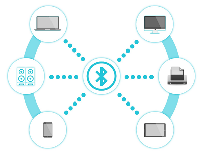

Over the past years, there have been many upgrades of Bluetooth standard to fulfil the demands of customers and the development of technology as well as to follow the trend of time.

Over the few years, there are many things changed including data transmission rate, power consumption with wearable and IoT Devices and Security System.

Here we are going to learn about HM-10 BLE 4.0 with Arduino Board. The HM-10 is a readily available Bluetooth 4.0 module. This module is used for establishing wireless data communication. The module is designed by using the Texas Instruments CC2540 or CC2541 Bluetooth low energy (BLE) System on Chip (SoC).

**Specification**

- Bluetooth protocol: Bluetooth Specification V4.0 BLE.
- No byte limit in serial port Transceiving.
- In open environment, realize 100m ultra-distance communication with iphone4s.
- Working frequency: 2.4GHz ISM band.
- Modulation method: GFSK(Gaussian Frequency Shift Keying).
- Transmission power: -23dbm, -6dbm, 0dbm, 6dbm, can be modified by AT command.
- Sensitivity: ≤-84dBm at 0.1% BER.
- Transmission rate: Asynchronous: 6K bytes ; Synchronous: 6k Bytes.
- Security feature: Authentication and encryption.
- Supporting service: Central & Peripheral UUID FFE0, FFE1.
- Power consumption: Auto sleep mode, stand by current 400uA\~800uA, 8.5mA during transmission.
- Power supply: 5V DC.
- Working temperature: –5 to +65 Centigrade.

**Components**

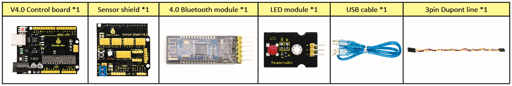

**Connection Diagram**

**1. STATE:** *state test pins, connected to internal LED, generally keep it unconnected.*

**2. RXD:** *serial interface, receiving terminal.*

**3. TXD:** *serial interface, transmitting terminal.*

**4. GND:** *Ground.*

**5. VCC:** *positive pole of the power source.*

**6. EN/BRK:** *break connect, it means breaking the Bluetooth connection, generally, keep it unconnected.*

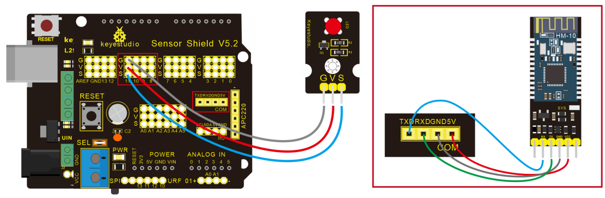

**Test Code**

```
/*
 keyestudio Mini Tank Robot v2.0
 lesson 7.1
 bluetooth 
http://www.keyestudio.com
*/

char ble_val; //character variable: save the value of Bluetooth reception

void setup() 
{
  Serial.begin(9600);
}

void loop() 
{
  if(Serial.available() > 0)  //make sure if there is data in serial buffer
  {
    ble_val = Serial.read();  //Read data from serial buffer
    Serial.println(ble_val);  //Print
  }
}
//*******************************************
```

(There will be contradiction between serial communication of code and communication of Bluetooth when uploading code. Therefore, don’t link Bluetooth module before uploading code.)

After uploading code on development board, then insert Bluetooth module, wait for the command from cellphone.

**Download APP**

The code is for reading the received signal, and we also need a stuff to send signal. In this project, we send signal to control robot car via cellphone.

Then we need to download the APP.

**iOS system**

**Note: Allow APP to access “location” in settings of your cellphone when connecting to Bluetooth module. Otherwise, Bluetooth may not be connected.**

Enter APP STORE to search **BLE Scanner 4.0, then download it.**

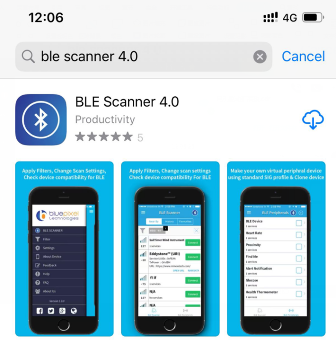

**Android system**

Please download the APP here.

**And allow APP to access“location”, you could enable “location”in settings of your cellphone.**

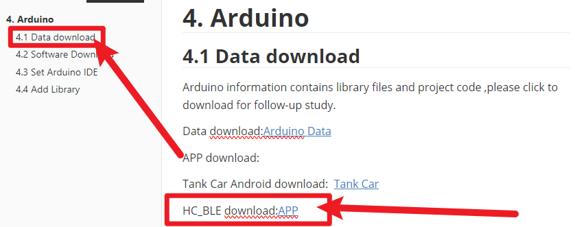

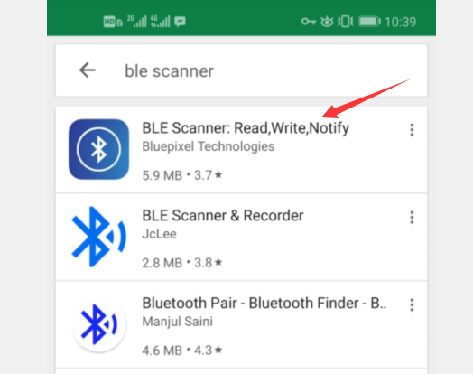

1. After installation, open App and enable “Location and Bluetooth” permission.
2. We take iOS version as an example. The operation method of Android version is almost same as it.
3. Scan Bluetooth module to get Bluetooth BLE 4.0. Its name is HMSoft. Then click“connect”to link with Bluetooth and use it.

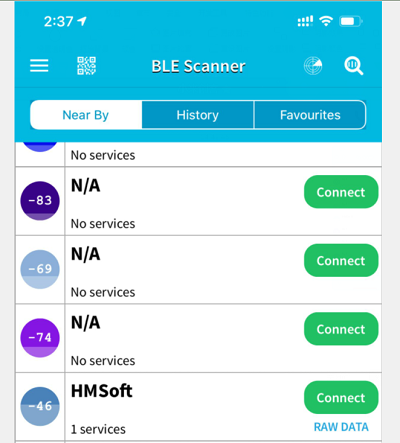

4. After connecting to HMSoft, click it to get multiple options, such as device information, access permission, general and custom service. Choose“CUSTOM SERVICE”.

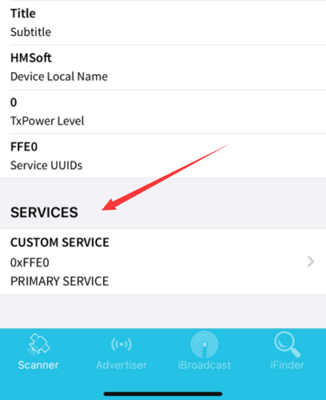

5. Then pop up the following page.

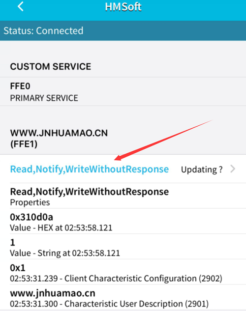

6. Click（Read,Notify,WriteWithoutResponse)to enter the following page.

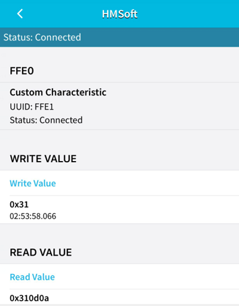

7. Click **Write Value, appear the interface to enter HEX or Text.**

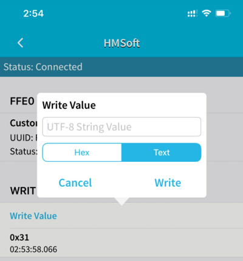

8. Open the serial monitor on Arduino，enter a 0 or other character at Text interface.

   

9. Then click“Write”, open serial monitor to view if there is a “0” signal.

   

**Code Explanation**

**Serial.available()** : The current rest characters when return to buffer area. Generally, this function is used to judge if there is data in buffer. When Serial.available()\>0, it means that serial receives the data and can be read.

**Serial.read()：**Read a data of a Byte in buffer of serial port, for instance, device sends data to Arduino via serial port, then we could read data by “Serial.read()”.

**Extension Practice**

We could send a command via cellphone to turn a LED on and off .

D10 is connected to a LED, as shown below:

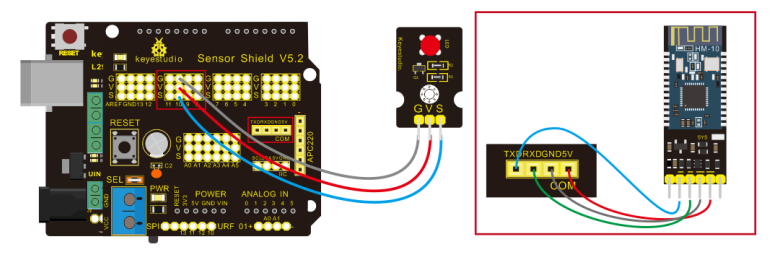

**Code Explanation**

**Serial.available()** : The current rest characters when return to buffer area. Generally, this function is used to judge if there is data in buffer. When Serial.available()\>0, it means that serial receives the data and can be read.

**Serial.read()：**Read a data of a Byte in buffer of serial port, for instance, device sends data to Arduino via serial port, then we could read data by “Serial.read()”.

**Extension Practice**

We could send a command via cellphone to turn a LED on and off .

D10 is connected to a LED, as shown below:


```
/*
 keyestudio Mini Tank Robot v2.0
 lesson 7.2
 Bluetooth 
 http://www.keyestudio.com
*/ 
int ledpin=11;
void setup()
{Serial.begin(9600);
 pinMode(ledpin,OUTPUT);
}
void loop()
{ int i;
  if (Serial.available())
  {i=Serial.read();
    Serial.println("DATA RECEIVED:");
    if(i=='1')
    { digitalWrite(ledpin,1);
      Serial.println("led on");
    }
    if(i=='0')
    { digitalWrite(ledpin,0);
      Serial.println("led off");
    }
  }
}//*******************************************
```

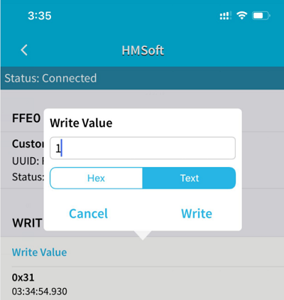

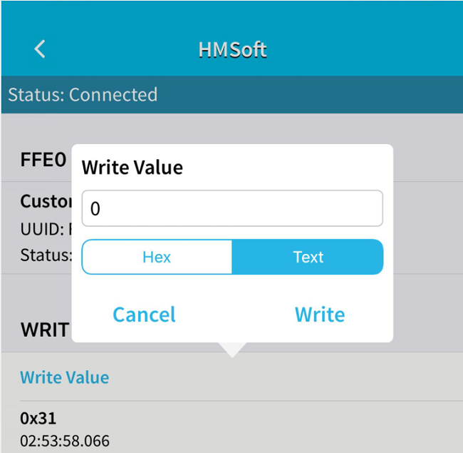

Click“Write”on APP, when you enter 1, LED will be on; when you input 0, LED will be off. (Remember to remove the Bluetooth module after finishing experiment, otherwise, code-burning will be affected).

