# Projet 7 Contrôle à Distance par Bluetooth

**Description**

Le Bluetooth, un simple module de communication sans fil, s'est popularisé au cours des dernières décennies et est utilisé dans la plupart des appareils alimentés par batterie pour sa fonction facile à utiliser.

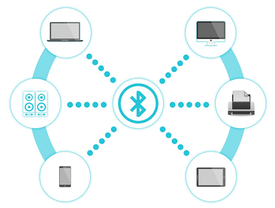

Au cours des années passées, il y a eu de nombreuses mises à niveau de la norme Bluetooth pour répondre aux demandes des clients et à l'évolution de la technologie ainsi que pour suivre la tendance du moment.

Au cours des dernières années, de nombreuses choses ont changé, notamment le débit de transmission des données, la consommation d'énergie avec les appareils portables et IoT, ainsi que le système de sécurité.

Ici, nous allons apprendre le HM-10 BLE 4.0 avec la carte Arduino. Le HM-10 est un module Bluetooth 4.0 facilement disponible. Ce module est utilisé pour établir une communication de données sans fil. Le module est conçu en utilisant le System on Chip (SoC) Bluetooth low energy (BLE) CC2540 ou CC2541 de Texas Instruments.

**Spécifications**

- Protocole Bluetooth : Spécification Bluetooth V4.0 BLE.
- Pas de limite d'octets dans la transmission en série.
- Dans un environnement ouvert, réaliser une communication ultra-distance de 100m avec iPhone4s.
- Fréquence de fonctionnement : bande ISM 2.4GHz.
- Méthode de modulation : GFSK (Gaussian Frequency Shift Keying).
- Puissance de transmission : -23dbm, -6dbm, 0dbm, 6dbm, peut être modifiée par commande AT.
- Sensibilité : ≤-84dBm à 0.1% BER.
- Débit de transmission : Asynchrone : 6K octets ; Synchrone : 6k octets.
- Fonction de sécurité : Authentification et chiffrement.
- Service supporté : Central & Peripheral UUID FFE0, FFE1.
- Consommation d'énergie : Mode veille automatique, courant de veille 400uA\~800uA, 8.5mA pendant la transmission.
- Alimentation : 5V DC.
- Température de fonctionnement : –5 à +65 degrés Celsius.

**Composants**

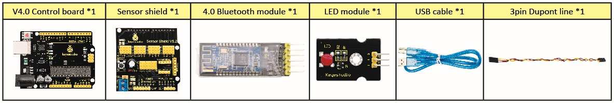

**Schéma de Connexion**

**1. STATE :** *broches de test d'état, connectées à la LED interne, généralement laisser non connecté.*

**2. RXD :** *interface série, terminal de réception.*

**3. TXD :** *interface série, terminal de transmission.*

**4. GND :** *Masse.*

**5. VCC :** *pôle positif de la source d'alimentation.*

**6. EN/BRK :** *rupture de connexion, cela signifie rompre la connexion Bluetooth, généralement, laisser non connecté.*

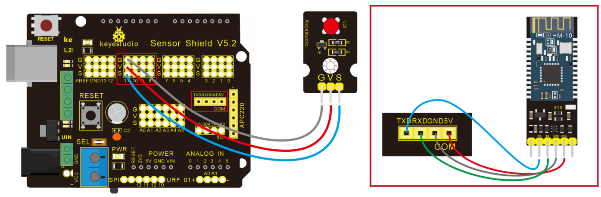

**Code de Test**

```c
/*
 keyestudio Mini Tank Robot V2.1
 leçon 7.1
 bluetooth 
http://www.keyestudio.com
*/

char ble_val; // variable caractère : sauvegarde la valeur de la réception Bluetooth

void setup() 
{
  Serial.begin(9600);
}

void loop() 
{
  if(Serial.available() > 0)  // vérifier s'il y a des données dans le tampon série
  {
    ble_val = Serial.read();  // Lire les données du tampon série
    Serial.println(ble_val);  // Imprimer
  }
}
//*******************************************
```

(Il y aura une contradiction entre la communication série du code et la communication Bluetooth lors du téléchargement du code. Par conséquent, ne connectez pas le module Bluetooth avant de télécharger le code.)

Après avoir téléchargé le code sur la carte de développement, insérez ensuite le module Bluetooth et attendez la commande du téléphone cellulaire.

**Télécharger l'APP**

Le code est destiné à lire le signal reçu, et nous avons également besoin d'un outil pour envoyer le signal. Dans ce projet, nous envoyons un signal pour contrôler la voiture robot via le téléphone cellulaire.

Nous devons ensuite télécharger l'APP.

**Système iOS**

**Remarque : Autorisez l'APP à accéder à la « localisation » dans les paramètres de votre téléphone cellulaire lors de la connexion au module Bluetooth. Sinon, le Bluetooth peut ne pas se connecter.**

Entrez APP STORE pour rechercher **BLE Scanner 4.0, puis téléchargez-le.**

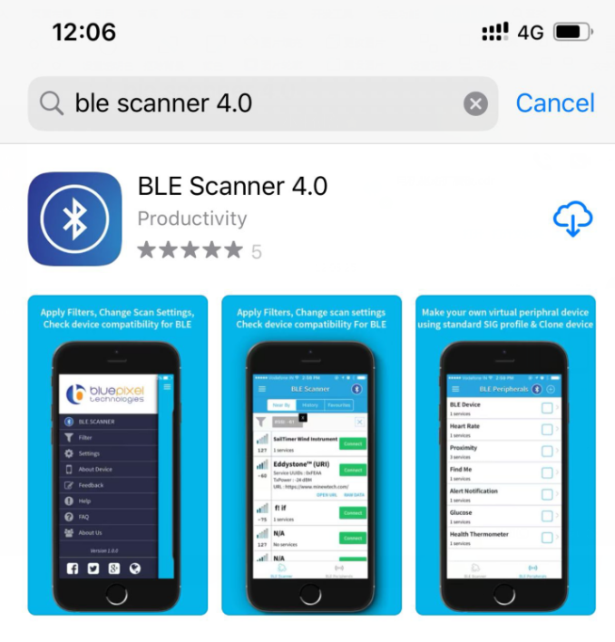

**Système Android**

Veuillez télécharger l'APP ici.

**Et autorisez l'APP à accéder à la « localisation », vous pouvez activer la « localisation » dans les paramètres de votre téléphone cellulaire.**

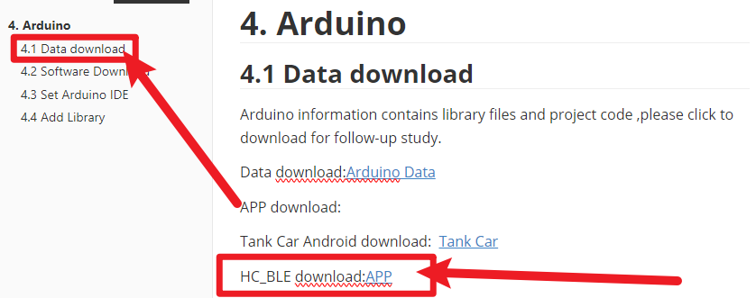

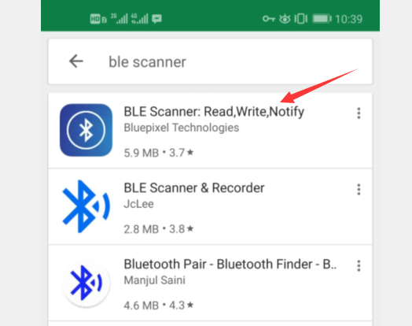

1. Après l'installation, ouvrez l'App et activez la permission « Localisation et Bluetooth ».
2. Nous prenons la version iOS comme exemple. La méthode d'exploitation de la version Android est presque la même.
3. Scannez le module Bluetooth pour obtenir Bluetooth BLE 4.0. Son nom est HMSoft. Cliquez ensuite sur « connecter » pour établir la liaison avec le Bluetooth et l'utiliser.

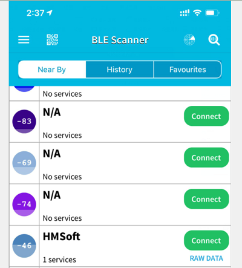

4. Après la connexion à HMSoft, cliquez dessus pour obtenir plusieurs options, telles que les informations de l'appareil, les permissions d'accès, les paramètres généraux et le service personnalisé. Choisissez « CUSTOM SERVICE ».

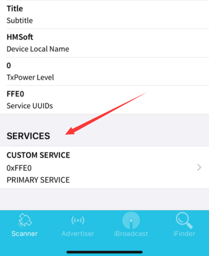

5. Ensuite, la page suivante s'affiche.

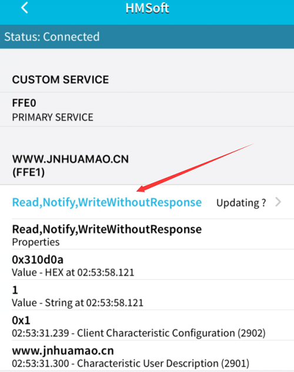

6. Cliquez sur (Read, Notify, WriteWithoutResponse) pour accéder à la page suivante.

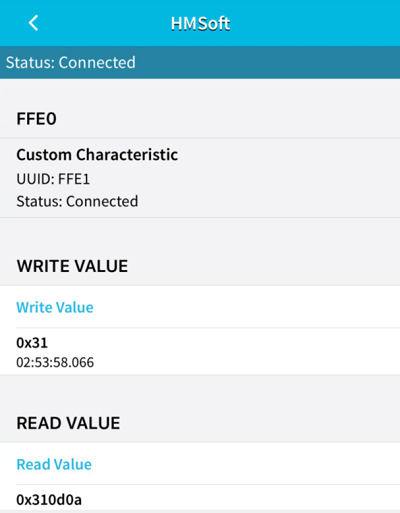

7. Cliquez sur **Write Value, l'interface pour entrer HEX ou Text apparaît.**

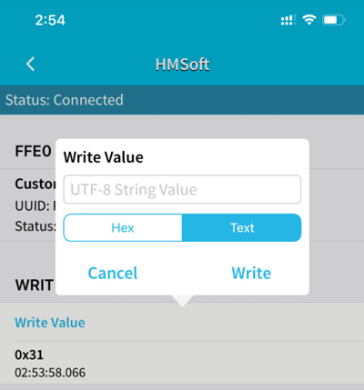

8. Ouvrez le moniteur série sur Arduino, entrez un 0 ou un autre caractère à l'interface Text.

   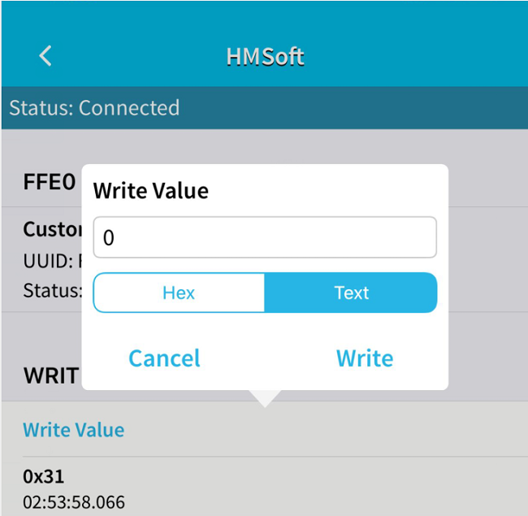

9. Cliquez ensuite sur « Write », ouvrez le moniteur série pour vérifier s'il y a un signal « 0 ».

   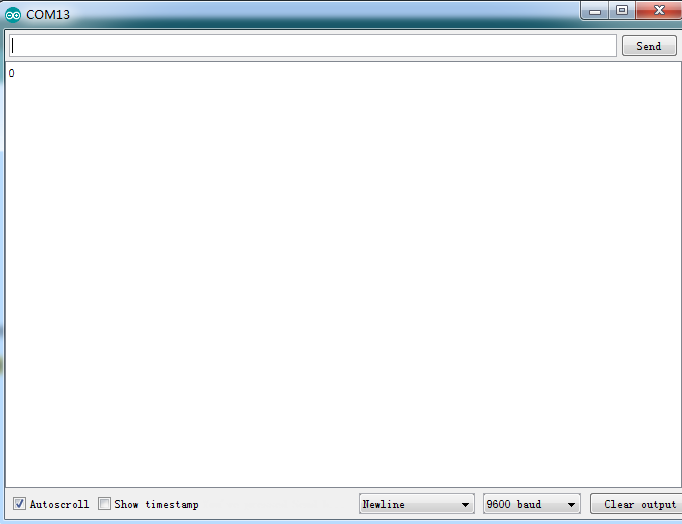

**Explication du Code**

**Serial.available()** : Les caractères restants actuels lors du retour à la zone tampon. Généralement, cette fonction est utilisée pour juger s'il y a des données dans le tampon. Quand Serial.available()\>0, cela signifie que la série reçoit les données et peut être lue.

**Serial.read() :** Lire une donnée d'un octet dans le tampon du port série, par exemple, l'appareil envoie des données à Arduino via le port série, puis nous pourrions lire les données par « Serial.read() ».

**Pratique d'Extension**

Nous pourrions envoyer une commande via le téléphone cellulaire pour allumer et éteindre une LED.

D10 est connecté à une LED, comme indiqué ci-dessous :


**Explication du Code**

**Serial.available()** : Les caractères restants actuels lors du retour à la zone tampon. Généralement, cette fonction est utilisée pour juger s'il y a des données dans le tampon. Quand Serial.available()\>0, cela signifie que la série reçoit les données et peut être lue.

**Serial.read() :** Lire une donnée d'un octet dans le tampon du port série, par exemple, l'appareil envoie des données à Arduino via le port série, puis nous pourrions lire les données par « Serial.read() ».

**Pratique d'Extension**

Nous pourrions envoyer une commande via le téléphone cellulaire pour allumer et éteindre une LED.

D10 est connecté à une LED, comme indiqué ci-dessous :

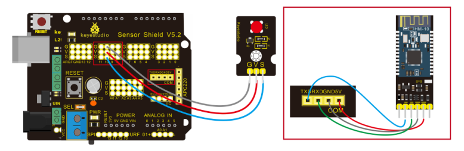

```c
/*
 keyestudio Mini Tank Robot V2.1
 leçon 7.2
 Bluetooth 
 http://www.keyestudio.com
*/ 
int ledpin=11;
void setup()
{Serial.begin(9600);
 pinMode(ledpin,OUTPUT);
}
void loop()
{ int i;
  if (Serial.available())
  {i=Serial.read();
    Serial.println("DONNÉES REÇUES :");
    if(i=='1')
    { digitalWrite(ledpin,1);
      Serial.println("led allumée");
    }
    if(i=='0')
    { digitalWrite(ledpin,0);
      Serial.println("led éteinte");
    }
  }
}//*******************************************
```

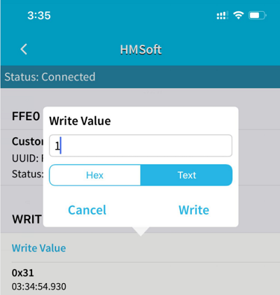


Cliquez sur « Write » sur l'APP, quand vous entrez 1, la LED s'allumera ; quand vous entrez 0, la LED s'éteindra. (N'oubliez pas de retirer le module Bluetooth après avoir terminé l'expérience, sinon, le téléchargement du code sera affecté).