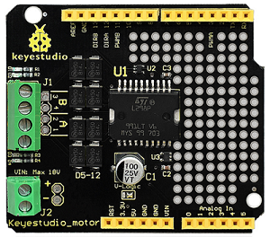
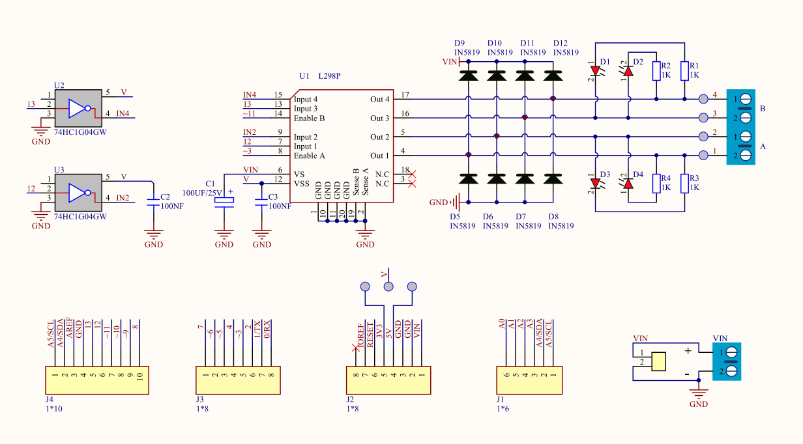
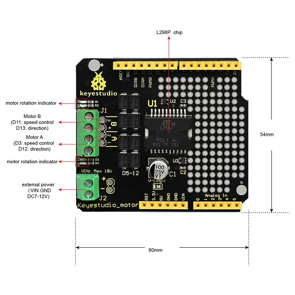
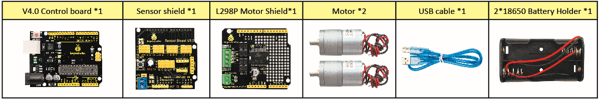
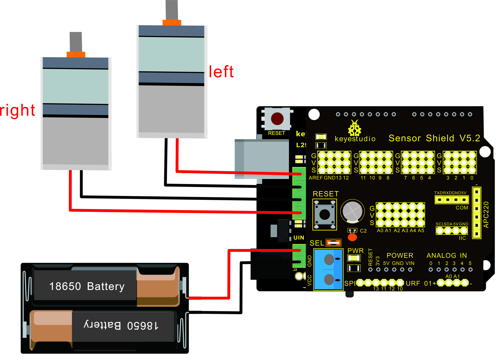

### Project 8 Motor Driving and Speed Control

**Description**



There are many ways to drive a motor. Our robot car uses the most common solution--L298P--which is an excellent high-power motor driver IC produced by STMicroelectronics. It can directly drive DC motors, two-phase and four-phase stepping motors. The driving current is up to 2A, and the output terminal of motor adopts eight high-speed Schottky diodes as protection.

We designed a shield based on the circuit of L298p. The stacked design reduces the technical difficulty of using and driving the motor.

**Specification**

Circuit Diagram for L298P Board



1. Logic part input voltage: DC5V
2. Driving part input voltage: DC 7-12V
3. Logic part working current: \<36mA
4. Driving part working current: \<2A
5. Maximum power dissipation: 25W (T=75℃)
6. Working temperature: -25℃～＋130℃
7. Control signal input level: high level 2.3V\<Vin\<5V, low level\0.3V\<Vin\<1.5V



**Drive Robot to Move**

Through the above circuit diagram, the direction pin of A motor is D12, and speed pin is D3; D13 is the direction pin of B motor, D11 is speed pin.

We know how to control digital ports according to the following chart.

PWM decides 2 motors to turn on so as to drive the robot car. The PWM value is in the range of 0-255. The larger the number, the faster the motor rotates.

| Tank Robot      | Motor (A)          | Motor (B)          |
| --------------- | ------------------ | ------------------ |
| Forward         | Turn clockwise     |                    |
| Backward        | Turn anticlockwise |                    |
| Rotate to left  | Turn anticlockwise | Turn clockwise     |
| Rotate to right | Turn clockwise     | Turn anticlockwise |
| Stop            | Stop               | Stop               |

**Components**



**Connection Diagram**



**Note:** the 4Pin terminal block is marked with silkscreen 1234. The red line of right rear motor is connected to terminal 1, black line is linked with end 2. The red line of left front motor is attached to terminal 3, black line is linked with port 4.

**Test Code**

```
/*
 keyestudio Mini Tank Robot v2.0
 lesson 8.1
 motor driver
 http://www.keyestudio.com
*/ 

#define ML_Ctrl 13  //define the direction control pin of left motor
#define ML_PWM 11   //define the PWM control pin of left motor
#define MR_Ctrl 12  //define direction control pin of right motor
#define MR_PWM 3   // define the PWM control pin of right motor

void setup()
{
  pinMode(ML_Ctrl, OUTPUT);//define direction control pin of left motor to output
  pinMode(ML_PWM, OUTPUT);//define PWM control pin of left motor as output
  pinMode(MR_Ctrl, OUTPUT);//define direction control pin of right motor as output.
  pinMode(MR_PWM, OUTPUT);//define the PWM control pin of right motor as output
}

void loop()
{ 
  digitalWrite(ML_Ctrl,LOW);//set the direction control pin of left motor to LOW
  analogWrite(ML_PWM,200);//set the PWM control speed of left motor to 200
  digitalWrite(MR_Ctrl,LOW);//set the direction control pin of right motor to LOW
  analogWrite(MR_PWM,200);//set the PWM control speed of right motor to 200

  //front
  delay(2000);//delay in 2s
   digitalWrite(ML_Ctrl,HIGH);//set the direction control pin of left motor to HIGH
  analogWrite(ML_PWM,200);//set the PWM control speed of left motor to 200  
digitalWrite(MR_Ctrl,HIGH);//set the direction control pin of right motor to HIGH
  analogWrite(MR_PWM,200);//set the PWM control speed of right motor to 200

   //back
  delay(2000);//delay in 2s 
  digitalWrite(ML_Ctrl,HIGH);//set the direction control pin of left motor to HIGH
  analogWrite(ML_PWM,200);//set the PWM control speed of left motor to 200
  digitalWrite(MR_Ctrl,LOW);//set the direction control pin of right motor to LOW
  analogWrite(MR_PWM,200);//set the PWM control speed of right motor to 200

    //left
  delay(2000);//delay in 2s
   digitalWrite(ML_Ctrl,LOW);//set the direction control pin of left motor to LOW
  analogWrite(ML_PWM,200);//set the PWM control speed of left motor to 200
  digitalWrite(MR_Ctrl,HIGH);//set the direction control pin of right motor to HIGH
  analogWrite(MR_PWM,200);//set the PWM control speed of right motor to 200

   //right
  delay(2000);//delay in 2s
  analogWrite(ML_PWM,0);//set the PWM control speed of left motor to 0
  analogWrite(MR_PWM,0);//set the PWM control speed of right motor to 0

    //stop
  delay(2000);//delay in 2s
}//*****************************************
```

**Test Result**

Hook up by connection diagram, upload code and power on, the smart car goes forward and back for 2s, turns left and right for 2s, stops for 2s and alternately.

**Code Explanation**

**digitalWrite(ML_Ctrl,LOW):** the rotation direction of motor is decided by the high/low level and and the pins that decide rotation direction are digital pins.

**analogWrite(ML_PWM,200):** the speed of motor is regulated by PWM, and the pins that decide the speed of motor must be PWM pins.

**Extension Practice**

Adjust the speed that PWM controls the motor, and hook up in the same way.


```
/*
 keyestudio Mini Tank Robot v2.0
 lesson 8.2
 motor driver pwm
 http://www.keyestudio.com
*/ 
#define ML_Ctrl 13  //define the direction control pin of left motor
#define ML_PWM 11   //define the PWM control pin of left motor
#define MR_Ctrl 12  //define the direction control pin of right motor
#define MR_PWM 3   //define the PWM control pin of right motor

void setup()
{ 
  pinMode(ML_Ctrl, OUTPUT);//define the direction control pin of left motor as OUTPUT
  pinMode(ML_PWM, OUTPUT);//define the PWM control pin of left motor as OUTPUT
  pinMode(MR_Ctrl, OUTPUT);//define the direction control pin of right motor as OUTPUT
  pinMode(MR_PWM, OUTPUT);//define the PWM control pin of right motor as OUTPUT
}

void loop()
{ 
  digitalWrite(ML_Ctrl,LOW);//Set direction control pin of left motor to LOW
  analogWrite(ML_PWM,100);// Set the PWM control speed of left motor to 100
  digitalWrite(MR_Ctrl,LOW);//Set the direction control pin of right motor to LOW
  analogWrite(MR_PWM,100);//Set the PWM control speed of right motor to 100
  //front
  delay(2000);//define 2s
  digitalWrite(ML_Ctrl,HIGH);//Set direction control pin of left motor to HIGH level
  analogWrite(ML_PWM,250);//Set the PWM control speed of left motor to 100
  digitalWrite(MR_Ctrl,HIGH);//Set direction control pin of right motor to HIGH level
  analogWrite(MR_PWM,250);//Set the PWM control speed of right motor to 100
   //back
  delay(2000);//define 2s
  digitalWrite(ML_Ctrl,HIGH);//Set direction control pin of left motor to HIGH level
  analogWrite(ML_PWM,250);//Set the PWM control speed of left motor to 100
  digitalWrite(MR_Ctrl,LOW);//Set direction control pin of right motor to LOW level
  analogWrite(MR_PWM,250);//Set the PWM control speed of right motor to 100
    //left
  delay(2000);//define 2s
   digitalWrite(ML_Ctrl,LOW);//set the direction control pin of left motor to LOW
  analogWrite(ML_PWM,250);//set the PWM control speed of left motor to 200
  digitalWrite(MR_Ctrl,HIGH);//set the direction control pin of right motor to HIGH
  analogWrite(MR_PWM,250);//set the PWM control speed of right motor to 100
   //right
  delay(2000);//define 2s
  analogWrite(ML_PWM,0);//set the PWM control speed of left motor to 0
  analogWrite(MR_PWM,0);// set the PWM control speed of right motor to 0

    //stop
  delay(2000);//define 2s
}//******************************************************************
```

Upload code successfully, the motors rotate faster.