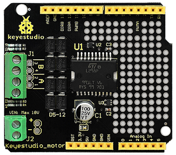
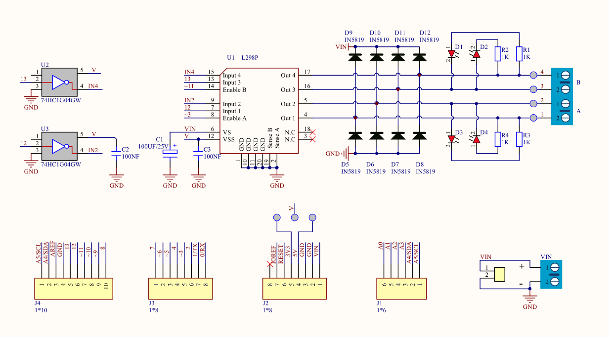
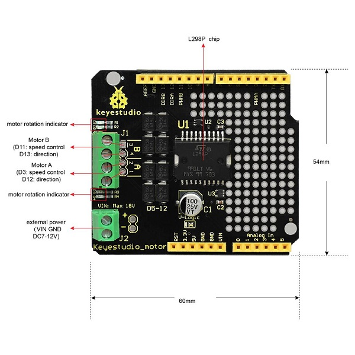
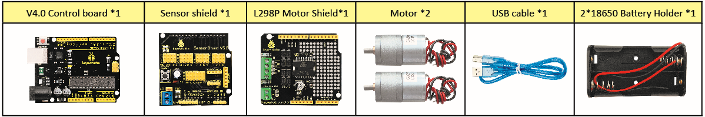
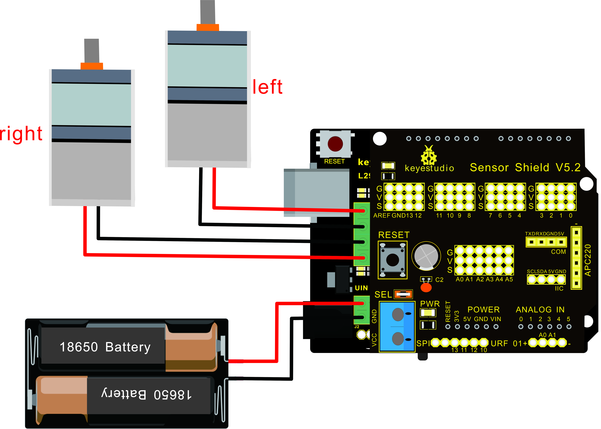

# Projekt 8 Motorsteuerung und Geschwindigkeitsregelung

**Beschreibung**



Es gibt viele Möglichkeiten, einen Motor anzusteuern. Unser Roboter-Auto verwendet die häufigste Lösung – den L298P – einen hervorragenden High-Power-Motortreiber-IC von STMicroelectronics. Er kann Gleichstrommotoren, zwei- und vierphasige Schrittmotoren direkt ansteuern. Der Antriebsstrom beträgt bis zu 2A, und der Ausgangsanschluss des Motors ist mit acht schnellen Schottky-Dioden zum Schutz ausgestattet.

Wir haben ein Shield basierend auf der L298P-Schaltung entwickelt. Das gestapelte Design reduziert die technische Schwierigkeit bei der Verwendung und Ansteuerung des Motors.

**Spezifikation**

Schaltplan für L298P-Platine



1. Eingangsspannung Logikteil: DC5V
2. Eingangsspannung Antriebsteil: DC 7-12V
3. Arbeitsstrom Logikteil: \<36mA
4. Arbeitsstrom Antriebsteil: \<2A
5. Maximale Leistungsdissipation: 25W (T=75℃)
6. Arbeitstemperatur: -25℃～＋130℃
7. Steuersignaleingangspegel: Hochpegel 2.3V\<Vin\<5V, Tiefpegel\0.3V\<Vin\<1.5V



**Roboter zum Fahren bringen**

Anhand des obigen Schaltplans ist der Richtungspin von Motor A D12 und der Geschwindigkeitspin ist D3; D13 ist der Richtungspin von Motor B, D11 ist der Geschwindigkeitspin.

Wir wissen, wie man digitale Anschlüsse nach dem folgenden Diagramm steuert.

PWM schaltet 2 Motoren ein, um den Roboter-Auto anzutreiben. Der PWM-Wert liegt im Bereich von 0-255. Je größer die Zahl, desto schneller dreht sich der Motor.

| Panzer-Roboter  | Motor (A)           | Motor (B)           |
| --------------- | ------------------- | ------------------- |
| Vorwärts        | Im Uhrzeigersinn    |                     |
| Rückwärts       | Gegen Uhrzeigersinn |                     |
| Nach links      | Gegen Uhrzeigersinn | Im Uhrzeigersinn    |
| Nach rechts     | Im Uhrzeigersinn    | Gegen Uhrzeigersinn |
| Stopp           | Stopp               | Stopp               |

**Komponenten**



**Verbindungsdiagramm**


**Hinweis:** Der 4-Pin-Anschlussblock ist mit dem Siebdruck 1234 gekennzeichnet. Die rote Leitung des hinteren rechten Motors ist mit Anschluss 1 verbunden, die schwarze Leitung mit Ende 2. Die rote Leitung des vorderen linken Motors ist mit Anschluss 3 verbunden, die schwarze Leitung mit Anschluss 4.

**Test-Code**

```c
/*
 keyestudio Mini Tank Robot V2.1
 Lektion 8.1
 Motortreiber
 http://www.keyestudio.com
*/ 

#define ML_Ctrl 13  //Richtungssteuerspin des linken Motors definieren
#define ML_PWM 11   //PWM-Steuerspin des linken Motors definieren
#define MR_Ctrl 12  //Richtungssteuerspin des rechten Motors definieren
#define MR_PWM 3   //PWM-Steuerspin des rechten Motors definieren

void setup()
{
  pinMode(ML_Ctrl, OUTPUT);//Richtungssteuerspin des linken Motors als Ausgang definieren
  pinMode(ML_PWM, OUTPUT);//PWM-Steuerspin des linken Motors als Ausgang definieren
  pinMode(MR_Ctrl, OUTPUT);//Richtungssteuerspin des rechten Motors als Ausgang definieren
  pinMode(MR_PWM, OUTPUT);//PWM-Steuerspin des rechten Motors als Ausgang definieren
}

void loop()
{ 
  digitalWrite(ML_Ctrl,LOW);//Richtungssteuerspin des linken Motors auf LOW setzen
  analogWrite(ML_PWM,200);//PWM-Steuerspeed des linken Motors auf 200 setzen
  digitalWrite(MR_Ctrl,LOW);//Richtungssteuerspin des rechten Motors auf LOW setzen
  analogWrite(MR_PWM,200);//PWM-Steuerspeed des rechten Motors auf 200 setzen

  //vorwärts
  delay(2000);//Verzögerung von 2s
   digitalWrite(ML_Ctrl,HIGH);//Richtungssteuerspin des linken Motors auf HIGH setzen
  analogWrite(ML_PWM,200);//PWM-Steuerspeed des linken Motors auf 200 setzen  
digitalWrite(MR_Ctrl,HIGH);//Richtungssteuerspin des rechten Motors auf HIGH setzen
  analogWrite(MR_PWM,200);//PWM-Steuerspeed des rechten Motors auf 200 setzen

   //rückwärts
  delay(2000);//Verzögerung von 2s 
  digitalWrite(ML_Ctrl,HIGH);//Richtungssteuerspin des linken Motors auf HIGH setzen
  analogWrite(ML_PWM,200);//PWM-Steuerspeed des linken Motors auf 200 setzen
  digitalWrite(MR_Ctrl,LOW);//Richtungssteuerspin des rechten Motors auf LOW setzen
  analogWrite(MR_PWM,200);//PWM-Steuerspeed des rechten Motors auf 200 setzen

    //links
  delay(2000);//Verzögerung von 2s
   digitalWrite(ML_Ctrl,LOW);//Richtungssteuerspin des linken Motors auf LOW setzen
  analogWrite(ML_PWM,200);//PWM-Steuerspeed des linken Motors auf 200 setzen
  digitalWrite(MR_Ctrl,HIGH);//Richtungssteuerspin des rechten Motors auf HIGH setzen
  analogWrite(MR_PWM,200);//PWM-Steuerspeed des rechten Motors auf 200 setzen

   //rechts
  delay(2000);//Verzögerung von 2s
  analogWrite(ML_PWM,0);//PWM-Steuerspeed des linken Motors auf 0 setzen
  analogWrite(MR_PWM,0);//PWM-Steuerspeed des rechten Motors auf 0 setzen

    //stopp
  delay(2000);//Verzögerung von 2s
}//*****************************************
```

**Test-Ergebnis**

Verbinden Sie nach dem Verbindungsdiagramm, laden Sie den Code hoch und schalten Sie die Stromversorgung ein. Das intelligente Auto fährt 2 Sekunden vorwärts und rückwärts, dreht sich 2 Sekunden nach links und rechts, stoppt 2 Sekunden und wechselt sich abwechselnd ab.

**Code-Erklärung**

**digitalWrite(ML_Ctrl,LOW):** Die Drehrichtung des Motors wird durch den High/Low-Pegel bestimmt, und die Pins, die die Drehrichtung bestimmen, sind digitale Pins.

**analogWrite(ML_PWM,200):** Die Geschwindigkeit des Motors wird durch PWM geregelt, und die Pins, die die Motorgeschwindigkeit bestimmen, müssen PWM-Pins sein.

**Erweiterungspraxis**

Passen Sie die Geschwindigkeit an, die PWM den Motor steuert, und verbinden Sie auf die gleiche Weise.



```c
/*
 keyestudio Mini Tank Robot V2.1
 Lektion 8.2
 Motortreiber PWM
 http://www.keyestudio.com
*/ 
#define ML_Ctrl 13  //Richtungssteuerspin des linken Motors definieren
#define ML_PWM 11   //PWM-Steuerspin des linken Motors definieren
#define MR_Ctrl 12  //Richtungssteuerspin des rechten Motors definieren
#define MR_PWM 3   //PWM-Steuerspin des rechten Motors definieren

void setup()
{ 
  pinMode(ML_Ctrl, OUTPUT);//Richtungssteuerspin des linken Motors als OUTPUT definieren
  pinMode(ML_PWM, OUTPUT);//PWM-Steuerspin des linken Motors als OUTPUT definieren
  pinMode(MR_Ctrl, OUTPUT);//Richtungssteuerspin des rechten Motors als OUTPUT definieren
  pinMode(MR_PWM, OUTPUT);//PWM-Steuerspin des rechten Motors als OUTPUT definieren
}

void loop()
{ 
  digitalWrite(ML_Ctrl,LOW);//Richtungssteuerspin des linken Motors auf LOW setzen
  analogWrite(ML_PWM,100);//PWM-Steuerspeed des linken Motors auf 100 setzen
  digitalWrite(MR_Ctrl,LOW);//Richtungssteuerspin des rechten Motors auf LOW setzen
  analogWrite(MR_PWM,100);//PWM-Steuerspeed des rechten Motors auf 100 setzen
  //vorwärts
  delay(2000);//2s definieren
  digitalWrite(ML_Ctrl,HIGH);//Richtungssteuerspin des linken Motors auf HIGH-Pegel setzen
  analogWrite(ML_PWM,250);//PWM-Steuerspeed des linken Motors auf 100 setzen
  digitalWrite(MR_Ctrl,HIGH);//Richtungssteuerspin des rechten Motors auf HIGH-Pegel setzen
  analogWrite(MR_PWM,250);//PWM-Steuerspeed des rechten Motors auf 100 setzen
   //rückwärts
  delay(2000);//2s definieren
  digitalWrite(ML_Ctrl,HIGH);//Richtungssteuerspin des linken Motors auf HIGH-Pegel setzen
  analogWrite(ML_PWM,250);//PWM-Steuerspeed des linken Motors auf 100 setzen
  digitalWrite(MR_Ctrl,LOW);//Richtungssteuerspin des rechten Motors auf LOW-Pegel setzen
  analogWrite(MR_PWM,250);//PWM-Steuerspeed des rechten Motors auf 100 setzen
    //links
  delay(2000);//2s definieren
   digitalWrite(ML_Ctrl,LOW);//Richtungssteuerspin des linken Motors auf LOW setzen
  analogWrite(ML_PWM,250);//PWM-Steuerspeed des linken Motors auf 200 setzen
  digitalWrite(MR_Ctrl,HIGH);//Richtungssteuerspin des rechten Motors auf HIGH setzen
  analogWrite(MR_PWM,250);//PWM-Steuerspeed des rechten Motors auf 100 setzen
   //rechts
  delay(2000);//2s definieren
  analogWrite(ML_PWM,0);//PWM-Steuerspeed des linken Motors auf 0 setzen
  analogWrite(MR_PWM,0);//PWM-Steuerspeed des rechten Motors auf 0 setzen

    //stopp
  delay(2000);//2s definieren
}//******************************************************************
```

Code erfolgreich hochgeladen, die Motoren drehen schneller.