### Project 9 8*16 LED Board

**Description**

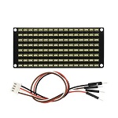

If you add an 8\*16 LED board to the robot, it will be amazing. Keyestudio's 8\*16 dot matrix can meet this requirement. Fueled by it, you can create facial emoticons, patterns or other interesting displays all by yourself. This 8\*16 LED light board comes with 128 LEDs. The data of the microprocessor (arduino) communicates with the AiP1640 through the two-wire bus interface, so as to control the 128 LEDs on the module, which produce the patterns you need on dot matrix. To facilitate wiring, a HX-2.54 4Pin wiring is provided.

**Specification**

- Working voltage: DC 3.3-5V
- Power loss: 400mW
- Oscillation frequency: 450KHz
- Drive current: 200mA
- Working temperature: -40\~80℃
- Communication method: two-wire bus

**Components**

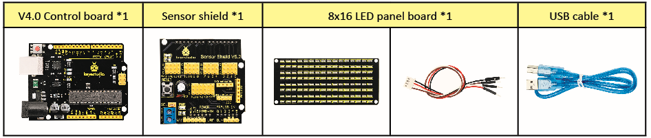

**8*16 Dot Matrix Display**

Circuit Graph

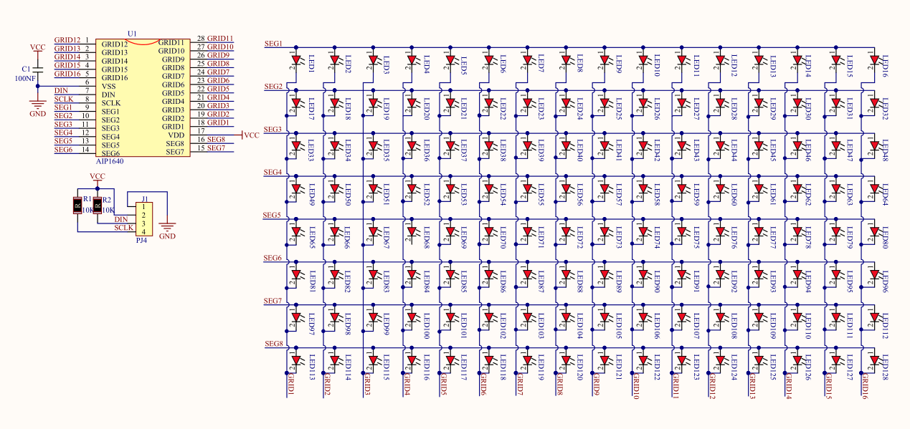

**The principle of 8\*16 dot matrix:**

How to control each LED light of 8\*16 dot matrix? We know that a byte has 8 bits, and each bit is 0 or 1. When a bit is 0, turn off LED and when a bit is 0, turn on LED. Thereby, one byte can control the LED in a row of dot matrix, so 16 bytes can control 16 columns of LED lights, that is, a 8\*16 dot matrix.

**Interface Description and Communication Protocol:**

The data of the microprocessor (arduino) communicates with the AiP1640 through the two-wire bus interface.

The communication protocol diagram is shown below:

(SCLK) is SCL, (DIN) is SDA:

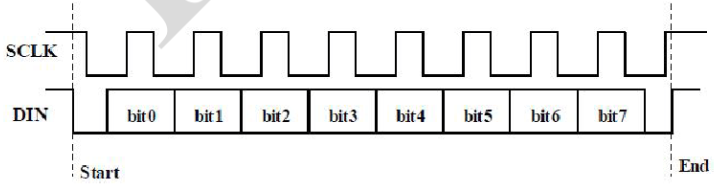

①The starting condition for data input: SCL is high level and SDA changes from high to low.

②For data command setting, there are methods as shown in the figure below:

In our sample program, select the way to **add 1 to the address automatically**, the binary value is 0100 0000 and the corresponding hexadecimal value is 0x40.

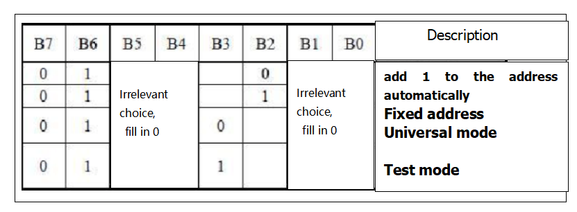

③For address command setting, the address can be selected as shown below.

The first 00H is selected in our sample program, and the binary number 1100 0000 corresponds to the hexadecimal 0xc0.

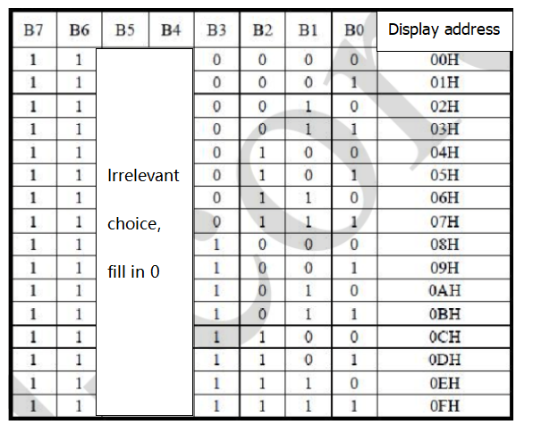

④The requirement for data input is that SCL is high level when inputting data, and the signal on SDA must remain unchanged. Only when the clock signal on SCL is low level, the signal on SDA can be altered. The data input is low-order first, high-order is behind.

⑤ The condition to end data transmission is that when SCL is low, SDA is low, and when SCL is high, the SDA level also becomes high.

⑥ Display control, set different pulse width, the pulse width can be selected as shown below.

In this example, we choose pulse width 4/16, and the hexadecimal corresponds to 1000 1010 is 0x8A.

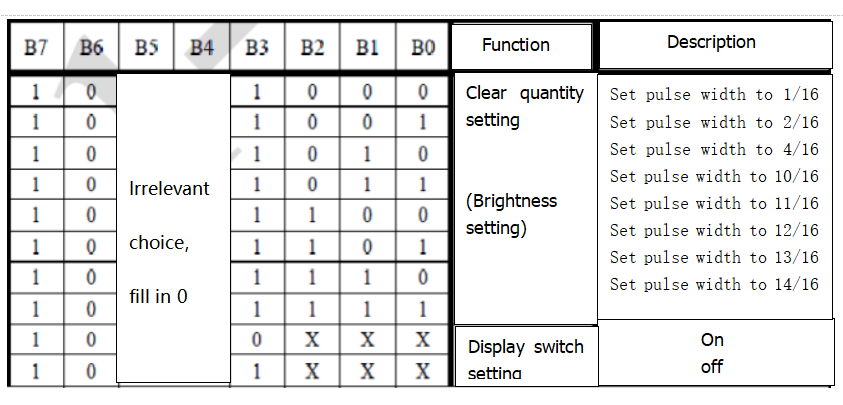

4\. Introduction for Modulus Tool

The online version of dot matrix modulus tool:

[http://dotmatrixtool.com/\#](http://dotmatrixtool.com/)

①Open links to enter the following page.

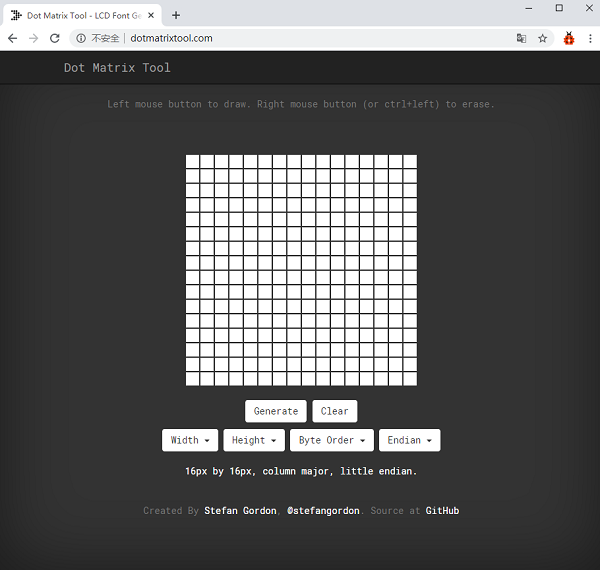

②The dot matrix is 8\*16 in this project, so set the height to 8, width to 16, as shown below.

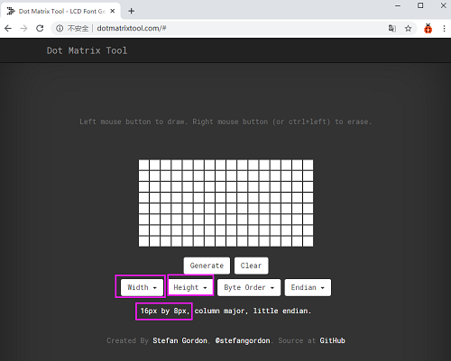

③ Generate hexadecimal data from the pattern

As shown below, press the left mouse button to select, the right button to cancel, draw the pattern you want, click **Generate**, and the hexadecimal data we need will be produced.

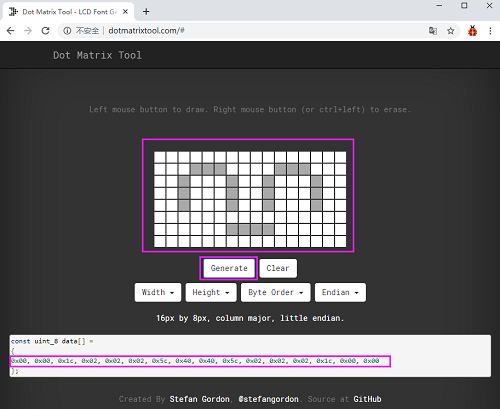

**Connection Diagram**

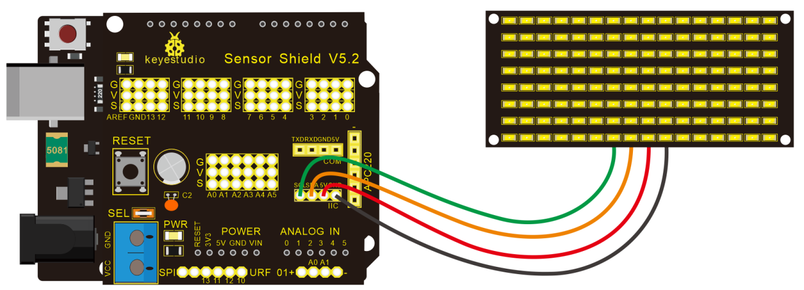

Wiring note: The GND, VCC, SDA, and SCL of the 8x16 LED panel are respectively connected to -(GND), + (VCC), A4 and A5 of the keyestudio sensor expansion board for two-wire serial communication. (Note: This pin is connected to arduino IIC, but this module is not IIC communication. It can be linked with any two pins.)

**Test Code**

The code that shows smile face.

```
/*
 keyestudio Mini Tank Robot v2.0
 lesson 9.1
 Matrix  face
 http://www.keyestudio.com
*/ 
//the data of smiley from modulus tool
unsigned char smile[] = {0x00, 0x00, 0x1c, 0x02, 0x02, 0x02, 0x5c, 0x40, 0x40, 0x5c, 0x02, 0x02, 0x02, 0x1c, 0x00, 0x00};

#define SCL_Pin  A5  //Set clock pin to A5
#define SDA_Pin  A4  //Set data pin to A4

void setup()
{
  //Set pin to output
  pinMode(SCL_Pin,OUTPUT);
  pinMode(SDA_Pin,OUTPUT);
  //clear the display
  //matrix_display(clear);
}

void loop()
{
  matrix_display(smile);  // display smile face
}
// the function for dot matrix display

void matrix_display(unsigned char matrix_value[])
{
  IIC_start();  // use the function of the data transmission start condition
  IIC_send(0xc0);  //select address
  
  for(int i = 0;i < 16;i++) //pattern data has 16 bits
  {
     IIC_send(matrix_value[i]); //convey the pattern data
  }

  IIC_end();   //end the transmission of pattern data  
  IIC_start();
  IIC_send(0x8A);  //display control, set pulse width to 4/16 s
  IIC_end();
}

//the condition to start conveying data
void IIC_start()
{
  digitalWrite(SCL_Pin,HIGH);
  delayMicroseconds(3);
  digitalWrite(SDA_Pin,HIGH);
  delayMicroseconds(3);
  digitalWrite(SDA_Pin,LOW);
  delayMicroseconds(3);
}
//Convey data
void IIC_send(unsigned char send_data)
{
  for(char i = 0;i < 8;i++)  //Each byte has 8 bits 8bit for every character
  {
      digitalWrite(SCL_Pin,LOW);  // pull down clock pin SCL_Pin to change the signal of SDA
      delayMicroseconds(3);
      if(send_data & 0x01)  //set high and low level of SDA_Pin according to 1 or 0 of every bit
      {
        digitalWrite(SDA_Pin,HIGH);
      }
      else
      {
        digitalWrite(SDA_Pin,LOW);
      }
      delayMicroseconds(3);
      digitalWrite(SCL_Pin,HIGH); //pull up the clock pin SCL_Pin to stop transmission
      delayMicroseconds(3);
      send_data = send_data >> 1;  // detect bit by bit, shift the data to the right by one
  }
}

//The sign of ending data transmission
void IIC_end()
{
  digitalWrite(SCL_Pin,LOW);
  delayMicroseconds(3);
  digitalWrite(SDA_Pin,LOW);
  delayMicroseconds(3);
  digitalWrite(SCL_Pin,HIGH);
  delayMicroseconds(3);
  digitalWrite(SDA_Pin,HIGH);
  delayMicroseconds(3);
}
//******************************************************
```

**Test Result**

Wire according to connection diagram. The DIP switch is dialed to the right end and power on, the smile face appears on the dot matrix.

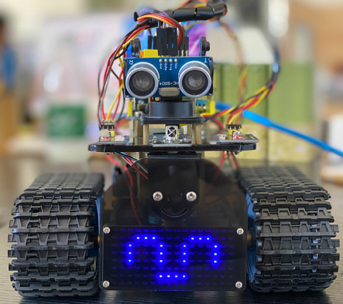

**Extension Practice**

We use the modulo tool ([http://dotmatrixtool.com/\#](http://dotmatrixtool.com/))to make the dot matrix alternately display, go front and stop patterns then clear the patterns, and the time interval is 2000 milliseconds.

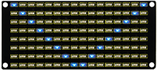

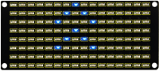

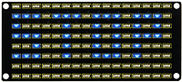

Get the graphical code to be displayed via modulus tool.

**Start：** 0x01,0x02,0x04,0x08,0x10,0x20,0x40,0x80,0x80,0x40,0x20,0x10,0x08,0x04,0x02,0x01

**Go front：** 0x00,0x00,0x00,0x00,0x00,0x24,0x12,0x09,0x12,0x24,0x00,0x00,0x00,0x00,0x00,0x00

**Go back：** 0x00,0x00,0x00,0x00,0x00,0x24,0x48,0x90,0x48,0x24,0x00,0x00,0x00,0x00,0x00,0x00

**Turn left：** 0x00,0x00,0x00,0x00,0x00,0x00,0x44,0x28,0x10,0x44,0x28,0x10,0x44,0x28,0x10,0x00

**Turn right：** 0x00,0x10,0x28,0x44,0x10,0x28,0x44,0x10,0x28,0x44,0x00,0x00,0x00,0x00,0x00,0x00

**Stop：** 0x2E,0x2A,0x3A,0x00,0x02,0x3E,0x02,0x00,0x3E,0x22,0x3E,0x00,0x3E,0x0A,0x0E,0x00

**Clear the displayed code**：0x00,0x00,0x00,0x00,0x00,0x00,0x00,0x00,0x00,0x00,0x00,0x00,0x00,0x00,0x00,0x00

The code that the multiple patterns shift:

```
/* keyestudio Mini Tank Robot v2.0
 lesson 9.2
 Matrix loop
 http://www.keyestudio.com
*/ 
//Array, used to store the data of the pattern, can be calculated by yourself or obtained from the modulus tool
unsigned char start01[] = 
{0x01,0x02,0x04,0x08,0x10,0x20,0x40,0x80,0x80,0x40,0x20,0x10,0x08,0x04,0x02,0x01};
unsigned char front[] = 
{0x00,0x00,0x00,0x00,0x00,0x24,0x12,0x09,0x12,0x24,0x00,0x00,0x00,0x00,0x00,0x00};
unsigned char back[] = 
{0x00,0x00,0x00,0x00,0x00,0x24,0x48,0x90,0x48,0x24,0x00,0x00,0x00,0x00,0x00,0x00};
unsigned char left[] = 
{0x00,0x00,0x00,0x00,0x00,0x00,0x44,0x28,0x10,0x44,0x28,0x10,0x44,0x28,0x10,0x00};
unsigned char right[] = 
{0x00,0x10,0x28,0x44,0x10,0x28,0x44,0x10,0x28,0x44,0x00,0x00,0x00,0x00,0x00,0x00};
unsigned char STOP01[] = 
{0x2E,0x2A,0x3A,0x00,0x02,0x3E,0x02,0x00,0x3E,0x22,0x3E,0x00,0x3E,0x0A,0x0E,0x00};
unsigned char clear[] = 
{0x00,0x00,0x00,0x00,0x00,0x00,0x00,0x00,0x00,0x00,0x00,0x00,0x00,0x00,0x00,0x00};
#define SCL_Pin  A5  //Set clock pin to A5
#define SDA_Pin  A4  //Set data pin to A4
void setup(){
  //Set pins to output
  pinMode(SCL_Pin,OUTPUT);
  pinMode(SDA_Pin,OUTPUT);
  //Clear the display
  matrix_display(clear);
}
void loop(){
  matrix_display(start01);  // Display start pattern
  delay(2000);
  matrix_display(front);    //Front pattern
  delay(2000);
  matrix_display(STOP01);   //Stop pattern
  delay(2000);
  matrix_display(clear);    //Clear the display Clear the screen
  delay(2000);
}
// This function is used to display of dot matrix
void matrix_display(unsigned char matrix_value[])
{
  IIC_start();  //call the function that data transmission start  
  IIC_send(0xc0);  //Choose address
  
  for(int i = 0;i < 16;i++) //pattern data has 16 bits
  {
     IIC_send(matrix_value[i]); //data to convey patterns 
  }
  IIC_end();   //end the transmission of pattern dataEnd
  IIC_start();
  IIC_send(0x8A);  //display control, set pulse width to 4/16
  IIC_end();
}
//The condition starting to transmit data
void IIC_start()
{
  digitalWrite(SCL_Pin,HIGH);
  delayMicroseconds(3);
  digitalWrite(SDA_Pin,HIGH);
  delayMicroseconds(3);
  digitalWrite(SDA_Pin,LOW);
  delayMicroseconds(3);
}
//Convey data
void IIC_send(unsigned char send_data)
{
  for(char i = 0;i < 8;i++)  //Each byte has 8 bits
  {
      digitalWrite(SCL_Pin,LOW);  //pull down clock pin SCL Pin to change the signals of SDA      
delayMicroseconds(3);
      if(send_data & 0x01)  //set high and low level of SDA_Pin according to 1 or 0 of every bit
      {
        digitalWrite(SDA_Pin,HIGH);
      }
      else
      {
        digitalWrite(SDA_Pin,LOW);
      }
      delayMicroseconds(3);
      digitalWrite(SCL_Pin,HIGH); //pull up clock pin SCL_Pin to stop transmitting data
      delayMicroseconds(3);
      send_data = send_data >> 1;  //detect bit by bit, so shift the data right by one
  }}
//The sign that data transmission ends
void IIC_end()
{
  digitalWrite(SCL_Pin,LOW);
  delayMicroseconds(3);
  digitalWrite(SDA_Pin,LOW);
  delayMicroseconds(3);
  digitalWrite(SCL_Pin,HIGH);
  delayMicroseconds(3);
  digitalWrite(SDA_Pin,HIGH);
  delayMicroseconds(3);} 
//*****************************************************
```

Upload code on development board, 8\*16 dot matrix displays front , back and stop patterns, alternately.

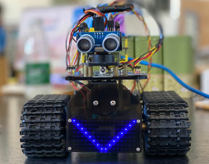

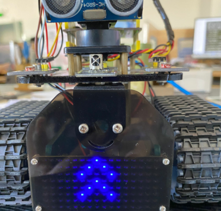

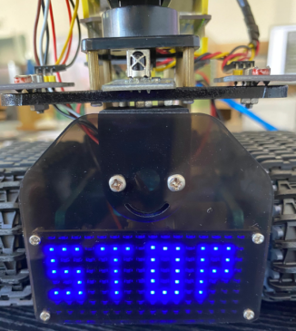