# Projekt 9 8*16 LED-Platine

**Beschreibung**

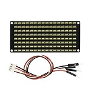

Wenn Sie dem Roboter eine 8\*16 LED-Platine hinzufügen, wird es beeindruckend. Keystudios 8\*16 Dot-Matrix erfüllt diese Anforderung. Damit können Sie Gesichtsausdrücke, Muster oder andere interessante Anzeigen selbst erstellen. Diese 8\*16 LED-Leuchttafel verfügt über 128 LEDs. Der Mikrocontroller (Arduino) kommuniziert über die Zwei-Draht-Bus-Schnittstelle mit dem AiP1640, um die 128 LEDs auf dem Modul zu steuern und die gewünschten Muster auf der Dot-Matrix zu erzeugen. Zur Vereinfachung der Verkabelung wird eine HX-2.54 4-Pin-Verdrahtung bereitgestellt.

**Spezifikation**

- Betriebsspannung: DC 3,3-5V
- Stromverbrauch: 400mW
- Oszillationsfrequenz: 450KHz
- Treiberstrom: 200mA
- Betriebstemperatur: -40\~80℃
- Kommunikationsmethode: Zwei-Draht-Bus

**Komponenten**

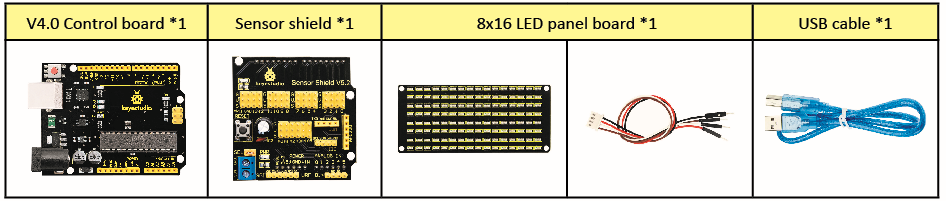

**8*16 Dot-Matrix-Anzeige**

Schaltschema

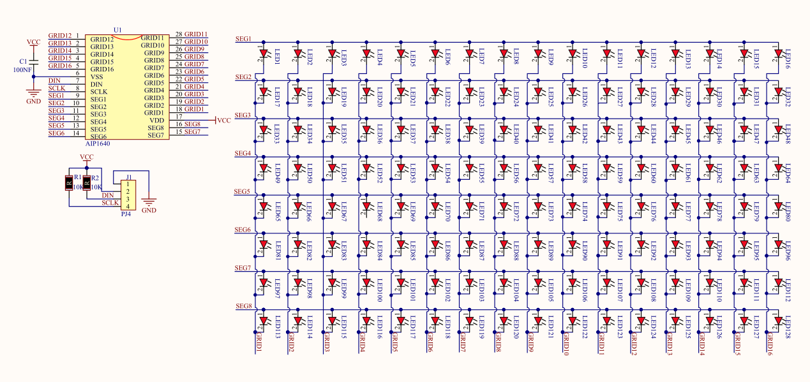

**Das Prinzip der 8\*16 Dot-Matrix:**

Wie steuert man jede LED-Leuchte der 8\*16 Dot-Matrix? Wir wissen, dass ein Byte 8 Bits hat, und jedes Bit ist 0 oder 1. Wenn ein Bit 0 ist, wird die LED ausgeschaltet, und wenn ein Bit 1 ist, wird die LED eingeschaltet. Dadurch kann ein Byte die LED in einer Reihe der Dot-Matrix steuern, also können 16 Bytes 16 Spalten von LED-Leuchten steuern, das heißt eine 8\*16 Dot-Matrix.

**Schnittstellenbeschreibung und Kommunikationsprotokoll:**

Der Mikrocontroller (Arduino) kommuniziert über die Zwei-Draht-Bus-Schnittstelle mit dem AiP1640.

Das Kommunikationsprotokolldiagramm ist unten dargestellt:

(SCLK) ist SCL, (DIN) ist SDA:

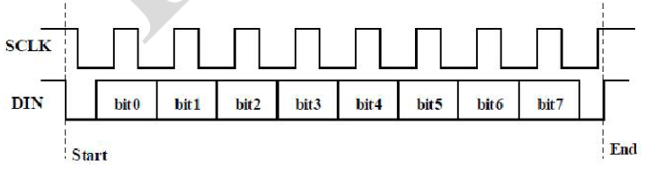

①Die Startbedingung für die Dateneingabe: SCL ist auf hohem Pegel und SDA wechselt von hoch zu niedrig.

②Für die Datenbefehls-Einstellung gibt es Methoden wie in der folgenden Abbildung dargestellt:

In unserem Beispielprogramm wählen wir die Methode **Adresse automatisch um 1 erhöhen**, der Binärwert ist 0100 0000 und der entsprechende Hexadezimalwert ist 0x40.

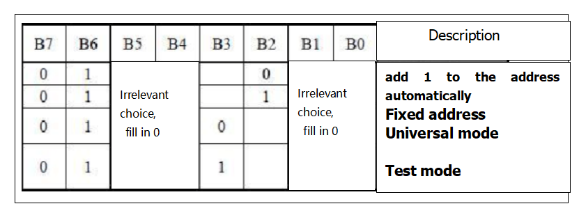

③Für die Adressbefehls-Einstellung kann die Adresse wie folgt ausgewählt werden.

In unserem Beispielprogramm wird die erste 00H ausgewählt, und die Binärzahl 1100 0000 entspricht dem Hexadezimal 0xc0.

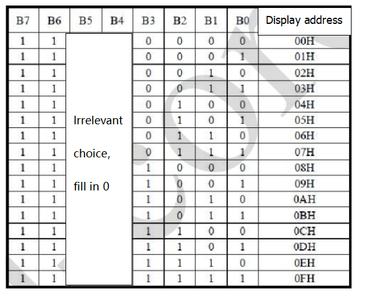

④Die Anforderung für die Dateneingabe ist, dass SCL auf hohem Pegel ist, wenn Daten eingegeben werden, und das Signal auf SDA muss unverändert bleiben. Nur wenn das Taktsignal auf SCL niedrig ist, kann das Signal auf SDA geändert werden. Die Dateneingabe erfolgt zuerst niedrig, dann hoch.

⑤ Die Bedingung zum Beenden der Datenübertragung ist, dass wenn SCL niedrig ist, SDA niedrig ist, und wenn SCL hoch ist, wird das SDA-Pegel auch hoch.

⑥ Anzeigesteuerung, setzen Sie verschiedene Pulsbreiten, die Pulsbreite kann wie folgt ausgewählt werden.

In diesem Beispiel wählen wir Pulsbreite 4/16, und das Hexadezimal entspricht 1000 1010 ist 0x8A.

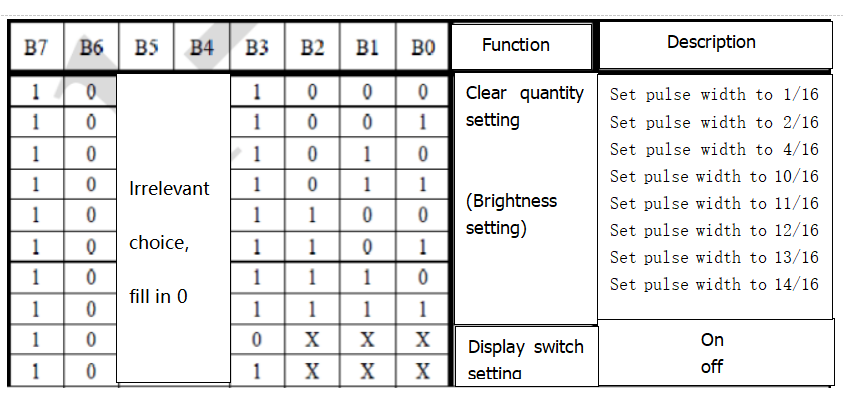

4\. Einführung in das Modulus-Tool

Die Online-Version des Dot-Matrix-Modulus-Tools:

[http://dotmatrixtool.com/#](http://dotmatrixtool.com/#)

①Öffnen Sie Links, um die folgende Seite zu öffnen.

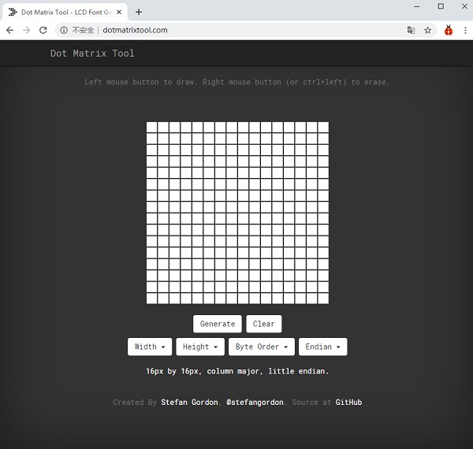

②Die Dot-Matrix ist in diesem Projekt 8\*16, also stellen Sie die Höhe auf 8 und die Breite auf 16 ein, wie unten dargestellt.

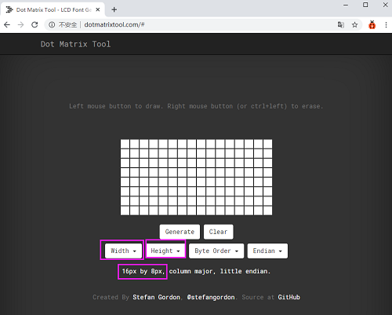

③ Hexadezimaldaten aus dem Muster generieren

Wie unten dargestellt, drücken Sie die linke Maustaste zum Auswählen, die rechte Taste zum Abbrechen, zeichnen Sie das gewünschte Muster, klicken Sie auf **Generate**, und die benötigten Hexadezimaldaten werden erzeugt.

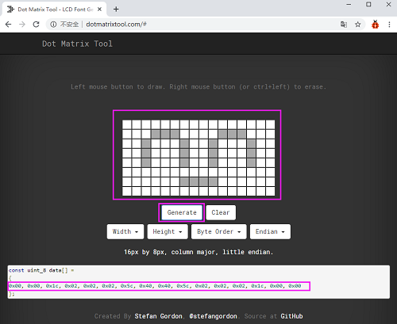

**Verbindungsdiagramm**

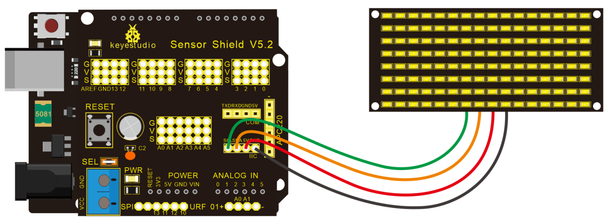

Verkabelungshinweis: GND, VCC, SDA und SCL der 8x16 LED-Platine sind jeweils mit -(GND), + (VCC), A4 und A5 des Keystudio-Sensorerweiterungsboards für die Zwei-Draht-Serienverbindung verbunden. (Hinweis: Dieser Pin ist mit Arduino IIC verbunden, aber dieses Modul ist keine IIC-Kommunikation. Es kann mit zwei beliebigen Pins verbunden werden.)

**Test-Code**

Der Code, der ein Lächeln zeigt.

```c
/*
 keyestudio Mini Tank Robot V2.1
 lesson 9.1
 Matrix  face
 http://www.keyestudio.com
*/ 
// Die Daten des Lächelns vom Modulus-Tool
unsigned char smile[] = {0x00, 0x00, 0x1c, 0x02, 0x02, 0x02, 0x5c, 0x40, 0x40, 0x5c, 0x02, 0x02, 0x02, 0x1c, 0x00, 0x00};

#define SCL_Pin  A5  // Taktsignal-Pin auf A5 setzen
#define SDA_Pin  A4  // Daten-Pin auf A4 setzen

void setup()
{
  // Pin als Ausgang setzen
  pinMode(SCL_Pin,OUTPUT);
  pinMode(SDA_Pin,OUTPUT);
  // Anzeige löschen
  // matrix_display(clear);
}

void loop()
{
  matrix_display(smile);  // Lächeln anzeigen
}
// Die Funktion für die Dot-Matrix-Anzeige

void matrix_display(unsigned char matrix_value[])
{
  IIC_start();  // Funktion der Startbedingung für die Datenübertragung verwenden
  IIC_send(0xc0);  // Adresse auswählen
  
  for(int i = 0;i < 16;i++) // Musterdaten haben 16 Bits
  {
     IIC_send(matrix_value[i]); // Musterdaten übertragen
  }

  IIC_end();   // Übertragung der Musterdaten beenden
  IIC_start();
  IIC_send(0x8A);  // Anzeigesteuerung, Pulsbreite auf 4/16 s setzen
  IIC_end();
}

// Die Bedingung zum Starten der Datenübertragung
void IIC_start()
{
  digitalWrite(SCL_Pin,HIGH);
  delayMicroseconds(3);
  digitalWrite(SDA_Pin,HIGH);
  delayMicroseconds(3);
  digitalWrite(SDA_Pin,LOW);
  delayMicroseconds(3);
}
// Daten übertragen
void IIC_send(unsigned char send_data)
{
  for(char i = 0;i < 8;i++)  // Jedes Byte hat 8 Bits, 8 Bits für jedes Zeichen
  {
      digitalWrite(SCL_Pin,LOW);  // Taktsignal-Pin SCL_Pin herunterziehen, um das Signal von SDA zu ändern
      delayMicroseconds(3);
      if(send_data & 0x01)  // Pegel von SDA_Pin nach 1 oder 0 jedes Bits setzen
      {
        digitalWrite(SDA_Pin,HIGH);
      }
      else
      {
        digitalWrite(SDA_Pin,LOW);
      }
      delayMicroseconds(3);
      digitalWrite(SCL_Pin,HIGH); // Taktsignal-Pin SCL_Pin hochziehen, um Übertragung zu stoppen
      delayMicroseconds(3);
      send_data = send_data >> 1;  // Bit für Bit erkennen, Daten um eins nach rechts verschieben
  }
}

// Das Zeichen für das Ende der Datenübertragung
void IIC_end()
{
  digitalWrite(SCL_Pin,LOW);
  delayMicroseconds(3);
  digitalWrite(SDA_Pin,LOW);
  delayMicroseconds(3);
  digitalWrite(SCL_Pin,HIGH);
  delayMicroseconds(3);
  digitalWrite(SDA_Pin,HIGH);
  delayMicroseconds(3);
}
//******************************************************
```

**Test-Ergebnis**

Verdrahten Sie nach dem Verbindungsdiagramm. Der DIP-Schalter wird nach rechts gedreht und die Stromversorgung eingeschaltet, das Lächeln erscheint auf der Dot-Matrix.

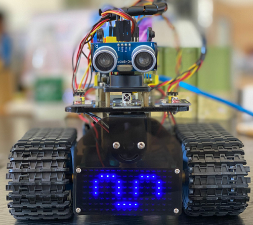

**Erweiterungspraxis**

Wir verwenden das Modulus-Tool ([http://dotmatrixtool.com/#](http://dotmatrixtool.com/#)), um die Dot-Matrix abwechselnd mit Vorwärts-, Rückwärts- und Stoppmustern anzuzeigen, dann die Muster zu löschen, und das Zeitintervall beträgt 2000 Millisekunden.

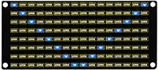

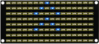

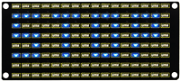

Rufen Sie den grafischen Code über das Modulus-Tool ab, der angezeigt werden soll.

**Start:** 0x01,0x02,0x04,0x08,0x10,0x20,0x40,0x80,0x80,0x40,0x20,0x10,0x08,0x04,0x02,0x01

**Vorwärts:** 0x00,0x00,0x00,0x00,0x00,0x24,0x12,0x09,0x12,0x24,0x00,0x00,0x00,0x00,0x00,0x00

**Rückwärts:** 0x00,0x00,0x00,0x00,0x00,0x24,0x48,0x90,0x48,0x24,0x00,0x00,0x00,0x00,0x00,0x00

**Nach links drehen:** 0x00,0x00,0x00,0x00,0x00,0x00,0x44,0x28,0x10,0x44,0x28,0x10,0x44,0x28,0x10,0x00

**Nach rechts drehen:** 0x00,0x10,0x28,0x44,0x10,0x28,0x44,0x10,0x28,0x44,0x00,0x00,0x00,0x00,0x00,0x00

**Stopp:** 0x2E,0x2A,0x3A,0x00,0x02,0x3E,0x02,0x00,0x3E,0x22,0x3E,0x00,0x3E,0x0A,0x0E,0x00

**Code zum Löschen der Anzeige**: 0x00,0x00,0x00,0x00,0x00,0x00,0x00,0x00,0x00,0x00,0x00,0x00,0x00,0x00,0x00,0x00

Der Code für mehrere Muster-Verschiebungen:

```c
/* keyestudio Mini Tank Robot V2.1
 lesson 9.2
 Matrix loop
 http://www.keyestudio.com
*/ 
// Array, wird verwendet, um die Daten des Musters zu speichern, kann selbst berechnet oder vom Modulus-Tool erhalten werden
unsigned char start01[] = 
{0x01,0x02,0x04,0x08,0x10,0x20,0x40,0x80,0x80,0x40,0x20,0x10,0x08,0x04,0x02,0x01};
unsigned char front[] = 
{0x00,0x00,0x00,0x00,0x00,0x24,0x12,0x09,0x12,0x24,0x00,0x00,0x00,0x00,0x00,0x00};
unsigned char back[] = 
{0x00,0x00,0x00,0x00,0x00,0x24,0x48,0x90,0x48,0x24,0x00,0x00,0x00,0x00,0x00,0x00};
unsigned char left[] = 
{0x00,0x00,0x00,0x00,0x00,0x00,0x44,0x28,0x10,0x44,0x28,0x10,0x44,0x28,0x10,0x00};
unsigned char right[] = 
{0x00,0x10,0x28,0x44,0x10,0x28,0x44,0x10,0x28,0x44,0x00,0x00,0x00,0x00,0x00,0x00};
unsigned char STOP01[] = 
{0x2E,0x2A,0x3A,0x00,0x02,0x3E,0x02,0x00,0x3E,0x22,0x3E,0x00,0x3E,0x0A,0x0E,0x00};
unsigned char clear[] = 
{0x00,0x00,0x00,0x00,0x00,0x00,0x00,0x00,0x00,0x00,0x00,0x00,0x00,0x00,0x00,0x00};
#define SCL_Pin  A5  // Taktsignal-Pin auf A5 setzen
#define SDA_Pin  A4  // Daten-Pin auf A4 setzen
void setup(){
  // Pins als Ausgang setzen
  pinMode(SCL_Pin,OUTPUT);
  pinMode(SDA_Pin,OUTPUT);
  // Anzeige löschen
  matrix_display(clear);
}
void loop(){
  matrix_display(start01);  // Start-Muster anzeigen
  delay(2000);
  matrix_display(front);    // Vorwärts-Muster
  delay(2000);
  matrix_display(STOP01);   // Stopp-Muster
  delay(2000);
  matrix_display(clear);    // Anzeige löschen
  delay(2000);
}
// Diese Funktion wird für die Anzeige der Dot-Matrix verwendet
void matrix_display(unsigned char matrix_value[])
{
  IIC_start();  // Funktion für die Startbedingung der Datenübertragung aufrufen
  IIC_send(0xc0);  // Adresse auswählen
  
  for(int i = 0;i < 16;i++) // Musterdaten haben 16 Bits
  {
     IIC_send(matrix_value[i]); // Daten zur Übertragung von Mustern
  }
  IIC_end();   // Übertragung der Musterdaten beenden
  IIC_start();
  IIC_send(0x8A);  // Anzeigesteuerung, Pulsbreite auf 4/16 setzen
  IIC_end();
}
// Die Bedingung zum Starten der Datenübertragung
void IIC_start()
{
  digitalWrite(SCL_Pin,HIGH);
  delayMicroseconds(3);
  digitalWrite(SDA_Pin,HIGH);
  delayMicroseconds(3);
  digitalWrite(SDA_Pin,LOW);
  delayMicroseconds(3);
}
// Daten übertragen
void IIC_send(unsigned char send_data)
{
  for(char i = 0;i < 8;i++)  // Jedes Byte hat 8 Bits
  {
      digitalWrite(SCL_Pin,LOW);  // Taktsignal-Pin SCL herunterziehen, um die Signale von SDA zu ändern
      delayMicroseconds(3);
      if(send_data & 0x01)  // Pegel von SDA_Pin nach 1 oder 0 jedes Bits setzen
      {
        digitalWrite(SDA_Pin,HIGH);
      }
      else
      {
        digitalWrite(SDA_Pin,LOW);
      }
      delayMicroseconds(3);
      digitalWrite(SCL_Pin,HIGH); // Taktsignal-Pin SCL hochziehen, um Datenübertragung zu stoppen
      delayMicroseconds(3);
      send_data = send_data >> 1;  // Bit für Bit erkennen, Daten um eins nach rechts verschieben
  }}
// Das Zeichen, dass die Datenübertragung endet
void IIC_end()
{
  digitalWrite(SCL_Pin,LOW);
  delayMicroseconds(3);
  digitalWrite(SDA_Pin,LOW);
  delayMicroseconds(3);
  digitalWrite(SCL_Pin,HIGH);
  delayMicroseconds(3);
  digitalWrite(SDA_Pin,HIGH);
  delayMicroseconds(3);} 
//*****************************************************
```

Laden Sie den Code auf das Entwicklungsboard hoch. Die 8\*16 Dot-Matrix zeigt abwechselnd Vorwärts-, Rückwärts- und Stoppmuster an.

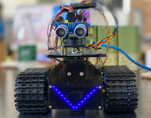

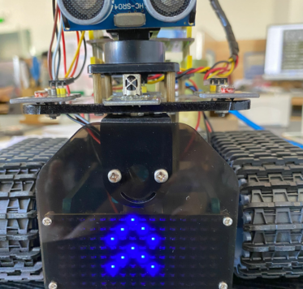

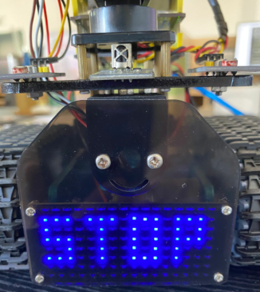